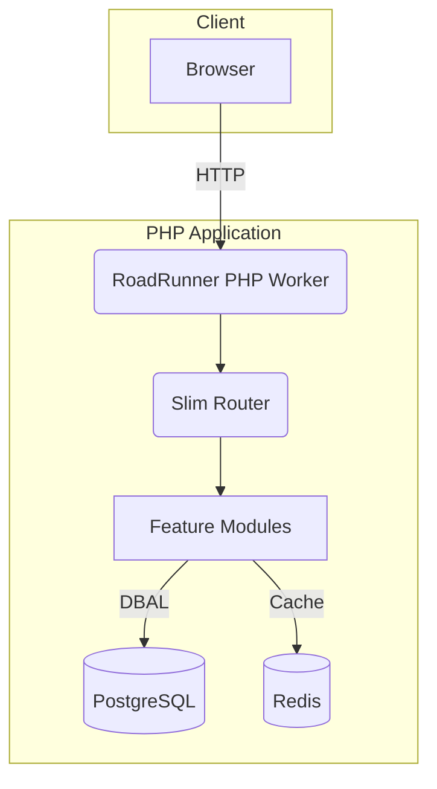

# Architecture Overview

This document provides a high-level look at **Infinri’s** architecture, focusing on the module system and key runtime components.

---

## 1. Bird’s-Eye View



* **RoadRunner** handles incoming HTTP requests, passing them to the Slim router running inside persistent PHP workers.
* **Slim Router** resolves the route and dispatches the appropriate controller/action exposed by a **Module**.
* **Modules** encapsulate domain functionality (Core, Admin, Contact, Pages, Shared). They interact with PostgreSQL via Cycle ORM and optionally with Redis for caching/queues.

---

## 2. Module Anatomy

```
ModuleName/
├── Actions/       # Application actions / service classes
├── Console/       # CLI commands
├── Controllers/   # HTTP controllers
├── Models/        # Cycle ORM entities
├── Services/      # Domain services
├── Support/       # Helpers & traits
├── Views/         # Plates templates
├── routes.php     # Route definitions
└── ModuleName.php # Module bootstrap (implements ModuleInterface)
```

### Lifecycle

1. **Registration** – Module registers services in the DI container.
2. **Dependency Resolution** – ModuleManager ensures version/constraint satisfaction.
3. **Boot** – Module executes boot logic (e.g., event listeners, schedules, etc.).

Lifecycle events (PSR-14) allow cross-module hooks.

---

## 3. Core Components

| Component | Responsibility |
|-----------|---------------|
| **Core Module** | DI container setup, error handling, router, env checks |
| **Admin Module** | Admin dashboard, user management, auth, password reset |
| **Contact Module** | Contact form, email notifications |
| **Pages Module** | Static page management |
| **Shared Module** | Cross-cutting helpers, middleware, UI components |

---

## 4. Data Flow Example (Admin Login)

1. Client submits login form → `/admin/login`.
2. Router resolves to `AuthController::login` (Admin module).
3. Controller uses `AdminUserRepository` (Admin module) to fetch user via Core-provided Cycle ORM.
4. Password verified → session established (Core session service).
5. Redirect to Admin dashboard route generated via `RouteParserInterface`.

---

## 5. Extending Infinri

1. **Create a new module** under `app/Modules/YourModule` following the skeleton above.
2. Implement `ModuleInterface` in `YourModule.php` and declare metadata (name, version, dependencies).
3. Register routes, services, migrations.
4. Add the module to `config/modules.php` (or auto-discover if enabled).

---

_For deeper details, see the module guides under `docs/modules/`._
