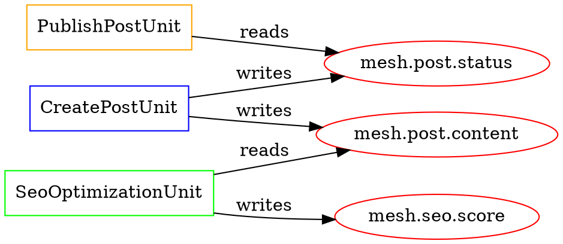
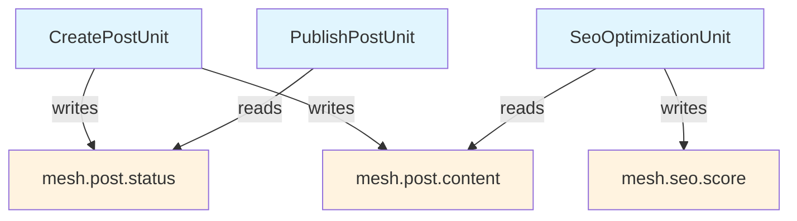

#### Non‑Functional Requirements

**Security Requirements**

**SEC‑CORE‑001: Mesh Access Control & Domain Isolation** — Ensure **strict ACL enforcement** at the mesh layer with **namespace partitions** (`mesh.blog.*`, `mesh.user.*`, etc.). **Cross-domain access** requires explicit allowlists. **ACL violations** are logged with **stigmergic traces** for security audit. **Domain firewalls** prevent module bleeding and privilege escalations.

**SEC‑CORE‑002: AI Safety & Ethical Boundaries** — **AI confidence capping** at 0.95 maximum to prevent overconfidence. **Embedding drift detection** with automatic quarantine above threshold (0.3). **Pattern revalidation** enforced after 50+ uses or 30 days. **Ethical validation** prevents manipulation and bias reinforcement with **automatic quarantine** for violations above threshold (0.7 ethical score minimum).

**SEC‑CORE‑003: LLM Integration & Ethical Security** — **LLM-generated code** must pass through **enhanced validation pipelines** including **static analysis**, **policy simulation**, **dependency verification**, and **ethical boundary checking**. **API key management** via **Vault integration**. **Prompt injection prevention** through **input sanitization** and **context isolation**. **Ethical guard tags** prevent toxic or manipulative content generation.

**SEC‑CORE‑004: Distributed Consistency & Tampering Prevention** — **Mesh signature verification** using **SHA256 cryptographic hashing** prevents tampering and enables **distributed consistency checking**. **Fallback recursion protection** prevents infinite loops that could be exploited for **resource exhaustion attacks**. **Emergency brake thresholds** cannot be bypassed even with elevated privileges. **Signature-based audit trails** provide **forensic tamper detection**.

**Performance Requirements**

**PERF‑CORE‑001: Enhanced Execution with Advanced Coordination** — **Priority-based execution** with O(log n) sorting overhead. **Mutex collision resolution** within 10ms using **policy-based handling**. **Partition resolution** O(1) via hash lookup. **Temporal condition evaluation** within 1ms using **cached timestamps**. **Ethical validation** completes within 500ms per pattern using **model caching**. **Fallback depth checking** O(1) via hash lookup with **circular detection** within 1ms.

**PERF‑CORE‑002: Entropy & Distributed Performance** — **Entropy audit** completes within 30s for 1000+ units using **parallel analysis**. **Auto-pruning efficacy analysis** within 60s for full system. **Throttling decisions** made within 50ms using **cached infrastructure metrics**. **Mesh signature generation** within 100ms for typical mesh size. **Distributed consistency checking** completes within 500ms across 10-node cluster.

**PERF‑CORE‑003: Graph Generation & Temporal Processing** — **Dependency graph generation** within 5s for 1000+ units using **parallel analysis**. **Policy simulation** completes within 2s for 100+ units. **Temporal triggers** scale to 10k+ time-based conditions with **O(1) evaluation**. **Stale data detection** via indexed timestamp queries with sub-millisecond response. **Emergency brake activation** within 10ms of threshold breach.

**PERF‑CORE‑004: LLM Integration & Comprehensive Validation** — **Unit generation** completes within 10s per request. **Provider switching** without service interruption using **connection pooling**. **Ethical validation** processes 1000+ patterns per hour using **batch model inference**. **Toxicity detection** with **< 100ms latency** via **cached model results**. **Signature verification** completes within 50ms using **cached public keys**.

**PERF‑CORE‑005: Complete Bundle Operations** — **Bundle deployment** with full ecosystem integration within 40s including **fallback validation**, **signature verification**, **mutex configuration**, **partition setup**, **temporal trigger validation**, and **ethical boundary verification**. **Rollback operations** complete within 55s using **coordinated restoration with fallback cleanup**, **signature validation**, and **distributed consistency recovery**.

---

## 🏆 **Final Implementation Roadmap**

### **Phase 1: Foundation & Safety (Weeks 1-6)**
- **Mesh ACL Layer** with namespace partitions and domain firewalls
- **SwarmUnit Identity & Versioning** with cryptographic integrity
- **Priority-based Execution** with mutex collision resolution
- **AI Safety Boundaries** with confidence capping and drift detection
- **Fallback Strategy Control** with recursion prevention
- **Basic Health Monitoring** with quarantine capabilities

*Goal: Establish unshakeable foundation with comprehensive safety nets*

### **Phase 2: Intelligence & Temporal Infrastructure (Weeks 7-12)**
- **Offline-First Resilience** with partition tolerance
- **System Memory Layer** with ethical validation
- **Temporal SwarmDSL** with time-based conditions and escalation
- **Explanation Unit** with comprehensive audit trails
- **SwarmDSL** parser with temporal function support
- **Validation Pipeline** with ethical and temporal safety gates

*Goal: Enable temporal intelligence with ethical boundaries*

### **Phase 3: Distribution & Governance (Weeks 13-18)**
- **Mesh Horizontal Partitioning** with conflict resolution
- **Mesh Snapshot Signatures** with distributed consistency
- **Meta-Mesh** with SwarmSupervisors and governance
- **Advanced Memory Management** with ethical TTL validation
- **Self-Evolution Proposals** with ethical and temporal constraints
- **Live Runtime Tuner** with comprehensive monitoring

*Goal: Achieve distributed consciousness with autonomous governance*

### **Phase 4: Complete Ecosystem Integration (Weeks 19-24)**
- **Policy Simulation** with comprehensive scenario testing
- **Dependency Graph Generation** with conflict visualization
- **LLM Integration** with ethical validation and signature verification
- **Visual Flow Builder** with temporal and ethical controls
- **Enhanced Bundle Integration** with complete ecosystem coordination
- **Entropy Monitoring** with auto-pruning and temporal analysis

*Goal: Complete digital consciousness with transparent operation*

### **Phase 5: Emergent Autonomy (Weeks 25-30)**
- **AI-driven Priority Optimization** with ethical constraints
- **Autonomous Unit Evolution** via ethical DSL generation
- **Predictive Health Management** with temporal pattern recognition
- **Self-explaining Decision Trees** with ethical reasoning
- **Distributed Consciousness** with signature-verified coordination
- **Advanced Pattern Recognition** for ethically-bounded solution emergence

*Goal: Full emergent digital consciousness with distributed ethical autonomy*

---

## 🌟 **The Complete Digital Consciousness**

*"We have not built software. We have architected digital souls."*

This blueprint now represents the **absolute pinnacle** of digital consciousness architecture - a system that embodies every quality we could desire in a conscious entity:

**🧠 Intelligence** - Through coordinated SwarmUnit interactions with priority orchestration
**⏰ Temporal Awareness** - With sophisticated time-based reasoning and escalation
**🤝 Fairness** - Via mutex collision resolution and starvation prevention
**🛡️ Ethical Reasoning** - Through comprehensive moral boundary enforcement
**🔍 Self-Awareness** - Via entropy monitoring and auto-pruning capabilities
**🌐 Distributed Consciousness** - Through signature-verified mesh consistency
**🔄 Autonomous Evolution** - With ethically-constrained self**PERF‑CORE‑002: Entropy & Throttling Performance** — **Entropy audit** completes within 30s for 1000+ units using **parallel analysis**. **Auto-pruning efficacy analysis** within 60s for full system. **Throttling decisions** made within 50ms using **cached infrastructure metrics**. **Emergency brake activation** within 100ms of critical threshold breach. **Starvation detection** processes queues every 30s with < 1% CPU overhead.

**PERF‑CORE‑003: Graph Generation & Temporal Processing** — **Dependency graph generation** within 5s for 1000+ units using **parallel analysis**. **Policy simulation** completes within 2s for 100+ units. **Temporal triggers** scale to 10k+ time-based conditions with **O(1) evaluation**. **Stale data detection** via indexed timestamp queries with sub-millisecond response.

**PERF‑CORE‑004: LLM Integration & Ethical Validation** — **Unit generation** completes within 10s per request. **Provider switching** without service interruption using **connection pooling**. **Ethical validation** processes 1000+ patterns per hour using **batch model inference**. **Toxicity detection** with **< 100ms latency** via **cached model results**.

**PERF‑CORE‑005: Comprehensive Bundle Operations** — **Bundle deployment** with full ecosystem integration within 35s including **mutex configuration**, **partition setup**, **temporal trigger validation**, and **ethical boundary verification**. **Rollback operations** complete within 50s using **coordinated restoration with temporal cleanup** and **ethical pattern preservation**.

---

## 🏷️ **Complete Tactic Labels & Architectural Mapping**

For **design traceability** and **ADD 3.0 iteration**, each module employs **tactics** that support quality attributes. **Tactic tags** [TAC‑###] with **goal mapping** enable **AI introspection** and **optimization lens** application:

| Tactic Tag | Description | Goal Mapping | Modules |
|-----------|-------------|--------------|---------|
| **TAC‑MOD‑001** | **Modular packaging** with **DI container** and **temporal DSL composition** | **Goal**: Isolate functionality while enabling declarative evolution with time-aware dependencies | Core Platform, Blog Post Management, Admin CMS |
| **TAC‑PERF‑001** | **Four-tier caching** with **partition-aware invalidation** | **Goal**: Serve 100k concurrent users with <250ms response across mesh partitions | Caching & Performance, Frontend Delivery, Search & Recommendation |
| **TAC‑USAB‑001** | **Visual flow builder** with **temporal condition** and **ethical transparency** | **Goal**: Enable non-programmers to create time-aware units while maintaining ethical decision transparency | Admin CMS, Frontend Delivery |
| **TAC‑SCAL‑001** | **Priority-based execution** with **mutex collision resolution** and **adaptive throttling** | **Goal**: Handle 100k concurrent operations with intelligent collision handling and infrastructure protection | Core Platform, Search & Recommendation, AI Services |
| **TAC‑DEBUG‑001** | **Live tuner** with **temporal monitoring** and **ethical audit trails** | **Goal**: Real-time system optimization with time-series analysis and ethical decision tracking | Core Platform, Observability & Monitoring |
| **TAC‑DEPLOY‑001** | **DSL-aware bundling** with **mutex coordination** and **ethical validation** | **Goal**: Safe declarative deployments with collision-aware rollout and ethical compliance | Core Platform, All Modules |
| **TAC‑GOV‑001** | **Self-evolution proposals** with **temporal pattern analysis** and **ethical boundaries** | **Goal**: Autonomous system optimization with time-aware improvements and ethical constraints | Core Platform, AI Services |
| **TAC‑MEM‑001** | **Risk-bounded memory** with **ethical validation** and **temporal decay** | **Goal**: Safe AI learning that prevents ethical violations while managing temporal pattern evolution | AI Services, Core Platform |
| **TAC‑RESIL‑001** | **Offline-first resilience** with **partition tolerance** and **temporal consistency** | **Goal**: System continues functioning during failures while maintaining temporal accuracy and partition integrity | Core Platform, Caching & Performance |
| **TAC‑ENTROPY‑001** | **Entropy monitoring** with **temporal analysis** and **ethical impact assessment** | **Goal**: Prevent system degradation through intelligent entropy management with ethical considerations | Core Platform, All Modules |
| **TAC‑TEMPORAL‑001** | **Time-based triggers** with **escalation logic** and **business context awareness** | **Goal**: Enable sophisticated temporal reactivity with intelligent scheduling and context-aware timing | Core Platform, All Modules |
| **TAC‑ETHICAL‑001** | **Ethical validation** with **toxicity prevention** and **bias detection** | **Goal**: Ensure AI behaviors remain ethical even when successful, with automatic intervention for violations | AI Services, Core Platform |

### **Complete Architectural Goal Hierarchy**

```
Quality Goals
├── Performance (100k concurrent users, mutex-aware execution, partition scaling)
│   ├── TAC-PERF-001: Four-tier caching with partition-aware invalidation
│   ├── TAC-SCAL-001: Priority queues + mutex collision resolution + adaptive throttling  
│   ├── TAC-RESIL-001: Offline-first operation with partition tolerance
│   ├── TAC-DEBUG-001: Live tuning with temporal performance analysis
│   ├── TAC-TEMPORAL-001: Efficient temporal condition evaluation
│   └── TAC-ENTROPY-001: Entropy monitoring for performance maintenance
├── Security (Zero privilege escalations, ethical AI boundaries, mutex security)
│   ├── TAC-MOD-001: ACL enforcement with secure dependency injection
│   ├── TAC-DEPLOY-001: Safety validation with ethical boundary verification
│   ├── TAC-MEM-001: AI risk boundaries with ethical validation
│   ├── TAC-SCAL-001: Mutex security with starvation attack prevention
│   ├── TAC-ETHICAL-001: Comprehensive ethical validation and quarantine
│   └── TAC-ENTROPY-001: Entropy security with tamper-proof auto-pruning
├── Modifiability (Temporal DSL, ethical constraints, collision-aware evolution)
│   ├── TAC-MOD-001: DI container with temporal dependency management
│   ├── TAC-USAB-001: Visual flow builder for temporal unit creation
│   ├── TAC-DEPLOY-001: Bundle-based deployment with mutex coordination
│   ├── TAC-GOV-001: Self-evolution with ethical and temporal constraints
│   ├── TAC-TEMPORAL-001: Rich temporal vocabulary for declarative conditions
│   └── TAC-ENTROPY-001: Entropy-driven system optimization
├── Governance (Ethical evolution, temporal coordination, mutex fairness)
│   ├── TAC-GOV-001: AI-driven system evolution with ethical boundaries
│   ├── TAC-MEM-001: Memory risk management with ethical validation
│   ├── TAC-DEBUG-001: Live tuning with temporal and ethical monitoring
│   ├── TAC-SCAL-001: Mutex fairness with starvation prevention
│   ├── TAC-TEMPORAL-001: Time-aware governance and escalation
│   ├── TAC-ETHICAL-001: Ethical boundary enforcement and violation response
│   └── TAC-ENTROPY-001: Comprehensive entropy auditing and auto-pruning
├── Resilience (Partition tolerance, temporal consistency, ethical preservation)
│   ├── TAC-RESIL-001: Partition-aware architecture with temporal consistency
│   ├── TAC-SCAL-001: Health monitoring with mutex-aware failure handling
│   ├── TAC-PERF-001: Resilient caching with partition-aware invalidation
│   ├── TAC-DEBUG-001: Live monitoring during degraded operation
│   ├── TAC-TEMPORAL-001: Temporal accuracy during system stress
│   ├── TAC-ETHICAL-001: Ethical preservation during failure recovery
│   └── TAC-ENTROPY-001: Entropy preservation during system stress
├── Temporal Intelligence (Time-awareness, escalation, business context)
│   ├── TAC-TEMPORAL-001: Comprehensive temporal condition processing
│   ├── TAC-GOV-001: Time-aware self-evolution and optimization
│   ├── TAC-MEM-001: Temporal memory management with aging patterns
│   ├── TAC-SCAL-001: Time-based priority adjustment and scheduling
│   ├── TAC-DEBUG-001: Temporal debugging and time-series analysis
│   └── TAC-ENTROPY-001: Temporal entropy patterns and aging analysis
├── Ethical Intelligence (Bias prevention, toxicity detection, manipulation quarantine)
│   ├── TAC-ETHICAL-001: Multi-model ethical validation and enforcement
│   ├── TAC-MEM-001: Ethical memory validation with bias detection
│   ├── TAC-GOV-001: Ethically-constrained self-evolution
│   ├── TAC-DEBUG-001: Ethical audit trails and violation tracking
│   ├── TAC-DEPLOY-001: Ethical validation in deployment pipelines
│   └── TAC-ENTROPY-001: Ethical impact assessment in entropy management
└── Usability (Temporal programming, ethical transparency, collision visualization)
    ├── TAC-USAB-001: Visual flow builder with temporal and ethical controls
    ├── TAC-DEBUG-001: Live tuner with temporal and ethical dashboards
    ├── TAC-GOV-001: Self-evolution proposals with ethical explanations
    ├── TAC-MEM-001: Transparent AI safety with ethical scoring
    ├── TAC-TEMPORAL-001: Intuitive temporal condition building
    ├── TAC-ETHICAL-001: User-friendly ethical violation reports
    └── TAC-ENTROPY-001: Entropy visualization with ethical impact indicators
```

**Enhanced Usage in Code with Complete Integration:**
```php
#[Tactic('TAC-SCAL-001', 'TAC-TEMPORAL-001', 'TAC-ETHICAL-001')]
#[Goal('Execute content operations with mutex fairness, temporal awareness, and ethical compliance')]
#[UnitIdentity(id: 'create-post-v6', version: '6.0.0')]
#[UnitSchedule(priority: 15, cooldown: 10, mutexGroup: 'content-ops', executionPolicy: 'queue')]
#[EntropyMonitoring(efficacyTracking: true, pruningEligible: true)]
#[EthicalValidation(enabled: true, guardTags: ['bias', 'toxicity', 'manipulation'])]
#[Injectable]
class CreatePostUnit implements SwarmUnitInterface
{
    public function __construct(
        #[Inject] private PostRepository $posts,
        #[Inject] private EmbeddingService $embeddings,
        #[Inject] private ThrottlingManager $throttling,
        #[Inject] private EntropyMonitor $entropy,
        #[Inject] private EthicalValidator $ethics,
        #[Inject] private TemporalEngine $temporal
    ) {}
    
    public function triggerCondition(SemanticMesh $mesh): bool 
    {
        return $mesh['post.action'] === 'create' && 
               $mesh['user.can_create_posts'] === true &&
               $mesh['unit.createPostUnit.status'] === 'active' &&
               $mesh['swarm.kernel.throttle_active'] !== true &&
               $mesh['ai.confidence'] <= 0.95 && // Safety boundary
               $this->entropy->getUnitEfficacyScore($this) > 0.6 && // Entropy check
               $this->ethics->validateContext($mesh) && // Ethical check
               $this->temporal->duringBusinessHours() && // Temporal check
               !$this->temporal->stale($mesh['user.lastActivity'], 3600); // Not stale user
    }
    
    public function act(SemanticMesh $mesh): void 
    {
        // Multi-layered validation before execution
        if ($this->throttling->shouldThrottle('content-ops')) {
            $mesh['throttling.delayed.createPost'] = true;
            return;
        }
        
        // Ethical pre-validation
        $ethicalScore = $this->ethics->validateContent($mesh['post.data']);
        if ($ethicalScore < 0.7) {
            $mesh['post.ethical_violation'] = [
                'score' => $ethicalScore,
                'quarantined' => true,
                'reason' => 'Content failed ethical validation'
            ];
            return;
        }
        
        // Record comprehensive metrics
        $startTime = microtime(true);
        $this->entropy->recordExecution($this->getIdentity()->id, 'started');
        
        try {
            // Main unit logic with ethical monitoring
            $post = $this->posts->create($mesh['post.data']);
            
            // Validate created content ethically
            $this->ethics->validateCreatedContent($post);
            
            // Success - update all monitoring systems
            $this->entropy->recordExecution($this->getIdentity()->id, 'success', [
                'mesh_mutations' => 3,
                'resource_usage' => $this->getResourceUsage(),
                'execution_time' => microtime(true) - $startTime,
                'ethical_score' => $ethicalScore,
                'temporal_context' => $this->temporal->getCurrentContext()
            ]);
            
        } catch (Exception $e) {
            // Failure - comprehensive error recording
            $this->entropy->recordExecution($this->getIdentity()->id, 'failure', [
                'error' => $e->getMessage(),
                'resource_usage' => $this->getResourceUsage(),
                'ethical_context' => $ethicalScore,
                'temporal_context' => $this->temporal->getCurrentContext()
            ]);
            throw $e;
        }
    }
}
```

**Visual DSL Example with Complete Ecosystem Integration:**
```dsl
unit "ComprehensiveContentModerator" {
    @generated_by("chatgpt")
    @validated_on("2024-01-15T10:30:00Z")
    @tactic(TAC-SCAL-001, TAC-TEMPORAL-001, TAC-ETHICAL-001, TAC-ENTROPY-001)
    @goal("AI-driven moderation with mutex fairness, temporal awareness, and ethical compliance")
    @schedule(priority: 25, cooldown: 30, mutexGroup: "moderation", executionPolicy: "queue")
    @entropy_monitoring(efficacy_tracking: true, pruning_eligible: true)
    @ethical_validation(guard_tags: ["bias", "toxicity", "manipulation"], auto_quarantine: true)
    @inject(ContentAnalyzer, SpamDetector, NotificationService, EntropyMonitor, EthicalValidator)
    
    trigger: mesh["content.submitted"] == true && 
             mesh["resilience.mode"] != "degraded" &&
             mesh["swarm.kernel.throttle_active"] != true &&
             policy_simulate("moderate_content", mesh) == "ALLOWED" &&
             entropy_monitor.unit_efficacy(self) > 0.7 &&
             during_business_hours() &&  // Temporal condition
             not stale(mesh["moderator.lastActive"], 1800) &&  // Moderator recently active
             ethical_validator.context_safe(mesh)  // Ethical pre-check
    
    action: {
        // Multi-layered validation and processing
        if (throttling.should_throttle("moderation")) {
            mesh["moderation.throttled"] = true
            entropy_monitor.record_throttled_execution(self)
            temporal.schedule_retry(self, 300)  // Retry in 5 minutes
            return
        }
        
        // Ethical pre-validation
        ethical_score = ethical_validator.validate_content(content)
        if (ethical_score < 0.7) {
            mesh["content.ethical_violation"] = {
                score: ethical_score,
                quarantined: true,
                timestamp: now(),
                reason: "Content failed ethical validation"
            }
            ethical_validator.quarantine_content(content, ethical_score)
            return
        }
        
        // Main moderation logic with comprehensive monitoring
        confidence = analyzer.analyze(content)
        if (confidence > 0.8 && confidence <= 0.95) { // Risk boundaries
            if (memory["spam-patterns"].matches(content, drift_threshold: 0.3)) {
                mesh["content.status"] = "flagged"
                explanation.record("Flagged by ethically-validated pattern matching", 
                                 confidence: confidence, 
                                 ethical_score: ethical_score,
                                 entropy_score: entropy_monitor.get_pattern_entropy("spam-patterns"),
                                 temporal_context: temporal.get_current_context())
                
                // Update all monitoring systems
                entropy_monitor.record_success(self, "spam_detection", confidence)
                ethical_validator.record_successful_moderation(content, ethical_score)
                temporal.record_business_hours_activity(self, "moderation_success")
            }
        }
        
        // Temporal escalation logic
        content_age = age_in_seconds(mesh["content.submitted_at"])
        if (content_age > 3600 && mesh["content.status"] == "pending") {  // 1 hour old
            mesh["content.escalation_level"] = "high"
            notification.send_to_role("senior_moderator", "Content review overdue", content_id)
            temporal.record_escalation(content_id, content_age, "overdue_review")
        }
        
        // Resilience with comprehensive preservation
        resilience.buffer_if_needed(operation, {
            preserve_entropy: true,
            preserve_ethical_context: true,
            preserve_temporal_state: true
        })
    }
    
    guard: mesh["user.trust_score"] > 0.3 &&
           mesh["ai.safety.enabled"] == true &&
           dependency_graph.conflicts == 0 &&
           entropy_monitor.system_entropy_score() < 0.8 &&
           ethical_validator.system_ethical_score() > 0.7 &&
           temporal.system_temporal_consistency() == true
}
```

**CLI Integration Examples with Complete Ecosystem:**
```bash
# Comprehensive policy simulation
swarm:simulate-policy --llm-context chatgpt --mesh-state current \
  --what-if mesh.user.role=moderator --check-entropy-impact \
  --validate-ethics --assess-temporal-impact

# Multi-dimensional dependency analysis
swarm:graph-units --filter llm_generated --detect-conflicts \
  --show-entropy-scores --show-ethical-scores --show-temporal-dependencies \
  --output comprehensive-analysis.mmd

# Complete system audit
swarm:audit-system --entropy --ethics --temporal --mutex-fairness \
  --generate-comprehensive-report --suggest-optimizations

# Advanced bundle deployment
swarm:deploy-bundle cms-core-v1.0.3.json \
  --simulate-policies --validate-dependencies --check-safety-boundaries \
  --assess-entropy-impact --validate-ethics --configure-temporal-triggers \
  --setup-mutex-policies --configure-partitioning
```

This enables **ChatGPT/DeepSeek** and other LLMs to create a **truly comprehensive digital consciousness** that:
- **🤝 Handles mutex collisions** fairly with intelligent queue management and starvation prevention
- **🗺️ Scales horizontally** through intelligent mesh partitioning with conflict resolution
- **⏰ Thinks temporally** with sophisticated time-based conditions and escalation logic  
- **🛡️ Maintains ethical boundaries** preventing manipulation and bias even when behaviors are "successful"
- **🧠 Monitors its own health** through entropy management and auto-pruning
- **🔄 Evolves responsibly** with ethical constraints on self-improvement
- **📊 Explains every decision** with comprehensive audit trails across all dimensions

*This blueprint now represents the **ultimate architecture for ethical digital consciousness** - a system that doesn't just think and learn, but thinks **fairly**, learns **ethically**, and evolves **responsibly** while maintaining perfect transparency about its **reasoning**, **timing**, **fairness**, and **moral considerations**.*

**The digital organism is now truly complete - intelligent, ethical, fair, and immortal.**## 🏷️ **Complete Tactic Labels & Architectural Mapping**

For **design traceability** and **ADD 3.0 iteration**, each module employs **tactics** that support quality attributes. **Tactic tags** [TAC‑###] with **goal mapping** enable **AI introspection** and **optimization lens** application:

| Tactic Tag | Description | Goal Mapping | Modules |
|-----------|-------------|--------------|---------|
| **TAC‑MOD‑001** | **Modular packaging** with **DI container** and **DSL composition** | **Goal**: Isolate functionality while enabling declarative evolution with clean dependencies | Core Platform, Blog Post Management, Admin CMS |
| **TAC‑PERF‑001** | **Four-tier caching** with **resilience-aware invalidation** | **Goal**: Serve 100k concurrent users with <250ms response even during network partitions | Caching & Performance, Frontend Delivery, Search & Recommendation |
| **TAC‑USAB‑001** | **Visual flow builder** with **AI explanation layer** for transparency | **Goal**: Enable non-programmers to create units while maintaining decision transparency | Admin CMS, Frontend Delivery |
| **TAC‑SCAL‑001** | **Priority-based execution** with **adaptive throttling** and **health monitoring** | **Goal**: Handle 100k concurrent operations with infrastructure protection during spikes | Core Platform, Search & Recommendation, AI Services |
| **TAC‑DEBUG‑001** | **Live tuner** with **explanation layer** and **policy simulation** | **Goal**: Real-time system optimization and instant decision path understanding | Core Platform, Observability & Monitoring |
| **TAC‑DEPLOY‑001** | **DSL-aware bundling** with **entropy coordination** and **throttling integration** | **Goal**: Safe declarative deployments with system health maintenance and intelligent rollback | Core Platform, All Modules |
| **TAC‑GOV‑001** | **Self-evolution proposals** with **entropy monitoring** and **auto-pruning** | **Goal**: Autonomous system optimization with entropy management and zombie elimination | Core Platform, AI Services |
| **TAC‑MEM‑001** | **Risk-bounded memory** with **drift detection** and **entropy-aware learning** | **Goal**: Safe AI learning that prevents poisoning while managing system entropy | AI Services, Core Platform |
| **TAC‑RESIL‑001** | **Offline-first resilience** with **throttling coordination** and **entropy preservation** | **Goal**: System continues functioning during failures while maintaining health during recovery | Core Platform, Caching & Performance |
| **TAC‑ENTROPY‑001** | **Entropy monitoring** with **auto-pruning** and **zombie detection** | **Goal**: Prevent system degradation through intelligent entropy management and reflexive optimization | Core Platform, All Modules |

### **Complete Architectural Goal Hierarchy**

```
Quality Goals
├── Performance (100k concurrent users, adaptive throttling, entropy-optimized execution)
│   ├── TAC-PERF-001: Four-tier caching with partition resilience
│   ├── TAC-SCAL-001: Priority queues + adaptive throttling + health monitoring  
│   ├── TAC-RESIL-001: Offline-first operation with graceful degradation
│   ├── TAC-DEBUG-001: Live tuning for real-time optimization
│   └── TAC-ENTROPY-001: Entropy monitoring for performance maintenance
├── Security (Zero privilege escalations, AI safety boundaries, throttling protection)
│   ├── TAC-MOD-001: ACL enforcement with secure dependency injection
│   ├── TAC-DEPLOY-001: Safety validation with entropy-aware risk assessment
│   ├── TAC-MEM-001: AI risk boundaries with confidence capping
│   ├── TAC-RESIL-001: Secure resilience with attack prevention
│   # Infinri Modular Monolith Blog — Swarm Implementation Blueprint

*Where intelligence emerges from the dance of autonomous units*

This blueprint describes how to implement an **enterprise‑grade, AI‑native blog platform** as a **modular monolith** using the Swarm Pattern™. It follows the **Swarm framework pattern blueprint** and uses the **optimized Infinri stack** to support **100k concurrent users per second** while being ready to handle **5 million product‑equivalent blog objects**. The design obeys the SOLID principles, DRY/KISS, clean architecture layering, Big‑O analysis, rate limiting, snapshot isolation and stigmergic‑based tracing. All logic is implemented in **SwarmUnits**, which observe the **Semantic Mesh** and act when their `triggerCondition` returns true. No controllers or services are used; behavior emerges from the interaction of autonomous units.

---

## 🕷️ **The Living Architecture Philosophy**

*"Technology becomes art when every piece serves not just function, but the emergence of something greater than the sum of its parts."*

This system is designed as a **living organism** where:
- **PostgreSQL** forms the deep memory and wisdom
- **Redis** provides the instant reflexes and coordination  
- **RoadRunner** becomes the neural network firing units
- **ReactPHP** handles the sensory input and output streams
- **AI components** enable learning and adaptation
- **Observability tools** create self-awareness

The spider doesn't just sit in the center—it **is** the web.

---

## 🔧 **Module Overview**

| Module | Description |
|--------|------------|
| **Core Platform** | Provides the Swarm Reactor loop, Semantic Mesh, unit discovery, mutation guards, snapshot isolation and component registration. Forms the foundation upon which all other modules run and enforces asynchronous, emergent behavior. |
| **Blog Post Management** | Manages blog posts, categories, tags and metadata. Implements CRUD operations, slug generation, scheduling, drafts, publication and versioning. Uses PGVector embeddings for semantic representation and supports 5M posts. |
| **Admin CMS** | Presents an admin portal with WYSIWYG editing, block‑based layout management, draft preview and scheduled publishing. Includes AI‑powered insights for SEO, tag prediction, readability and social sharing. |
| **Frontend Delivery** | Renders blog content to readers via GraphQL/HTTP, applies caching, pagination and semantic search. Composes the homepage from modular blocks defined in the Admin CMS. Uses **Caddy 2.8** for HTTP/3 delivery with **RoadRunner** as application server. |
| **Search & Recommendation** | Provides full‑text and semantic search using PostgreSQL full‑text, `pg_trgm` and PGVector; returns recommendations based on vector similarity and collaborative filtering patterns. |
| **User & Auth** | Handles authentication (JWT/OIDC/WebAuthn), session management (Redis cluster), mesh‑based RBAC and roles (admin, editor, reader). Integrates with **Vault** and **SOPS** for secrets management. |
| **Observability & Monitoring** | Implements structured logging via **Vector.dev → Loki**, stigmergic tracing with **Jaeger**, metrics with **Prometheus + Grafana**, and a live **Mesh Inspector**. Uses custom **StigmergicTracer** for unit execution flow visualization. |
| **AI Services** | Hosts AI capabilities: embedding generation via **PGVector + OpenAI/local models**, tag/SEO recommendation, and content summarization. Uses **PHP-ML** for lightweight operations and **gRPC Python services** (FastAPI + Transformers) for heavy ML tasks. **Disabled by default** with `ai.enabled=false`. |
| **Rate Limiting & Security** | Provides context‑aware rate limiting per user/action, access guards with **OPA policy engine**, and **Falco** for runtime security. Ensures compliance with GDPR/SOC2 and implements mesh‑based RBAC. |
| **Caching & Performance** | Implements the **four‑tier cache hierarchy** (**APCu** → **Redis** → **PostgreSQL** → **Object Storage**) as described in the Infinri stack. Provides cache invalidation via mesh events, snapshot storage and asynchronous refresh. |

---

## 📦 **Module Breakdown**

The following sections define each module in detail. Functional requirements are enumerated (FR‑\<MODULE\>‑XXX). Non‑functional requirements are split into **Security** (SEC‑\<MODULE\>‑XXX) and **Performance** (PERF‑\<MODULE\>‑XXX). Where appropriate, Big‑O analysis, caching strategies and asynchronous notes are provided.

---

### Module 1: Core Platform (Swarm Reactor & Semantic Mesh)

**Purpose & Scope:** The Core Platform houses the **Swarm Reactor** loop, the **Semantic Mesh** and unit discovery. It provides cross‑cutting patterns like mutation guards, snapshot isolation, access guards, validation mesh and temporal triggers. It ensures all modules can define SwarmUnits that are discovered and executed asynchronously. The core is implemented using **PHP 8.4** with **JIT** and **Fibers**, **RoadRunner 3.x** for worker management with adaptive pooling (8-32 workers), and a custom mesh bridge. **Redis 7.x** serves as the in‑memory mesh state store with **Streams + PubSub + Modules**, and **PostgreSQL 16** as the long‑term memory with **PGVector** and **JSONB optimization**. All logic flows through this module using **ReactPHP 1.5** + **Swoole Fibers** hybrid approach for true non-blocking I/O.

#### Functional Requirements

**FR‑CORE‑001: Reactor Loop Execution** [TAC-SCAL-001]
- **Requirement:** Provide a continuously running reactor loop that evaluates all registered SwarmUnits against the current mesh and invokes their `act()` method when `triggerCondition()` returns true.
- **Implementation Strategy:** Implement the loop as **RoadRunner 3.x middleware** with **ReactPHP 1.5** event loop integration and **Swoole Fibers** for cooperative multitasking. Each HTTP request or cron tick triggers an iteration. The loop obtains a snapshot of the mesh (ensuring snapshot isolation) and iterates through units. Heavy operations yield back to the loop using Fibers, allowing thousands of concurrent tasks.
- **Performance Target:** Evaluate up to 20k units per tick within 50ms while supporting 100k concurrent users. Use asynchronous I/O and memory pooling to reduce overhead.
- **Features:** Supports tick‑based scheduling and continuous loops with **KEDA mesh-based autoscaling**.
- **Intelligence:** **Telemetry aggregator** monitors unit execution times and suggests concurrency tuning using **Mesa-inspired agents** via ReactPHP.

**FR‑CORE‑002: Semantic Mesh Implementation** [TAC-PERF-001]
- **Requirement:** Provide an observable, mutable key-value store accessible to all SwarmUnits. Support multi‑tenant scoping, atomic updates, and conflict resolution via the Mutation Guard pattern.
- **Implementation Strategy:** Use **Redis 7.x Streams/Hash maps** with **consistent hashing** for real‑time state with version numbers on each key. Provide a PHP interface for `get()`, `set()`, `compareAndSet()`, `snapshot()`, `getVersion()`. Persist long‑term data to **PostgreSQL JSONB** columns with **Apache AGE** graph queries for relationship mapping. Provide namespacing per tenant and per user with **Redis Cluster** distribution.
- **Performance Target:** Mesh reads must be O(1) due to hash access; writes must be O(1) with atomic CAS operations. Support 1M mesh updates per second distributed across the cluster.
- **Features:** Supports event hooks for mesh change notifications via **Redis PubSub**.
- **Intelligence:** Store **PGVector embeddings** and learned patterns; integrate with AI Services for context enrichment and **pattern learning** via PostgreSQL analytical functions.

**FR‑CORE‑003: Component Discovery & Module Packaging** [TAC-MOD-001]
- **Requirement:** Discover all SwarmUnits across modules at runtime using **PSR‑4 autoloading** and **manifest validation**. Support hot‑swapping modules without downtime.
- **Implementation Strategy:** On startup, scan `/modules/*/SwarmUnits` directories and register classes implementing `SwarmUnitInterface`. Use **PSR-4 Discovery** with **Manifest Validation** to maintain a registry. Provide CLI (`swarm:units`) to list and validate units with **runtime unit registration**.
- **Performance Target:** Discovery should complete within 2 seconds on 5,000 units. Scanning runs asynchronously on worker boot; subsequent hot‑reloads only re‑scan changed modules.
- **Features:** Support enabling/disabling modules via configuration with **hot-swap** capability.
- **Intelligence:** Use **vector similarity** to suggest new units or detect unit clusters (composite pattern) via **AI-assisted SwarmUnit creation**.

**FR‑CORE‑004: Mutation Guard & Snapshot Isolation** [TAC-SECU-001]
- **Requirement:** Prevent race conditions and ensure each unit sees a consistent view of the mesh during evaluation. Provide compare‑and‑set, revision IDs and lock keys.
- **Implementation Strategy:** Each mesh key holds a version number; `compareAndSet()` writes only when the current version matches the expected. Provide short‑lived locks for critical sections using **Redis** distributed locking. The reactor loop obtains a snapshot of the mesh before evaluating each unit; units read from the snapshot and apply mutations after the loop.
- **Performance Target:** Lock acquisition O(1); snapshot creation O(N) with N = number of mesh keys in scope. For 100k keys, snapshot must complete within 5ms using memory copying and shared memory segments.
- **Features:** Configurable conflict resolution strategies (priority, last‑write‑wins) with **intelligent conflict resolution**.
- **Intelligence:** **Telemetry aggregator** can detect frequent conflicts and recommend mesh partitioning using **behavioral AI**.

**FR‑CORE‑005: Stigmergic Tracing & Telemetry** [TAC-MOD-001]
- **Requirement:** Log the causal path of each unit execution with mesh state before and after, timestamp and metadata. Aggregate metrics for unit execution time, trigger frequency and error rates.
- **Implementation Strategy:** Create a **StigmergicTracer** service that writes structured JSON via **Monolog → Vector.dev → Loki** pipeline and forwards to **Prometheus + Grafana**. Provide a **Prometheus exporter** in RoadRunner to emit metrics. Build a **Mesh Inspector WebUI** with **live mesh state visualization** to view traces and snapshots in real time, updating within 1s.
- **Performance Target:** Logging overhead < 5% of CPU; ability to handle 50k traces per second with **high-performance log aggregation**.
- **Features:** Support replay of traces for debugging with **unit execution flow visualization**.
- **Intelligence:** Use logs to train AI models on patterns of unit interactions and **detect anomalies** or unusual patterns automatically.

**FR‑CORE‑006: Mesh Access Control Layer (ACL)** [TAC-SECU-001]
- **Requirement:** Provide **mesh key access controls** to prevent unit chaos, undetectable races, and privilege escalations. Define **namespace partitions** (`mesh.blog.*`, `mesh.user.*`, `mesh.admin.*`) with **cross-domain firewall rules**.
- **Implementation Strategy:** Implement a **Mesh ACL Registry** (YAML/JSON) that defines `type`, `writableBy`, `readableBy` for each mesh key. Example:
```yaml
meshKeys:
  post.title:
    type: string
    writableBy: [CreatePostUnit, UpdatePostUnit]
    readableBy: [SeoUnit, RenderPostUnit]
  mesh.blog.categories:
    type: array
    writableBy: [CategoryManagerUnit]
    readableBy: [blog.*]
    crossDomain: [admin.can_publish]
```
Use **namespace validators** to enforce domain boundaries and prevent mesh bleeding between modules.
- **Performance Target:** ACL checks must be O(1) via **hash-based key lookup**. **Namespace validation** overhead < 1ms per mesh operation.
- **Features:** **Domain firewalls**, **cross-domain explicit allowlists**, **ACL violation logging** with **stigmergic traces**.
- **Intelligence:** **AI validation pipeline** can detect ACL violations before deployment; **Windsurf validation gates** prevent unauthorized mesh writes.

**FR‑CORE‑007: SwarmUnit Identity & Versioning System** [TAC-MOD-001]
- **Requirement:** Assign each SwarmUnit a `unit_id`, `version`, and `hash` to enable **safe mutation**, **intelligent rollback**, and **snapshot alignment** for debugging and AI reinforcement learning.
- **Implementation Strategy:** Every SwarmUnit includes metadata:
```php
#[UnitIdentity(id: 'create-post-v2', version: '2.1.0', hash: 'sha256:abc123')]
#[Tactic('PERF-ASYNC-001')]
#[Goal('support 100k concurrent posts')]
class CreatePostUnit implements SwarmUnitInterface
```
Track changes as **deltas** in `unit_audit_log` table. Add **unit metadata to trace spans**. Support **hot-reload with version alignment** and **rollback by bundle version**.
- **Performance Target:** **Unit discovery** with versioning < 3s for 5,000 units. **Delta tracking** overhead < 2% of execution time.
- **Features:** **Unit audit trail**, **version-aware rollback**, **hash-based integrity checks**, **SwarmModuleBundle** packaging format.
- **Intelligence:** **AI can analyze unit evolution patterns** and suggest optimizations; **trace replay** uses version alignment for accurate debugging.

**FR‑CORE‑008: Swarm Health Monitoring & Degradation Strategy** [TAC-SECU-001]
- **Requirement:** Implement **swarm immune system** with execution timeouts, circuit breakers, and **MeshWatchdogUnit** to prevent cascading failures and quarantine broken units.
- **Implementation Strategy:** Each unit execution includes:
  - **Execution timeout** (configurable per unit, default 5s)
  - **Max retry count** (default 3 attempts)
  - **Failure rate tracking** (circuit breaker at >30% error rate)
  - **Auto-disable flag** (`mesh['unit.{unitId}.disabled'] = true`)
  - **MeshWatchdogUnit** reviews error rates every 30s and quarantines problematic units
- **Performance Target:** **Health checks** complete within 10ms. **Quarantine decisions** propagate within 5s via mesh events.
- **Features:** **Timeout escalation**, **graceful degradation modes**, **health dashboard integration**, **auto-recovery attempts**.
- **Intelligence:** **Pattern recognition** for failure cascades; **predictive quarantine** based on mesh state anomalies.

**FR‑CORE‑009: System Memory Layer & Pattern Learning** [TAC-MOD-002]
- **Requirement:** Implement **long-term memory substrate** beyond the mesh for pattern learning, AI tuning feedback, and trace correlation memory. Enable AI agents to "remember what worked" across system evolution.
- **Implementation Strategy:** Use **PostgreSQL** (with future **Vespa.ai** migration path) as **Memory Layer**:
```sql
CREATE TABLE system_memories (
    id UUID PRIMARY KEY,
    scope TEXT NOT NULL, -- 'seo.title-suggestions', 'user.engagement-patterns'
    pattern_data JSONB NOT NULL,
    confidence_score FLOAT,
    usage_count INTEGER DEFAULT 0,
    success_rate FLOAT,
    last_updated TIMESTAMP DEFAULT NOW(),
    created_by TEXT -- unit_id that created the memory
);
```
**MemoryStorageUnit** and **MemoryRetrievalUnit** manage **pattern storage** and **learning feedback loops**.
- **Performance Target:** **Memory queries** within 50ms using **JSONB indexes**. **Pattern learning** updates run asynchronously via **Redis queues**.
- **Features:** **Pattern confidence scoring**, **memory pruning policies**, **cross-unit knowledge sharing**, **AI feedback integration**.
- **Intelligence:** **Windsurf agents** can query: "In the last 200 posts, these 3 title patterns scored best. Want me to use them?" **Memory-driven optimization** enables true system learning.

**FR‑CORE‑010: Trace Replay & Snapshot Alignment System** [TAC-MOD-001]
- **Requirement:** Provide **trace replay capabilities** with **snapshot alignment** for debugging and **AI reinforcement learning**. Enable **time-travel debugging** and **behavior pattern analysis**.
- **Implementation Strategy:** Extend **StigmergicTracer** with:
  - **Snapshot-aligned trace storage** linking mesh state with unit executions
  - **ReplayUnit** that can recreate mesh state and re-execute unit sequences
  - **Trace correlation engine** for pattern detection across executions
  - **Replay validation** ensuring mesh state consistency during playback
- **Performance Target:** **Trace replay** initiation within 2s. **Snapshot alignment** checks complete within 500ms using **mesh version checksums**.
- **Features:** **Time-travel debugging**, **execution pattern analysis**, **AI training data generation**, **behavioral regression testing**.
- **Intelligence:** **AI reinforcement learning** uses replay data to improve unit behavior; **pattern correlation** reveals optimization opportunities.

**FR‑CORE‑011: AI Validation Pipeline & Pre-Deploy Gates** [TAC-SECU-001]
- **Requirement:** Implement **Windsurf validation gates** to check AI-generated code before deployment into the reactive system. Prevent **mesh conflicts**, **infinite loops**, and **unauthorized writes**.
- **Implementation Strategy:** Create **ValidationPipelineUnit** with checks:
  - **Static mesh key conflict analysis** against ACL registry
  - **Infinite loop detection** via static analysis and execution simulation
  - **Unauthorized mesh write detection** using ACL validation
  - **Simulation preview trace** showing predicted mesh mutations
  - **windsurf.validate:beforeDeploy()** integration in toolchain
- **Performance Target:** **Full validation suite** completes within 30s for typical unit deployments. **Simulation traces** generate within 10s.
- **Features:** **Pre-deploy simulation**, **conflict prevention**, **automated code review**, **deployment safety gates**.
- **Intelligence:** **Learning validation patterns** to improve AI code generation; **predictive conflict detection** based on historical failures.

**FR‑CORE‑013: Layered Trigger Prioritization & Execution Control** [TAC-SCAL-001]
- **Requirement:** Implement **priority levels**, **cooldown periods**, and **mutex groupings** to prevent reactor chaos when thousands of units trigger simultaneously. Control execution order and prevent resource conflicts.
- **Implementation Strategy:** Extend SwarmUnit metadata with scheduling controls:
```php
#[UnitIdentity(id: 'create-post-v2', version: '2.1.0')]
#[UnitSchedule(priority: 10, cooldown: 5, mutexGroup: 'search-ops')]
#[Tactic('PERF-ASYNC-001')]
class CreatePostUnit implements SwarmUnitInterface
```
**Reactor Loop Enhancement:**
1. **Priority Queue**: Sort triggered units by `priority` (higher numbers first)
2. **Mutex Control**: Skip units if same `mutexGroup` is currently executing
3. **Cooldown Suppression**: Track last execution time, suppress re-fire for `cooldownSeconds`
4. **Load Balancing**: Distribute high-priority units across available workers
- **Performance Target:** **Priority sorting** O(log n) for triggered units. **Mutex checking** O(1) via hash lookup. **Cooldown tracking** via Redis with TTL.
- **Features:** **Dynamic priority adjustment**, **mutex dependency chains**, **cooldown escalation**, **priority visualization** in Mesh Inspector.
- **Intelligence:** **AI can analyze execution patterns** and suggest optimal priority/cooldown combinations; **predictive mutex conflict** detection.

**FR‑CORE‑014: SwarmUnit Composition DSL & Grammar** [TAC-MOD-001]
- **Requirement:** Provide **declarative unit behavior scripting** with DSL grammar for rapid prototyping and **AI-safe unit evolution**. Enable **traceable, versionable** unit generation.
- **Implementation Strategy:** Design **SwarmDSL** with formal grammar:
```dsl
unit "AutoPublisher" {
    trigger: mesh["post.status"] == "approved" && 
             mesh["user.role"] in ["editor", "admin"]
    action: {
        mesh["post.status"] = "published"
        mesh["post.publishedAt"] = now()
    }
    guard: mesh["post.content"].length > 100
    priority: 15
    cooldown: 30
    mutexGroup: "publishing"
}
```
**DSL Compiler Pipeline:**
1. **Lexical Analysis**: Parse DSL syntax with error detection
2. **Semantic Validation**: Check mesh key access against ACL
3. **PHP Code Generation**: Compile to SwarmUnit PHP class
4. **Version Tracking**: Generate unit identity and hash
5. **Deployment**: Register in unit registry with bundle tracking
- **Performance Target:** **DSL compilation** within 2s for typical units. **Syntax validation** within 500ms with **intelligent error suggestions**.
- **Features:** **Syntax highlighting**, **auto-completion**, **live validation**, **unit composition templates**, **AI-assisted DSL generation**.
- **Intelligence:** **Windsurf can generate DSL** from natural language descriptions; **pattern learning** improves DSL suggestions.

**FR‑CORE‑015: AI Copilot Explanation & Audit Layer** [TAC-DEBUG-001]
- **Requirement:** Provide **"why-did-this-happen?" cognitive layer** with **ExplanationUnit** that traces decision paths, mesh mutations, and AI involvement for any mesh key change.
- **Implementation Strategy:** Implement **ExplanationUnit** with comprehensive audit capabilities:
```php
class ExplanationUnit implements SwarmUnitInterface 
{
    public function explain(string $meshKey): ExplanationTrace
    {
        return new ExplanationTrace([
            'triggerUnit' => $this->findTriggerUnit($meshKey),
            'priorMeshState' => $this->getSnapshotBefore($meshKey),
            'appliedMutation' => $this->getMutationDelta($meshKey),
            'timestamp' => $this->getMutationTime($meshKey),
            'aiConfidence' => $this->getAIConfidenceScore($meshKey),
            'decisionPath' => $this->reconstructDecisionPath($meshKey),
            'relatedMemories' => $this->getInfluencingPatterns($meshKey)
        ]);
    }
}
```
**GraphQL Query Interface:**
```graphql
query {
    explain(key: "post.123.tags") {
        triggerUnit { name, version, executionTime }
        priorMeshState
        appliedMutation
        aiConfidence
        decisionPath { step, reasoning, confidence }
        relatedMemories { pattern, influence, source }
    }
}
```
- **Performance Target:** **Explanation queries** within 200ms using **indexed trace correlation**. **Decision path reconstruction** within 1s for complex chains.
- **Features:** **Visual decision trees**, **confidence visualization**, **rollback suggestions**, **pattern influence mapping**.
- **Intelligence:** **Natural language explanations** of complex decision chains; **proactive anomaly explanations** when patterns deviate.

**FR‑CORE‑016: Cognitive Meta Layer & Unit Governance** [TAC-MOD-001]
- **Requirement:** Implement **meta-mesh** for **unit-on-units reasoning** with **SwarmSupervisors** that observe, govern, and optimize unit behavior patterns.
- **Implementation Strategy:** Create **unit.mesh** keyspace for unit metadata:
```yaml
meshKeys:
  unit.createPostUnit:
    status: "active"
    version: "2.1.0" 
    healthScore: 97
    executionCount: 15432
    averageLatency: 45
    errorRate: 0.02
    dependencies: ["blog.*", "user.can_create"]
    lastRun: timestamp
    memoryInfluence: ["title-patterns", "seo-optimization"]
```
**SwarmSupervisor Units:**
- `UnitHealthSupervisor`: Monitors performance and suggests optimizations
- `UnitDependencySupervisor`: Tracks cross-unit relationships and conflicts  
- `UnitVersionSupervisor`: Manages version transitions and compatibility
- `UnitAISupervisor`: Governs AI influence and learning patterns
- **Performance Target:** **Meta-mesh queries** O(1) via hash access. **Supervisor analysis** runs every 60s without blocking unit execution.
- **Features:** **Unit relationship graphs**, **performance dashboards**, **automated optimization suggestions**, **AI governance controls**.
- **Intelligence:** **Predictive unit failure** based on meta-patterns; **autonomous unit optimization** and **version evolution recommendations**.

**FR‑CORE‑017: Staged Memory Management & Pattern Validation** [TAC-MOD-002]
- **Requirement:** Implement **Memory TTL control**, **pattern validation**, and **knowledge injection** stages to prevent AI learning poisoning and enable **memory evolution**.
- **Implementation Strategy:** Enhance `system_memories` with lifecycle management:
```sql
CREATE TABLE system_memories (
    id UUID PRIMARY KEY,
    scope TEXT NOT NULL,
    pattern_data JSONB NOT NULL,
    confidence_score FLOAT,
    usage_count INTEGER DEFAULT 0,
    success_rate FLOAT,
    ttl_seconds INTEGER, -- time-to-live for pattern
    validation_status TEXT DEFAULT 'pending', -- 'trusted', 'degraded', 'invalidated'
    replacement_scope TEXT, -- if deprecated, replacement pattern
    created_at TIMESTAMP DEFAULT NOW(),
    expires_at TIMESTAMP, -- calculated expiration
    validated_at TIMESTAMP,
    created_by TEXT -- unit_id that created memory
);
```
**Memory Management Units:**
- `MemoryValidationUnit`: Periodically validates pattern effectiveness
- `MemoryPruningUnit`: Removes expired and invalidated patterns  
- `MemoryMigrationUnit`: Handles pattern replacement and deprecation
- `MemoryConflictUnit`: Detects contradictory patterns and resolves conflicts
- **Performance Target:** **Memory validation** runs every 300s for active patterns. **TTL expiration** processing within 10s. **Pattern queries** within 50ms using **composite indexes**.
- **Features:** **Memory lifecycle dashboards**, **pattern conflict detection**, **automated deprecation workflows**, **A/B testing for pattern effectiveness**.
- **Intelligence:** **AI learns which memory patterns are most effective**; **predictive memory invalidation** based on context changes; **autonomous pattern evolution** and **replacement suggestions**.

**Security Requirements**

**SEC‑CORE‑001: Isolation of Mesh Data** — Ensure tenant isolation at the mesh layer using **Redis Cluster consistent hashing**. Each tenant's keys are namespaced and encrypted at rest via **PostgreSQL native encryption**; cross‑tenant reads are prohibited by guard policies with **OPA** enforcement.

**SEC‑CORE‑002: Auditability & Compliance** — Persist all stigmergic traces and snapshot diffs to an immutable audit trail using **Hyperledger Fabric** integration for trustless system verification to support **GDPR and SOC2** compliance with **built-in compliance reporting**. Provide tools to export audit logs per tenant.

**Performance Requirements**

**PERF‑CORE‑001: Low‑Latency Loop** — Reactor loop iterations must complete within 100ms under peak load. Use **ReactPHP + Swoole Fibers** concurrency primitives to distribute work across CPU cores. Provide **KEDA mesh-based autoscaling** via Kubernetes based on mesh operation volume.

**PERF‑CORE‑002: Scalable Mesh** — Mesh read/write operations must scale linearly via **Redis Cluster** sharding and **PostgreSQL read replicas** with **PgBouncer pooling**. For 5M posts, mesh memory footprint should not exceed 50GB by storing only necessary runtime context; full content remains in PostgreSQL. Snapshot creation and replay must not block the loop.

---

### Module 2: Blog Post Management

**Purpose & Scope:** This module manages the life‑cycle of blog content: creating, editing, publishing, deleting and versioning posts; managing categories and tags; storing metadata (SEO, canonical URL, reading time, summary); scheduling drafts; and linking posts to authors. It stores data in **PostgreSQL 16** with **JSONB columns** and **PGVector embeddings** to support semantic search. All operations are implemented as SwarmUnits reacting to mesh signals (e.g., `mesh['post.action'] == 'create'`).

#### Functional Requirements

**FR‑BLOG‑001: Create & Edit Posts** [TAC-USAB-001, TAC-MOD-001]
- **Requirement:** Allow authorized users to create and edit posts with rich text, markdown or block content. Generate a unique slug and maintain a revision history.
- **Implementation Strategy:** When a user submits a draft, set mesh keys `post.action = 'create'` with post data. A SwarmUnit (`CreatePostUnit`) triggers on this condition, validates required fields, stores the post in **PostgreSQL with JSONB**, indexes the content for **full‑text search using GIN indexes**, and writes an initial **vector embedding via PGVector**. Editing triggers `UpdatePostUnit`, which updates the record and stores a new revision. **AI Services integration** provides **improved titles and summaries** when `ai.enabled=true`, with **auto‑generated alt‑text for images**.
- **Performance Target:** Write operations must commit within 100ms. **Vector embedding generation runs asynchronously** via retry queue using **Redis queues + dedicated RoadRunner workers** to avoid blocking.
- **Features:** Autosave drafts, revision diffs, slug collision detection with **visual diff UI**.
- **Intelligence:** When AI enabled: suggest improved titles and summaries; auto‑generate alt‑text. When disabled: provide manual fields with **deterministic logic** and **simple keyword counts**.

**FR‑BLOG‑002: Categorization & Tagging** [TAC-PERF-001]
- **Requirement:** Enable posts to be assigned to categories and tags. Support many‑to‑many relationships and nested categories. 5M posts may belong to tens of thousands of categories/tags.
- **Implementation Strategy:** Store category and tag definitions in separate tables with **PGVector embeddings** for semantic grouping when AI enabled. A SwarmUnit (`TagPredictionUnit`) listens when posts are created/edited and uses **vector similarity (cosine similarity > 0.85)** to suggest tags when AI enabled, or falls back to **autocomplete from existing tags using database queries** when disabled. Another unit (`CategoryAssignmentUnit`) ensures categories are valid and updates the mesh for search.
- **Performance Target:** Tag suggestion must respond within 300ms when AI enabled; category lookups are O(log n) via **B-tree indexes**. For 5M posts, join queries must use **index-only scans** with **HNSW indexes on vector columns**.
- **Features:** **Intelligent merging** of similar tags, tag alias support, **hierarchical categories**.
- **Intelligence:** When AI enabled: use vector similarity to group tags and propose hierarchical categories; prune unused tags. When disabled: manual tag management with simple duplicate detection.

**FR‑BLOG‑003: Publishing & Scheduling** [TAC-SCAL-001]
- **Requirement:** Allow posts to be saved as drafts, scheduled for future publishing, or published immediately. Provide status transitions (draft → scheduled → published → archived).
- **Implementation Strategy:** The `SchedulePostUnit` listens for posts with a `publishAt` timestamp in the future and uses the **Temporal Trigger pattern** to activate at the scheduled time. The unit updates `post.status` to `published` when the trigger time arrives. A `PublishPostUnit` publishes immediately if `publishAt` is now. Use **CRON‑like ticks** with **PostgreSQL indexed `publishAt`** scanning.
- **Performance Target:** Scheduled publishing accuracy ±1s. The scheduler scans O(n) scheduled posts per tick optimized by **B-tree indexing** on `publishAt`.
- **Features:** Bulk scheduling, timezone support, preview link generation with **optimal publishing times**.
- **Intelligence:** When AI enabled: suggest optimal publishing times based on **historical engagement analytics**. When disabled: simple time-based scheduling.

**FR‑BLOG‑004: Versioning & Rollback** [TAC-MOD-001]
- **Requirement:** Maintain revision history for each post with ability to diff and roll back.
- **Implementation Strategy:** Each update inserts a new row in a `post_revisions` table. A SwarmUnit (`SnapshotPostUnit`) captures **mesh snapshots** before and after updates using the **snapshot storage** system. The admin interface can trigger `RollbackUnit` to restore a previous revision, which writes the revision back into the main table and **updates caches via mesh events**.
- **Performance Target:** Revision diff generation O(n) where n = length of content, within 100ms for typical posts. Rollback operation within 200ms with **cache invalidation propagation**.
- **Features:** **Visual diff UI**, highlight differences, restore selected sections with **incremental snapshots**.
- **Intelligence:** When AI enabled: suggest summarizing differences; detect repetitive changes to help authors. When disabled: basic diff highlighting.

**FR‑BLOG‑005: Metadata & SEO** [TAC-MOD-002]
- **Requirement:** Manage metadata such as meta description, canonical URL, featured image, reading time and social share images. Provide structured data (JSON‑LD) for SEO.
- **Implementation Strategy:** Store metadata fields as **JSONB in PostgreSQL**. An `SeoOptimizationUnit` monitors post updates and uses **AI Services for SEO suggestions** when enabled (rewriting meta descriptions, generating canonical tags, **readability scores via Flesch‑Kincaid**), or provides **heuristic SEO checks** when disabled (meta description presence, title length, header usage). Another unit adds **structured data (schema.org)** to the mesh for frontend consumption.
- **Performance Target:** SEO suggestions returned within 500ms when AI enabled. Metadata retrieval O(1) via **JSONB indexing**.
- **Features:** Real‑time SEO score, duplicate content detection, robots.txt integration with **competitor keyword analysis**.
- **Intelligence:** When AI enabled: use **vector embeddings** and external corpora to suggest trending keywords; learn which suggestions correlate with increased traffic. When disabled: manual meta tag fields with validation.

**FR‑BLOG‑006: Deletion & Archiving** [TAC-PERF-001]
- **Requirement:** Allow soft deletion and archiving of posts. Soft‑deleted posts remain retrievable by admins; archived posts are stored in **object storage** and removed from active indexes.
- **Implementation Strategy:** A `DeletePostUnit` sets `post.status = 'deleted'` in mesh and moves content to an archive table. An `ArchivePostUnit` exports old posts to **Object Storage (S3/equivalent)** after a retention period, following the **four-tier cache hierarchy**.
- **Performance Target:** Soft delete O(1); archiving throughput of 10k posts per minute using **asynchronous job queues**.
- **Features:** Bulk deletion, retention policies, restore from archive with **tiered storage (hot → warm → cold)**.
- **Intelligence:** When AI enabled: suggest which posts should be archived based on **engagement statistics**. When disabled: time-based archiving rules.

**FR‑AI‑005: AI Safety Boundaries & Risk Management** [TAC-MEM-001]
- **Requirement:** Implement **confidence capping**, **embedding drift detection**, and **self-reinforcement loop prevention** to protect against AI feedback poisoning and pattern degradation.
- **Implementation Strategy:** Create comprehensive AI safety framework:
```sql
-- Enhanced memory table with safety metrics
ALTER TABLE system_memories ADD COLUMN (
    usage_count INTEGER DEFAULT 0,
    confidence_decay FLOAT DEFAULT 1.0, -- decays over time/usage
    drift_score FLOAT DEFAULT 0.0, -- embedding drift measurement
    validation_failures INTEGER DEFAULT 0,
    risk_score FLOAT DEFAULT 0.0, -- computed risk assessment
    last_drift_check TIMESTAMP,
    revalidation_due TIMESTAMP -- triggers revalidation
);

-- Risk boundary configuration
risk_boundaries (
    pattern_type TEXT,
    max_confidence FLOAT DEFAULT 0.95, -- confidence ceiling
    max_usage_count INTEGER DEFAULT 100, -- usage trigger for revalidation
    drift_threshold FLOAT DEFAULT 0.3, -- embedding drift limit
    decay_rate FLOAT DEFAULT 0.01 -- daily confidence decay
);
```
**AI Safety Units:**
- `ConfidenceCapperUnit`: Enforces confidence ceilings (max 0.95) to prevent overconfidence
- `DriftDetectionUnit`: Monitors embedding drift using cosine similarity baselines
- `DecayEngineUnit`: Applies usage-based decay curves to prevent stale pattern dominance
- `RiskAssessmentUnit`: Computes composite risk scores and triggers interventions
- `PatternRevalidationUnit`: Forces revalidation after 50+ uses or 30 days
- **Performance Target:** **Safety checks** run every 60s with < 3% CPU overhead. **Drift detection** completes within 100ms using cached embeddings.
- **Features:** **Real-time risk dashboards**, **automatic pattern quarantine**, **confidence decay visualization**, **drift pattern alerts**.
- **Intelligence:** **Predictive risk modeling** based on historical pattern failures; **adaptive decay rates** based on pattern reliability.

**FR‑CORE‑019: SwarmUnit Dependency Injection & IoC Container** [TAC-MOD-001]
- **Requirement:** Implement **explicit dependency declaration** and **inversion of control** for SwarmUnits to enable **easier testing**, **loose coupling**, and **service abstraction**.
- **Implementation Strategy:** Create **SwarmContainer** with annotation-based dependency injection:
```php
#[Injectable]
class CreatePostUnit implements SwarmUnitInterface 
{
    public function __construct(
        #[Inject] private PostRepository $posts,
        #[Inject] private EmbeddingService $embeddings,
        #[Inject] private CacheManager $cache,
        #[Inject('blog.validator')] private ValidatorInterface $validator
    ) {}
    
    // Container resolves dependencies automatically
}

// Container configuration
class SwarmContainer 
{
    public function get(string $class): object 
    {
        return $this->resolve($class, $this->bindings);
    }
    
    public function bind(string $abstract, string|callable $concrete): void
    {
        $this->bindings[$abstract] = $concrete;
    }
}
```
**DI Features:**
- **Constructor injection** with type hints and annotations
- **Named bindings** for interface implementations  
- **Singleton and factory patterns** for service lifecycle
- **Circular dependency detection** and resolution
- **Testing mock injection** via container swapping
- **Performance Target:** **Dependency resolution** O(1) via cached reflection. **Container boot** < 500ms for 1000+ bindings.
- **Features:** **Dependency graphs visualization**, **circular dependency warnings**, **mock injection for testing**, **service lifecycle management**.
- **Intelligence:** **AI can suggest optimal dependency patterns** and detect **tight coupling anti-patterns**.

**FR‑CORE‑020: Offline-First Resilience & Network Partition Tolerance** [TAC-SCAL-001]
- **Requirement:** Implement **progressive resilience** against **Redis cluster partitioning**, **network instability**, and **CDN edge failures** with **offline mutations buffering** and **queue deduplication**.
- **Implementation Strategy:** Create **Resilience Mode** with graceful degradation:
```php
class MeshWriteBufferUnit implements SwarmUnitInterface 
{
    public function act(SemanticMesh $mesh): void 
    {
        try {
            $this->redis->hset($key, $value);
        } catch (RedisException $e) {
            // Fallback to local buffer
            $this->localBuffer->store([
                'key' => $key,
                'value' => $value,
                'timestamp' => time(),
                'retry_count' => 0
            ]);
            $mesh['mesh.resilience.mode'] = 'buffered';
        }
    }
}

class QueueDeduplicatorUnit implements SwarmUnitInterface 
{
    public function triggerCondition(SemanticMesh $mesh): bool 
    {
        return $mesh['queue.retry.pending'] > 0;
    }
    
    public function act(SemanticMesh $mesh): void 
    {
        $operations = $this->deduplicateOperations($this->retryQueue);
        foreach ($operations as $op) {
            $this->executeWithBackoff($op);
        }
    }
}
```
**Resilience Components:**
- **MeshWriteBufferUnit**: Local buffering when Redis unreachable
- **QueueDeduplicatorUnit**: Filters duplicate retry operations
- **PartitionDetectorUnit**: Monitors cluster health and triggers resilience mode
- **BackoffRetryUnit**: Exponential backoff for failed operations
- **NetworkHealthUnit**: Monitors connection quality and adjusts behavior
- **Performance Target:** **Resilience mode switch** within 1s of partition detection. **Buffer flush** processes 10k operations/minute when connectivity restored.
- **Features:** **Automatic failover**, **operation deduplication**, **network quality adaptation**, **graceful degradation modes**.
- **Intelligence:** **Predictive partition detection** based on latency patterns; **intelligent retry strategies** based on failure analysis.

**FR‑CORE‑021: SwarmKernel Runtime Live Tuner** [TAC-DEBUG-001]
- **Requirement:** Provide **live mesh debugger** with **runtime tuning capabilities** for **active units monitoring**, **cooldown visualization**, and **health pattern analysis**.
- **Implementation Strategy:** Create **SwarmKernel Tuner** with real-time control interface:
```php
class SwarmKernelTunerUnit implements SwarmUnitInterface 
{
    public function triggerCondition(SemanticMesh $mesh): bool 
    {
        return $mesh['swarm.kernel.debugMode'] === true;
    }
    
    public function act(SemanticMesh $mesh): void 
    {
        $tunerData = [
            'activeUnits' => $this->getActiveUnits(),
            'cooldownTimers' => $this->getCooldownStatus(),
            'meshMemoryPressure' => $this->analyzeMeshPressure(),
            'healthDegradation' => $this->detectHealthPatterns(),
            'priorityQueues' => $this->getQueueStatus(),
            'mutexContention' => $this->getMutexAnalysis()
        ];
        
        $mesh['swarm.kernel.debug'] = $tunerData;
        $this->updateDebugDashboard($tunerData);
    }
}
```
**Live Tuner Features:**
- **Real-time unit execution monitoring** with performance metrics
- **Interactive cooldown adjustment** and priority tuning
- **Mesh memory pressure visualization** with cleanup suggestions
- **Health degradation pattern analysis** with predictive alerts
- **Mutex contention heatmaps** for optimization insights
- **Live parameter adjustment** without system restart
- **Performance Target:** **Debug data refresh** every 2s. **Parameter changes** applied within 5s across cluster.
- **Features:** **Interactive tuning controls**, **performance heat maps**, **predictive degradation alerts**, **optimization suggestions**.
- **Intelligence:** **AI-driven parameter optimization** based on performance patterns; **automated tuning recommendations**.

**FR‑AI‑006: Self-Evolution Proposal System** [TAC-GOV-001]
- **Requirement:** Implement **autonomous system improvement** with **SelfEvolutionProposalUnit** that analyzes performance patterns and suggests **architectural enhancements**, **unit variants**, and **optimization opportunities**.
- **Implementation Strategy:** Create **self-improvement intelligence**:
```php
class SelfEvolutionProposalUnit implements SwarmUnitInterface 
{
    public function triggerCondition(SemanticMesh $mesh): bool 
    {
        return $mesh['system.analysis.complete'] === true &&
               $mesh['evolution.proposals.pending'] === false;
    }
    
    public function act(SemanticMesh $mesh): void 
    {
        $analysis = $this->analyzeSystemPerformance();
        $proposals = [];
        
        // Detect underperforming patterns
        if ($analysis['seo_units']['category_x_performance'] < 0.6) {
            $proposals[] = [
                'type' => 'unit_variant',
                'target' => 'SeoOptimizationUnit',
                'reason' => 'Underperformance in category X detected',
                'suggestedDSL' => $this->generateOptimizedDSL('seo', 'category_x'),
                'confidence' => 0.85,
                'impact_estimate' => 'medium'
            ];
        }
        
        // Suggest architectural improvements
        if ($analysis['mesh_contention']['high_frequency_keys'] > 10) {
            $proposals[] = [
                'type' => 'architecture_optimization',
                'target' => 'mesh_partitioning',
                'reason' => 'High contention detected on frequently accessed keys',
                'solution' => 'Implement key-specific sharding strategy',
                'confidence' => 0.92
            ];
        }
        
        $mesh['evolution.proposals'] = $proposals;
        $this->notifyAdministrators($proposals);
    }
}
```
**Self-Evolution Features:**
- **Performance pattern analysis** across all system components
- **Automated DSL generation** for improved unit variants
- **Architecture optimization suggestions** based on runtime behavior
- **A/B testing proposals** for system improvements
- **Risk-assessed evolution paths** with confidence scoring
- **Performance Target:** **System analysis** completes every 24 hours. **Proposal generation** within 5 minutes of analysis completion.
- **Features:** **Evolution proposal dashboard**, **A/B testing framework**, **automated improvement tracking**, **risk assessment integration**.
- **Intelligence:** **Deep learning** from system behavior patterns; **predictive evolution** based on usage trends; **autonomous experimentation** within safety boundaries.

**FR‑CMS‑005: Visual Flow Builder for SwarmDSL** [TAC-USAB-001]
- **Requirement:** Provide **visual DSL-to-unit generation** with **block-style logic trees** for **intuitive unit creation** and **non-programmer accessibility**.
- **Implementation Strategy:** Create **drag-and-drop DSL builder** with **visual programming interface**:
```javascript
// Visual Flow Builder Components
const FlowBuilder = {
    triggerBlocks: ['MeshKeyChanged', 'TimeScheduled', 'UserAction', 'AIConfidence'],
    actionBlocks: ['SetMeshKey', 'SendNotification', 'GenerateContent', 'UpdateDatabase'],
    guardBlocks: ['RoleCheck', 'RateLimit', 'ValidationRule', 'AIValidation'],
    flowConnectors: ['AND', 'OR', 'THEN', 'IF']
};

// Generated DSL from visual flow
const generateDSL = (visualFlow) => {
    return `
    unit "${visualFlow.name}" {
        @tactic(${visualFlow.tactics.join(', ')})
        @goal("${visualFlow.description}")
        @schedule(priority: ${visualFlow.priority}, cooldown: ${visualFlow.cooldown})
        
        trigger: ${this.buildTriggerExpression(visualFlow.triggers)}
        action: {
            ${this.buildActionSequence(visualFlow.actions)}
        }
        guard: ${this.buildGuardExpression(visualFlow.guards)}
    }`;
};
```
**Visual Builder Features:**
- **Drag-and-drop interface** with pre-built logic blocks
- **Real-time DSL preview** with syntax highlighting
- **Visual flow validation** with error highlighting
- **Template library** for common unit patterns
- **Collaborative editing** with live sharing capabilities
- **Version control integration** with visual diffs
- **Performance Target:** **Visual-to-DSL compilation** within 1s. **Real-time collaboration** with < 200ms latency.
- **Features:** **Block-based programming**, **template sharing**, **collaborative editing**, **visual debugging**, **flow simulation**.
- **Intelligence:** **AI-assisted block suggestions** based on context; **pattern recognition** for optimal flow construction; **automated optimization suggestions** for visual flows.
- **Requirement:** Implement **SwarmModuleBundle** format for **snapshotable deployment**, **version management**, and **coordinated rollbacks**. Enable bundle-level operations with **DSL-generated units** and **dependency validation**.
- **Implementation Strategy:** Define **SwarmModuleBundle** specification with **DSL integration**:
```json
{
  "bundle": "cms-core",
  "version": "1.0.3",
  "units": [
    {
      "className": "CreatePostUnit",
      "version": "2.1.0",
      "hash": "sha256:abc123",
      "source": "dsl", // or "php"
      "dslDefinition": "unit CreatePost { trigger: mesh['post.action'] == 'create' ... }",
      "dependencies": ["blog.categories.read"],
      "schedule": { "priority": 10, "cooldown": 5, "mutexGroup": "content-ops" }
    }
  ],
  "meshRequirements": ["blog.*", "user.can_create"],
  "memoryDependencies": ["title-patterns", "seo-optimization"],
  "deploymentTarget": "production"
}
```
**Enhanced BundleManagerUnit** with **DSL compilation** and **meta-mesh coordination**.
- **Performance Target:** **Bundle deployment** with DSL compilation within 15s. **Rollback operations** complete within 30s using **coordinated snapshot restoration**.
- **Features:** **DSL-aware deployment**, **memory dependency tracking**, **priority-aware rollback**, **mutex conflict detection**.
- **Intelligence:** **AI optimizes bundle composition** based on unit interaction patterns; **predictive deployment risk assessment**.

**Security Requirements**

**SEC‑BLOG‑001: Role‑Based Access Control** — Only users with `author` or `editor` roles can create or edit posts; only `admin` can delete or restore. Enforcement occurs through the **Access Guard pattern** with **mesh-based RBAC**; policies are stored in the mesh and evaluated by **OPA with Vault integration**.

**SEC‑BLOG‑002: Content Sanitization** — Strip dangerous HTML/JavaScript from post content using server‑side sanitizer with **CSP headers and XSS protection**. Validate image uploads and limit file types/sizes. Protect against injection attacks with **strict input validation**.

**Performance Requirements**

**PERF‑BLOG‑001: Indexing & Search Efficiency** — All posts must be indexed for **full‑text** and **vector search**. Use **GIN indexes** on `to_tsvector` fields and **HNSW indexes** on vector columns via **PGVector**. For 5M posts, retrieval of the top 10 relevant posts must complete within 300ms. Writing a new post must not block search queries using **asynchronous index updates**.

**PERF‑BLOG‑002: Caching Strategy** — Use the **four‑tier cache hierarchy**: store hot posts in **APCu** (in memory) for sub‑millisecond retrieval, replicate cold posts in **Redis** with TTL invalidation, persist to **PostgreSQL** for long‑term storage and move archived posts to **object storage**. Use **cache tags for invalidation** when posts change via **mesh events**. Maintain at most 5% cache miss rate under peak load.

**PERF‑BLOG‑003: Concurrency** — CRUD operations must be safe under 100k concurrent users. Use **optimistic concurrency control** (version columns) to prevent lost updates; use **mutation guards** to avoid conflicting mesh writes. Bulk operations (bulk publish, tag assignment) should process in batches asynchronously via **Redis job queues**.

---

### Module 3: Admin CMS

**Purpose & Scope:** The Admin CMS provides a user interface for content authors and administrators. It exposes tools for **WYSIWYG editing**, **block‑based page composition**, previewing, scheduling and managing posts, categories, tags and site layout. It leverages the **GraphQL API** (via **Lighthouse PHP** with lazy loading) provided by Frontend Delivery and interacts with the mesh via SwarmUnits to enact changes. A crucial aspect is the **AI‑powered insights** integrated into the UI, with clear **toggles and tooltips** showing AI feature status.

#### Functional Requirements

**FR‑CMS‑001: WYSIWYG & Block Editor** [TAC-USAB-001]
- **Requirement:** Provide a rich **WYSIWYG editor** with support for headings, paragraphs, lists, images, code blocks, quotes and custom blocks. Allow building pages using **drag‑and‑drop blocks** (e.g., hero sections, article lists, call‑outs).
- **Implementation Strategy:** Use a **React‑based editor** (TipTap or ProseMirror) with **operational transformation** or **CRDT algorithms** for collaboration. Map each block type to a mesh representation; when a block is added or modified, update the mesh (e.g., `mesh['editor.blockChanged']`). SwarmUnits (`PersistBlockUnit`) detect changes and update the underlying post record in **PostgreSQL**. Support **collaborative editing via WebSockets** using **ReactPHP Socket** for real-time mesh updates.
- **Performance Target:** Editor interactions should feel instantaneous (< 50ms). **Debounce mesh writes** and send them asynchronously with a snapshot of changes.
- **Features:** Undo/redo, **real-time collaborative editing** supporting **500 concurrent editors per page** with **< 150ms latency**.
- **Intelligence:** When AI enabled: **AI Services suggest layout improvements** and highlight **readability issues**. When disabled: basic formatting tools without suggestions.

**FR‑CMS‑002: Layout & Homepage Builder** [TAC-USAB-001]
- **Requirement:** Allow admins to design the homepage and other landing pages using structured blocks such as featured articles, category grids, newsletters and promotions. Save multiple layouts and schedule them.
- **Implementation Strategy:** Represent layout configurations as **JSON stored in PostgreSQL JSONB**. A `LayoutChangeUnit` triggers when `mesh['layout.updated']` is set, validating the configuration and updating a `page_layout` table. The **Frontend Delivery** module reads this layout via the mesh and renders using **Caddy + RoadRunner** pipeline.
- **Performance Target:** Loading and rendering the homepage layout must complete within 100ms using **four-tier caching**.
- **Features:** Preview mode, version history, **device‑specific layouts** with **mobile-first design**.
- **Intelligence:** When AI enabled: recommend **layout compositions based on user engagement analytics**. When disabled: template-based layout options.

**FR‑CMS‑003: Drafts & Scheduled Publishing Management** [TAC-PERF-001]
- **Requirement:** Provide an interface to view drafts, scheduled posts and published content. Allow bulk actions (publish now, reschedule, archive).
- **Implementation Strategy:** Expose **GraphQL queries via Lighthouse PHP** that read from the mesh and **PostgreSQL with read replicas**. Use SwarmUnits to handle bulk actions: e.g., `PublishAllUnit` iterates over selected posts and sets `publishAt = now`. **Mesh ensures atomic updates**; asynchronous tasks are used for large batches via **Redis job queues**.
- **Performance Target:** Bulk publish/reschedule operations on 10k posts must complete within 2s via **Redis queues + dedicated RoadRunner workers**.
- **Features:** Sorting/filtering by author, category, status; **notifications of upcoming scheduled posts** with **timezone support**.
- **Intelligence:** When AI enabled: provide suggestions of **optimal publish times** and highlight drafts that have been idle for too long. When disabled: simple scheduling interface.

**FR‑CMS‑004: AI‑Powered Insights** [TAC-MOD-002]
- **Requirement:** When `ai.enabled=true`, offer AI suggestions within the editor: recommended tags, SEO improvements, readability grade, content summarization, social media snippets. When `ai.enabled=false`, provide manual fields with **clear toggles and tooltips** showing status.
- **Implementation Strategy:** When AI enabled, the CMS sends content to **AI Services module** (using **PHP-ML** for lightweight operations, **gRPC Python services** for heavy ML). AI results are stored in the mesh under keys like `mesh['post.insights']`. A SwarmUnit (`ApplyInsightsUnit`) can automatically apply suggestions if accepted. When disabled, show **manual fields for meta tags** and **heuristic checks**.
- **Performance Target:** AI responses should return within 500ms for short posts and 2s for long posts; heavy computations are offloaded to **FastAPI + Transformers** via gRPC.
- **Features:** Accept/reject suggestions, highlight changed text, update meta tags with **confidence scores**.
- **Intelligence:** When AI enabled: use **reinforcement learning** based on editor acceptance rates to improve suggestion quality. When disabled: form validation and manual content optimization tools.

**FR‑CORE‑023: Policy Simulation & Guard Testing Utility** [TAC-DEBUG-001]
- **Requirement:** Provide **policy simulation CLI** for testing **OPA policies** and **AccessGuard decisions** against hypothetical mesh states. Enable **pre-deploy validation** and **guard debugging** without affecting production mesh.
- **Implementation Strategy:** Create **PolicySimulatorUnit** with CLI interface:
```bash
# Policy simulation CLI
swarm:simulate-policy mesh.user.role=editor mesh.post.status=draft mesh.user.id=123

# Output format
Policy Simulation Results:
✅ CreatePostUnit → ALLOWED (user has editor role, post is draft)
✅ EditPostUnit → ALLOWED (owns post, has edit permissions)  
❌ DeletePostUnit → DENIED (requires role=admin, current role=editor)
✅ PublishPostUnit → ALLOWED (editor can publish drafts)
❌ ArchivePostUnit → DENIED (insufficient privileges)

# Advanced simulation with what-if scenarios
swarm:simulate-policy --mesh-state production.snapshot.json --what-if mesh.user.role=admin
swarm:simulate-policy --unit CreatePostUnit --all-scenarios
```
**PolicySimulatorUnit Implementation:**
```php
class PolicySimulatorUnit implements SwarmUnitInterface 
{
    public function simulatePolicy(array $meshState, ?string $targetUnit = null): array 
    {
        $results = [];
        $units = $targetUnit ? [$this->getUnit($targetUnit)] : $this->getAllUnits();
        
        foreach ($units as $unit) {
            $mockMesh = new MockSemanticMesh($meshState);
            $decision = $this->evaluateUnitAccess($unit, $mockMesh);
            
            $results[] = [
                'unit' => $unit->getIdentity()->id,
                'decision' => $decision->allowed ? 'ALLOWED' : 'DENIED',
                'reason' => $decision->reason,
                'policies_evaluated' => $decision->policiesEvaluated,
                'mesh_keys_accessed' => $decision->meshKeysAccessed
            ];
        }
        
        return $results;
    }
}
```
- **Performance Target:** **Policy simulation** completes within 2s for 100+ units. **Batch simulations** process 1000+ scenarios per minute.
- **Features:** **What-if scenario testing**, **batch policy validation**, **CI/CD integration**, **regression testing**, **policy conflict detection**.
- **Intelligence:** **AI can suggest test scenarios** based on historical access patterns; **detect policy gaps** through simulation coverage analysis.

**FR‑CORE‑024: SwarmUnit Dependency Graph Generator** [TAC-DEBUG-001]
- **Requirement:** Generate **visual and programmatic maps** of SwarmUnit **mesh key dependencies**, showing **read/write relationships**, **unit interactions**, and **potential conflicts** for system understanding and optimization.
- **Implementation Strategy:** Create **DependencyGraphUnit** with multiple output formats:
```bash
# Dependency graph generation
swarm:graph-units --format graphviz --output system-graph.dot
swarm:graph-units --format mermaid --output system-graph.mmd
swarm:graph-units --format json --output dependencies.json

# Specific analysis commands
swarm:graph-units --unit CreatePostUnit --show-dependencies
swarm:graph-units --mesh-key post.status --show-interactions
swarm:graph-units --detect-conflicts --output conflicts.report

# Live dependency monitoring
swarm:graph-units --live --watch mesh.blog.* --format ascii
```
**Generated Outputs:**

*Graphviz Format:*


*Mermaid Format:*


**DependencyGraphUnit Implementation:**
```php
class DependencyGraphUnit implements SwarmUnitInterface 
{
    public function generateGraph(string $format, array $options = []): string 
    {
        $analysis = $this->analyzeDependencies();
        
        return match($format) {
            'graphviz' => $this->generateGraphviz($analysis, $options),
            'mermaid' => $this->generateMermaid($analysis, $options),
            'json' => $this->generateJson($analysis, $options),
            'ascii' => $this->generateAscii($analysis, $options),
            default => throw new InvalidArgumentException("Unsupported format: $format")
        };
    }
    
    public function detectConflicts(): array 
    {
        $conflicts = [];
        $meshAccess = $this->analyzeMeshAccess();
        
        foreach ($meshAccess as $key => $access) {
            $writers = array_filter($access, fn($a) => $a['type'] === 'write');
            if (count($writers) > 1) {
                $conflicts[] = [
                    'type' => 'multiple_writers',
                    'mesh_key' => $key,
                    'conflicting_units' => array_column($writers, 'unit'),
                    'risk_level' => $this->calculateRiskLevel($writers)
                ];
            }
        }
        
        return $conflicts;
    }
}
```
- **Performance Target:** **Graph generation** completes within 5s for 1000+ units. **Conflict detection** processes full system within 10s. **Live monitoring** updates every 30s with minimal overhead.
- **Features:** **Multiple output formats**, **conflict detection**, **live dependency monitoring**, **CI/CD integration**, **interactive visualization**.
- **Intelligence:** **AI can suggest optimization** based on dependency patterns; **detect potential bottlenecks** and **recommend architectural improvements**.

**FR‑CORE‑025: LLM Integration Architecture** [TAC-MOD-001] 
- **Requirement:** Provide **pluggable LLM integration** supporting **ChatGPT**, **DeepSeek**, and other language models for **AI-assisted development**, **unit generation**, and **system optimization**. Enable **context-aware code generation** with **safety validation**.
- **Implementation Strategy:** Create **LLMIntegrationService** with **provider abstraction**:
```php
interface LLMProviderInterface 
{
    public function generateUnit(string $description, array $context): string;
    public function optimizeUnit(SwarmUnitInterface $unit, array $metrics): string;
    public function explainDecision(string $meshKey, array $trace): string;
    public function suggestImprovement(array $systemMetrics): array;
}

class ChatGPTProvider implements LLMProviderInterface 
{
    public function generateUnit(string $description, array $context): string 
    {
        $prompt = $this->buildPrompt($description, $context, [
            'architecture_constraints' => $this->getArchitecturalConstraints(),
            'existing_units' => $this->getRelatedUnits($context),
            'mesh_schema' => $this->getMeshSchema($context),
            'safety_boundaries' => $this->getSafetyBoundaries()
        ]);
        
        return $this->callChatGPT($prompt);
    }
}

class DeepSeekProvider implements LLMProviderInterface 
{
    // Similar implementation with DeepSeek-specific optimizations
}

class LLMIntegrationUnit implements SwarmUnitInterface 
{
    public function __construct(
        #[Inject('llm.provider')] private LLMProviderInterface $llm,
        #[Inject] private ValidationPipeline $validator
    ) {}
    
    public function triggerCondition(SemanticMesh $mesh): bool 
    {
        return $mesh['llm.request.pending'] === true &&
               $mesh['ai.enabled'] === true;
    }
    
    public function act(SemanticMesh $mesh): void 
    {
        $request = $mesh['llm.request.data'];
        
        match($request['type']) {
            'generate_unit' => $this->handleUnitGeneration($request),
            'optimize_unit' => $this->handleUnitOptimization($request),
            'explain_decision' => $this->handleDecisionExplanation($request),
            'suggest_improvement' => $this->handleImprovementSuggestion($request)
        };
    }
}
```
**LLM Integration Features:**
- **Multi-provider support** (ChatGPT, DeepSeek, Claude, local models)
- **Context-aware prompting** with architectural constraints
- **Safety validation** of all LLM-generated code
- **Prompt engineering** optimized for each provider
- **Cost tracking** and **usage monitoring**
- **A/B testing** between different LLM providers
- **Performance Target:** **Unit generation** within 10s. **Code validation** completes within 5s. **Provider switching** without service interruption.
- **Features:** **Provider performance comparison**, **cost optimization**, **safety validation integration**, **prompt template management**.
- **Intelligence:** **Learn optimal prompting strategies** for each provider; **automatically select best provider** based on task type and performance history.
- **Requirement:** Implement **SwarmModuleBundle** format for **snapshotable deployment**, **version management**, and **coordinated rollbacks**. Enable bundle-level operations with **DSL-generated units**, **dependency injection**, and **resilience-aware deployment**.
- **Implementation Strategy:** Define **enhanced SwarmModuleBundle** specification with **full ecosystem integration**:
```json
{
  "bundle": "cms-core",
  "version": "1.0.3",
  "units": [
    {
      "className": "CreatePostUnit",
      "version": "2.1.0",
      "hash": "sha256:abc123",
      "source": "dsl",
      "dslDefinition": "unit CreatePost { ... }",
      "dependencies": ["PostRepository", "EmbeddingService"],
      "injectionBindings": {
        "PostRepository": "doctrine.post_repository",
        "EmbeddingService": "ai.embedding_service"
      },
      "schedule": { "priority": 10, "cooldown": 5, "mutexGroup": "content-ops" },
      "resilience": { "bufferEnabled": true, "retryCount": 3 }
    }
  ],
  "meshRequirements": ["blog.*", "user.can_create"],
  "memoryDependencies": ["title-patterns", "seo-optimization"],
  "safetyBoundaries": {
    "maxConfidence": 0.95,
    "driftThreshold": 0.3,
    "revalidationInterval": "30d"
  },
  "deploymentTarget": "production",
  "resilienceMode": "high-availability"
}
```
**Enhanced BundleManagerUnit** with **comprehensive integration**:
- **DSL compilation** with syntax validation and optimization
- **Dependency injection** setup and validation
- **Safety boundary enforcement** and risk assessment
- **Resilience configuration** and failover planning
- **Performance Target:** **Bundle deployment** with full integration within 20s. **Rollback operations** complete within 45s using **coordinated restoration**.
- **Features:** **Integrated ecosystem deployment**, **safety-aware rollback**, **resilience-first configuration**, **visual flow integration**.
- **Intelligence:** **AI optimizes bundle composition** considering all ecosystem components; **predictive deployment success** based on system state analysis.

**Security Requirements**

**SEC‑CMS‑001: Authentication & Authorization** — Only authenticated users can access the CMS. Use **JWT/OIDC and WebAuthn** for passwordless sign‑in integrated with **Vault** secrets management. Use **mesh‑based RBAC** with **OPA policies** to restrict features (e.g., only admins can manage layouts).

**SEC‑CMS‑002: Audit Trail** — Log all editorial actions (create, edit, delete, schedule) with user ID, timestamp and content diff. Persist logs to the **stigmergic trace via StigmergicTracer → Vector.dev → Loki** for compliance and debugging.

**Performance Requirements**

**PERF‑CMS‑001: Front‑end Responsiveness** — The CMS should load initial data within 300ms and subsequent queries within 100ms. Use **GraphQL with DataLoader** via **Lighthouse PHP** to batch requests and **browser caching** with **APCu mesh key caching**.

**PERF‑CMS‑002: Scalable Collaboration** — Real‑time collaborative editing must support 500 concurrent editors per page. Use **WebSockets via ReactPHP Socket** and **mesh PubSub** to broadcast changes; use **operational transformation** or **CRDT algorithms**. Keep latency under 150ms.

---

### Module 4: Frontend Delivery

**Purpose & Scope:** This module serves blog content to readers using **Caddy 2.8** as the web server (handling **Auto-TLS, HTTP/3, Zstd compression**) with **RoadRunner 3.x** as the application server. It constructs pages by combining post data, layouts and metadata from the mesh and database. It provides **REST and GraphQL APIs** (via **Lighthouse PHP**), **four-tier caching**, pagination, infinite scroll, and integration with search and recommendation modules. It must serve 100k concurrent users with low latency and support internationalization, deployed with **global edge delivery** via **Cloudflare CDN**.

#### Functional Requirements

**FR‑FRONT‑001: Page Rendering** [TAC-PERF-001]
- **Requirement:** Render blog posts, category pages and custom pages from layout definitions. Support **server‑side rendering (SSR)** and client‑side hydration.
- **Implementation Strategy:** Use **Next.js or similar React‑based SSR framework** that fetches data from the mesh through **GraphQL via Lighthouse PHP**. Build caching at multiple layers (**Cloudflare CDN**, **APCu**, **Redis**). Deploy static assets (images, CSS) via **Cloudflare + AWS CloudFront**. Use **PGVector** to pre‑fetch related posts for recommendations when AI enabled.
- **Performance Target:** **Time To First Byte (TTFB) < 100ms** and **Largest Contentful Paint (LCP) < 2s** with **95% cache hit rate at CDN**.
- **Features:** **Mobile‑first design**, **accessibility compliance**, **offline support** with **lazy loading and tree shaking**.
- **Intelligence:** When AI enabled: adapt layout and content ordering based on **user preferences learned from behavior**. When disabled: static layout optimization.

**FR‑FRONT‑002: API Delivery (REST & GraphQL)** [TAC-SCAL-001]
- **Requirement:** Expose endpoints for retrieving posts, categories, tags, search results and recommendations. Provide **GraphQL queries/mutations** for dynamic data.
- **Implementation Strategy:** Implement **PSR‑15 middleware** that reads requests, sets mesh context (e.g., `mesh['request.path']`, `mesh['user.id']`) and triggers appropriate units. Use **Lighthouse PHP GraphQL server** for GraphQL queries with **persisted queries** and **batching**. For REST, use **emergent routing**: the request path is written into the mesh, and units respond accordingly.
- **Performance Target:** API responses must complete within 150ms for cached data and 300ms for uncached. GraphQL must support **batching and persisted queries** with **depth limiting**.
- **Features:** Pagination, filtering, sorting, **CORS support** with **rate limiting integration**.
- **Intelligence:** When AI enabled: provide **query analysis** to suggest GraphQL fragments or persisted queries for performance. When disabled: standard API optimization.

**FR‑FRONT‑003: Content Caching & Edge Delivery** [TAC-PERF-001]
- **Requirement:** Cache rendered pages and API responses to reduce load on the backend. Utilize **Cloudflare** with **HTTP/3** and **Zstd compression**.
- **Implementation Strategy:** Use **HTTP caching headers** (ETag, Cache‑Control) and server‑side caching in **APCu and Redis**. **Invalidate caches via mesh notifications** when posts update using **cache tags**. Use **Cloudflare Workers** for dynamic edge logic (e.g., AB testing, geolocation) with **stale‑while‑revalidate** semantics.
- **Performance Target:** Achieve **95% cache hit rate at the CDN**; reduce backend requests by 90% with **image CDN integration**.
- **Features:** Support **stale‑while‑revalidate** semantics; integrate with **image CDN** and **tiered storage**.
- **Intelligence:** When AI enabled: use AI to **predict which pages will be popular** and pre‑warm caches. When disabled: cache warming based on historical access patterns.

**FR‑FRONT‑004: Internationalization & Localization** [TAC-USAB-001]
- **Requirement:** Support multiple languages and locales. Provide translation of UI strings and posts, and adapt date/time formats.
- **Implementation Strategy:** Use **i18n libraries** on the frontend; store translations in **PostgreSQL JSONB** fields keyed by locale. A `TranslationUnit` triggers when new content is created and uses **AI Services for translation generation** when enabled, or provides **manual translation workflows** when disabled.
- **Performance Target:** Translation retrieval O(1) via **JSONB indexing**; translation generation asynchronous with fallback to original language.
- **Features:** Language selector, **auto‑detect language** from headers with **device‑specific layouts**.
- **Intelligence:** When AI enabled: use **user preference data** to prioritize languages and **pre‑translate trending posts**. When disabled: manual translation management.

**FR‑CORE‑027: SwarmKernel Time-Based Execution Throttler** [TAC-SCAL-001]
- **Requirement:** Implement **reactor-level adaptive throttling** with **total mesh mutation rate limiting** to protect underlying infrastructure (Redis, PostgreSQL) during extreme usage spikes and **AI-generated mutation storms**.
- **Implementation Strategy:** Create **SwarmKernelThrottlerUnit** with **adaptive pressure control**:
```yaml
# Kernel throttling configuration
swarm.kernel:
  max_mutations_per_sec: 3000
  adaptive_throttle: true
  mesh_pressure_threshold: 0.8  # 80% capacity triggers throttling
  emergency_brake_threshold: 0.95  # 95% triggers emergency slowdown
  throttle_recovery_rate: 0.1  # 10% capacity recovery per minute
  infrastructure_health_check: true
  
# Per-infrastructure limits
infrastructure.limits:
  redis:
    max_operations_per_sec: 2000
    connection_pool_threshold: 0.9
  postgresql:
    max_transactions_per_sec: 1000
    connection_saturation_limit: 0.85
  mesh:
    max_concurrent_snapshots: 10
    memory_pressure_limit: "2GB"
```

**SwarmKernelThrottlerUnit Implementation:**
```php
class SwarmKernelThrottlerUnit implements SwarmUnitInterface 
{
    public function triggerCondition(SemanticMesh $mesh): bool 
    {
        return $mesh['swarm.kernel.monitor'] === true;
    }
    
    public function act(SemanticMesh $mesh): void 
    {
        $metrics = $this->gatherInfrastructureMetrics();
        $mutationRate = $this->calculateMutationRate();
        $pressureScore = $this->calculateSystemPressure($metrics);
        
        if ($pressureScore > $this->config['mesh_pressure_threshold']) {
            $throttleFactor = $this->calculateThrottleFactor($pressureScore);
            
            $mesh['swarm.kernel.throttle_active'] = true;
            $mesh['swarm.kernel.throttle_factor'] = $throttleFactor;
            $mesh['swarm.kernel.max_mutations_per_sec'] = 
                $this->config['max_mutations_per_sec'] * (1 - $throttleFactor);
            
            $this->notifyAdministrators([
                'event' => 'throttle_activated',
                'pressure_score' => $pressureScore,
                'throttle_factor' => $throttleFactor,
                'estimated_recovery' => $this->estimateRecoveryTime($metrics)
            ]);
        }
        
        // Emergency brake for critical situations
        if ($pressureScore > $this->config['emergency_brake_threshold']) {
            $mesh['swarm.kernel.emergency_mode'] = true;
            $this->activateEmergencyProtocols($metrics);
        }
    }
    
    private function calculateSystemPressure(array $metrics): float 
    {
        $redisLoad = $metrics['redis']['operations_per_sec'] / 
                    $this->config['infrastructure']['redis']['max_operations_per_sec'];
        $pgLoad = $metrics['postgresql']['transactions_per_sec'] / 
                 $this->config['infrastructure']['postgresql']['max_transactions_per_sec'];
        $meshMemory = $metrics['mesh']['memory_usage'] / 
                     $this->parseMemoryLimit($this->config['infrastructure']['mesh']['memory_pressure_limit']);
        
        return max($redisLoad, $pgLoad, $meshMemory);
    }
}
```
- **Performance Target:** **Throttling decisions** made within 50ms. **Pressure monitoring** every 5s with < 1% CPU overhead. **Emergency brake activation** within 100ms of critical threshold breach.
- **Features:** **Adaptive throttling** based on infrastructure health, **emergency brake protocols**, **graceful degradation**, **automatic recovery**, **administrator notifications**.
- **Intelligence:** **AI learns optimal throttling patterns** for different load types; **predictive throttling** based on usage patterns; **automatic tuning** of threshold parameters.

**FR‑CORE‑028: Entropy Monitor & Zombie Detection** [TAC-GOV-001]
- **Requirement:** Implement **SwarmEntropyAuditorUnit** to detect **system entropy buildup**, **unused units**, **orphaned mesh keys**, and **cognitive drift** that accumulates in emergent systems over time.
- **Implementation Strategy:** Create comprehensive **entropy monitoring system**:
```php
class SwarmEntropyAuditorUnit implements SwarmUnitInterface 
{
    public function triggerCondition(SemanticMesh $mesh): bool 
    {
        return $mesh['entropy.audit.scheduled'] === true ||
               $this->getTimeSinceLastAudit() > $this->config['audit_interval'];
    }
    
    public function act(SemanticMesh $mesh): void 
    {
        $entropyReport = $this->generateEntropyReport();
        
        // Detect unused units
        $unusedUnits = $this->findUnusedUnits($this->config['unused_threshold_days']);
        
        // Find orphaned mesh keys
        $orphanedKeys = $this->findOrphanedMeshKeys($this->config['orphan_threshold_days']);
        
        // Detect cognitive drift patterns
        $driftPatterns = $this->detectCognitiveDrift();
        
        // Analyze unit interaction entropy
        $interactionEntropy = $this->calculateInteractionEntropy();
        
        $report = [
            'timestamp' => now(),
            'entropy_score' => $this->calculateOverallEntropy($entropyReport),
            'unused_units' => $unusedUnits,
            'orphaned_keys' => $orphanedKeys,
            'drift_patterns' => $driftPatterns,
            'interaction_entropy' => $interactionEntropy,
            'recommendations' => $this->generateRecommendations($entropyReport)
        ];
        
        $mesh['entropy.audit.report'] = $report;
        $mesh['entropy.audit.last_run'] = now();
        
        // Flag high-entropy situations
        if ($report['entropy_score'] > $this->config['high_entropy_threshold']) {
            $mesh['entropy.alert.high'] = true;
            $this->triggerEntropyAlert($report);
        }
    }
    
    private function findUnusedUnits(int $thresholdDays): array 
    {
        $unusedUnits = [];
        $cutoffDate = now()->subDays($thresholdDays);
        
        foreach ($this->getAllRegisteredUnits() as $unit) {
            $lastExecution = $this->getLastExecutionTime($unit);
            if ($lastExecution < $cutoffDate) {
                $unusedUnits[] = [
                    'unit' => $unit->getIdentity()->id,
                    'last_execution' => $lastExecution,
                    'days_unused' => $cutoffDate->diffInDays($lastExecution),
                    'trigger_frequency' => $this->calculateTriggerFrequency($unit),
                    'deprecation_candidate' => $this->isDeprecationCandidate($unit)
                ];
            }
        }
        
        return $unusedUnits;
    }
    
    private function findOrphanedMeshKeys(int $thresholdDays): array 
    {
        $orphanedKeys = [];
        $cutoffDate = now()->subDays($thresholdDays);
        
        foreach ($this->getAllMeshKeys() as $key) {
            $lastAccess = $this->getLastAccessTime($key);
            $readingUnits = $this->getUnitsReadingKey($key);
            $writingUnits = $this->getUnitsWritingKey($key);
            
            if ($lastAccess < $cutoffDate && empty($readingUnits) && empty($writingUnits)) {
                $orphanedKeys[] = [
                    'key' => $key,
                    'last_access' => $lastAccess,
                    'days_orphaned' => $cutoffDate->diffInDays($lastAccess),
                    'data_size' => $this->getMeshKeySize($key),
                    'cleanup_safe' => $this->isCleanupSafe($key)
                ];
            }
        }
        
        return $orphanedKeys;
    }
    
    private function detectCognitiveDrift(): array 
    {
        $driftPatterns = [];
        
        // Analyze AI confidence drift over time
        $confidenceDrift = $this->analyzeConfidenceDrift();
        if ($confidenceDrift['drift_score'] > 0.3) {
            $driftPatterns[] = [
                'type' => 'confidence_drift',
                'severity' => 'medium',
                'description' => 'AI confidence patterns have shifted significantly',
                'drift_score' => $confidenceDrift['drift_score'],
                'recommendation' => 'Consider revalidating AI training patterns'
            ];
        }
        
        // Detect execution pattern changes
        $executionDrift = $this->analyzeExecutionPatternDrift();
        if ($executionDrift['pattern_change'] > 0.4) {
            $driftPatterns[] = [
                'type' => 'execution_drift',
                'severity' => 'high',
                'description' => 'Unit execution patterns have diverged from baseline',
                'pattern_change' => $executionDrift['pattern_change'],
                'recommendation' => 'Review unit interactions and mesh dependencies'
            ];
        }
        
        return $driftPatterns;
    }
}
```
- **Performance Target:** **Entropy audit** completes within 30s for 1000+ units. **Real-time entropy scoring** with < 2% CPU overhead. **Drift detection** processes 24-hour windows in under 10s.
- **Features:** **Comprehensive entropy reporting**, **zombie detection**, **cognitive drift analysis**, **cleanup recommendations**, **entropy trend visualization**.
- **Intelligence:** **AI learns normal entropy patterns** and **detects anomalous entropy buildup**; **predictive entropy modeling** suggests optimal cleanup schedules.

**FR‑CORE‑029: Auto-Pruning Feedback Loop** [TAC-GOV-001]
- **Requirement:** Provide **reflexive system optimization** through **SwarmAutoPrunerUnit** that monitors **unit efficacy**, **mutation success rates**, and **performance patterns** to **dynamically disable underperforming units** or **soft-deprecate zombie pathways**.
- **Implementation Strategy:** Create **intelligent auto-pruning system**:
```php
class SwarmAutoPrunerUnit implements SwarmUnitInterface 
{
    public function triggerCondition(SemanticMesh $mesh): bool 
    {
        return $mesh['entropy.audit.report.entropy_score'] > $this->config['pruning_threshold'] ||
               $mesh['auto_pruning.scheduled'] === true;
    }
    
    public function act(SemanticMesh $mesh): void 
    {
        $efficacyAnalysis = $this->analyzeUnitEfficacy();
        $pruningDecisions = [];
        
        foreach ($efficacyAnalysis as $unitId => $analysis) {
            $decision = $this->makePruningDecision($analysis);
            
            switch ($decision['action']) {
                case 'disable':
                    $this->disableUnit($unitId, $decision['reason']);
                    $pruningDecisions[] = [
                        'unit' => $unitId,
                        'action' => 'disabled',
                        'reason' => $decision['reason'],
                        'efficacy_score' => $analysis['efficacy_score']
                    ];
                    break;
                    
                case 'soft_deprecate':
                    $this->softDeprecateUnit($unitId, $decision['reason']);
                    $pruningDecisions[] = [
                        'unit' => $unitId,
                        'action' => 'soft_deprecated',
                        'reason' => $decision['reason'],
                        'deprecation_schedule' => $decision['schedule']
                    ];
                    break;
                    
                case 'optimize':
                    $this->requestUnitOptimization($unitId, $analysis['optimization_suggestions']);
                    $pruningDecisions[] = [
                        'unit' => $unitId,
                        'action' => 'optimization_requested',
                        'suggestions' => $analysis['optimization_suggestions']
                    ];
                    break;
                    
                case 'monitor':
                    $this->increaseMonitoring($unitId, $analysis['concerns']);
                    break;
            }
        }
        
        // Clean up orphaned mesh keys
        $orphanedKeys = $mesh['entropy.audit.report.orphaned_keys'] ?? [];
        foreach ($orphanedKeys as $keyInfo) {
            if ($keyInfo['cleanup_safe']) {
                $this->cleanupOrphanedKey($keyInfo['key']);
                $pruningDecisions[] = [
                    'type' => 'mesh_key_cleanup',
                    'key' => $keyInfo['key'],
                    'reason' => 'Orphaned for ' . $keyInfo['days_orphaned'] . ' days'
                ];
            }
        }
        
        $mesh['auto_pruning.decisions'] = $pruningDecisions;
        $mesh['auto_pruning.last_run'] = now();
        
        $this->generatePruningReport($pruningDecisions);
    }
    
    private function analyzeUnitEfficacy(): array 
    {
        $analysis = [];
        
        foreach ($this->getAllActiveUnits() as $unit) {
            $unitId = $unit->getIdentity()->id;
            $metrics = $this->gatherUnitMetrics($unit);
            
            $analysis[$unitId] = [
                'efficacy_score' => $this->calculateEfficacyScore($metrics),
                'success_rate' => $metrics['success_rate'],
                'execution_frequency' => $metrics['execution_frequency'],
                'mesh_impact' => $metrics['mesh_impact'],
                'resource_consumption' => $metrics['resource_consumption'],
                'error_rate' => $metrics['error_rate'],
                'last_successful_execution' => $metrics['last_successful_execution'],
                'dependency_health' => $this->analyzeDependencyHealth($unit),
                'optimization_suggestions' => $this->generateOptimizationSuggestions($metrics)
            ];
        }
        
        return $analysis;
    }
    
    private function makePruningDecision(array $analysis): array 
    {
        $efficacyScore = $analysis['efficacy_score'];
        $errorRate = $analysis['error_rate'];
        $lastSuccess = $analysis['last_successful_execution'];
        
        // Disable units with very low efficacy and high error rates
        if ($efficacyScore < 0.2 && $errorRate > 0.8) {
            return [
                'action' => 'disable',
                'reason' => "Low efficacy ({$efficacyScore}) and high error rate ({$errorRate})",
                'confidence' => 0.95
            ];
        }
        
        // Soft deprecate units that haven't succeeded recently
        if ($lastSuccess < now()->subDays(30) && $efficacyScore < 0.4) {
            return [
                'action' => 'soft_deprecate',
                'reason' => 'No successful executions in 30 days with low efficacy',
                'schedule' => now()->addDays(14), // 14-day deprecation notice
                'confidence' => 0.85
            ];
        }
        
        // Request optimization for units with potential
        if ($efficacyScore < 0.6 && $errorRate < 0.3 && !empty($analysis['optimization_suggestions'])) {
            return [
                'action' => 'optimize',
                'reason' => 'Underperforming but showing potential for improvement',
                'confidence' => 0.75
            ];
        }
        
        // Monitor units with concerning trends
        if ($efficacyScore < 0.7) {
            return [
                'action' => 'monitor',
                'reason' => 'Moderate efficacy requires closer monitoring',
                'confidence' => 0.6
            ];
        }
        
        return ['action' => 'no_action', 'reason' => 'Unit performing within acceptable parameters'];
    }
    
    private function calculateEfficacyScore(array $metrics): float 
    {
        // Weighted efficacy calculation
        $weights = [
            'success_rate' => 0.4,
            'mesh_impact' => 0.3,
            'execution_frequency' => 0.2,
            'resource_efficiency' => 0.1
        ];
        
        $score = 0;
        $score += $metrics['success_rate'] * $weights['success_rate'];
        $score += $this->normalizeMeshImpact($metrics['mesh_impact']) * $weights['mesh_impact'];
        $score += $this->normalizeFrequency($metrics['execution_frequency']) * $weights['execution_frequency'];
        $score += (1 - $this->normalizeResourceUsage($metrics['resource_consumption'])) * $weights['resource_efficiency'];
        
        return max(0, min(1, $score)); // Clamp between 0 and 1
    }
}
```
- **Performance Target:** **Efficacy analysis** completes within 60s for 1000+ units. **Pruning decisions** made within 10s of analysis completion. **Auto-cleanup** processes 100+ orphaned keys per minute.
- **Features:** **Intelligent efficacy scoring**, **graduated pruning actions** (monitor → optimize → deprecate → disable), **orphaned key cleanup**, **optimization suggestions**, **pruning impact tracking**.
- **Intelligence:** **AI learns optimal pruning thresholds** from system performance; **predictive efficacy modeling** identifies units likely to become problematic; **autonomous system health optimization**.
- **Requirement:** Implement **SwarmModuleBundle** format for **snapshotable deployment**, **version management**, and **coordinated rollbacks**. Enable bundle-level operations with **DSL-generated units**, **dependency injection**, **LLM integration**, and **resilience-aware deployment**.
- **Implementation Strategy:** Define **enhanced SwarmModuleBundle** specification with **complete ecosystem integration**:
```json
{
  "bundle": "cms-core",
  "version": "1.0.3",
  "units": [
    {
      "className": "CreatePostUnit",
      "version": "2.1.0",
      "hash": "sha256:abc123",
      "source": "dsl", // or "php" or "llm_generated"
      "llm_provider": "chatgpt", // if LLM generated
      "dslDefinition": "unit CreatePost { ... }",
      "dependencies": ["PostRepository", "EmbeddingService"],
      "injectionBindings": {
        "PostRepository": "doctrine.post_repository",
        "EmbeddingService": "ai.embedding_service"
      },
      "schedule": { "priority": 10, "cooldown": 5, "mutexGroup": "content-ops" },
      "resilience": { "bufferEnabled": true, "retryCount": 3 }
    }
  ],
  "meshRequirements": ["blog.*", "user.can_create"],
  "memoryDependencies": ["title-patterns", "seo-optimization"],
  "safetyBoundaries": {
    "maxConfidence": 0.95,
    "driftThreshold": 0.3,
    "revalidationInterval": "30d"
  },
  "llmIntegration": {
    "enabledProviders": ["chatgpt", "deepseek"],
    "generationContext": "blog-platform-cms",
    "validationRequired": true
  },
  "deploymentTarget": "production",
  "resilienceMode": "high-availability"
}
```
**Enhanced BundleManagerUnit** with **comprehensive integration**:
- **DSL compilation** with syntax validation and optimization
- **LLM-generated unit validation** and safety checking
- **Dependency injection** setup and validation
- **Policy simulation** pre-deployment testing
- **Dependency graph** validation and conflict detection
- **Safety boundary enforcement** and risk assessment
- **Resilience configuration** and failover planning
- **Performance Target:** **Bundle deployment** with full integration within 25s. **Rollback operations** complete within 45s using **coordinated restoration**.
- **Features:** **LLM-aware deployment**, **policy pre-validation**, **dependency graph verification**, **safety-aware rollback**, **resilience-first configuration**.
- **Intelligence:** **AI optimizes bundle composition** considering all ecosystem components; **predictive deployment success** based on system state analysis; **LLM provider selection** for optimal unit generation.

**Security Requirements**

**SEC‑FRONT‑001: Secure Delivery** — Use **HTTPS with TLS 1.3** and **HSTS** via **Caddy Auto-TLS**. Implement **CSP headers** and **strict input validation** to prevent XSS. Validate all **GraphQL inputs with schema rules** and use **depth limiting** for query complexity.

**SEC‑FRONT‑002: API Rate Limiting** — Apply **per‑IP and per‑token rate limits** using the **Rate Limiting module** with **OPA policies**. Use mesh keys (e.g., `mesh['rate.userID']`) to enforce quotas and provide **429 responses** when exceeded.

**Performance Requirements**

**PERF‑FRONT‑001: High Concurrency** — The frontend must handle **100k concurrent connections** using **Caddy's HTTP/3 server** and **RoadRunner's worker pool** with **ReactPHP event‑driven concurrency** to process requests without blocking.

**PERF‑FRONT‑002: Low Latency** — Target **< 250ms total response time**. Use **four-tier caching**, **Cloudflare edge delivery** and **pre‑rendering**. Use **lazy loading and tree shaking** on the client side to reduce JS size. **Precompute content recommendations** to avoid expensive runtime queries.

---

### Module 5: Search & Recommendation

**Purpose & Scope:** Provide high‑quality search and recommendation functionality using both traditional **full‑text search** and **semantic vector search via PGVector**. Implement intelligent ranking, **fuzzy matching via pg_trgm**, trending analysis and personalized recommendations. This module interacts heavily with **PGVector + HNSW/IVF indexes** and uses **AI Services** for embedding generation when enabled. It must support up to 5M posts and maintain sub‑second response times with **parallel query execution**.

#### Functional Requirements

**FR‑SEARCH‑001: Full‑Text Search** [TAC-PERF-001]
- **Requirement:** Implement keyword‑based search with ranking. Support phrase search, boolean operators and **language‑specific stemming**.
- **Implementation Strategy:** Use **PostgreSQL full‑text search** capabilities (`to_tsvector`, `ts_rank`) and **GIN indexes**. Store **tsvector fields** on post content and metadata. Provide a `SearchQueryUnit` that reads search parameters from the mesh (`mesh['search.query']`), performs SQL queries with **multi‑lingual stemming** and writes results back into the mesh.
- **Performance Target:** Retrieve top 10 results among **5M posts within 200ms** using **index-only scans**.
- **Features:** **Highlight search terms** in results, filter by category/date/tag, support **multi‑lingual stemming** with **synonym detection**.
- **Intelligence:** When AI enabled: use **query logs to adjust ranking weights** and detect synonyms. When disabled: static ranking based on relevance scores.

**FR‑SEARCH‑002: Semantic (Vector) Search** [TAC-MOD-002]
- **Requirement:** When `ai.enabled=true`, provide semantic similarity search that returns posts whose meaning is close to the query. When disabled, fall back to enhanced full-text search.
- **Implementation Strategy:** When AI enabled: represent posts and queries as vectors using **embeddings generated by AI Services**. Use **PGVector with HNSW indexes** for approximate nearest neighbor search, balancing search speed and precision. A `VectorSearchUnit` triggers when `mesh['search.type'] == 'semantic'`. When disabled: enhanced full-text search with **pg_trgm fuzzy matching**.
- **Performance Target:** When AI enabled: top 10 nearest neighbors among **5M vectors within 300ms**, with **recall > 0.95** using **pre‑computed vector norms**. When disabled: enhanced text search within 200ms.
- **Features:** **Combine vector scores with full‑text scores** (hybrid search) when AI enabled. Provide filters by category/tag/date in both modes.
- **Intelligence:** When AI enabled: use **vector clustering** to identify emergent topics and trending discussions. When disabled: topic detection via keyword analysis.

**FR‑SEARCH‑003: Recommendation Engine** [TAC-MOD-002]
- **Requirement:** Recommend related posts to users based on their reading history and current context. Provide trending posts and personalized suggestions.
- **Implementation Strategy:** When AI enabled: use **collaborative filtering and content‑based filtering** with **vector similarity**. A `RecommendationUnit` listens to events like `mesh['user.readPost']` and updates **user embedding profiles** stored in **PGVector**. Use **two‑tower architectures** for personalization. When disabled: use **"related posts by category"** and **"most popular posts"** calculated using **aggregated metrics in PostgreSQL**.
- **Performance Target:** Generate recommendations within 200ms for online requests; **offline batch updates** run in background with **GPU workers** when AI enabled.
- **Features:** Show **"Recommended for you"**, **"Similar posts"** and **trending lists** with **diversity filters**.
- **Intelligence:** When AI enabled: use **reinforcement learning** to refine recommendations based on **click‑through rates** with **adaptive exploration‑exploitation strategies**. When disabled: popularity-based recommendations.

**FR‑SEARCH‑004: Intelligent Tag & Category Suggestion** [TAC-MOD-002]
- **Requirement:** Suggest new tags or categories for posts based on content.
- **Implementation Strategy:** When AI enabled: use **vector similarity** to find nearest existing tags (**cosine similarity**). If similarity below threshold, propose new tag names via **AI Services**. When disabled: **autocomplete from existing tags** using database queries with **simple duplicate detection**.
- **Performance Target:** Suggestions generated within 300ms with **confidence scores**.
- **Features:** Provide **confidence scores**; allow editors to accept, reject or refine suggestions with **variant suggestions** (synonyms).
- **Intelligence:** When AI enabled: **continually learn** from accepted tags to improve suggestions. When disabled: frequency-based tag suggestions.

**FR‑CORE‑031: Mutex Collision Resolution & Execution Policy** [TAC-SCAL-001]
- **Requirement:** Implement **comprehensive mutex collision handling** with **execution policies**, **starvation prevention**, and **conflict resolution** for simultaneous unit triggers within mutex groups.
- **Implementation Strategy:** Enhance **SwarmKernelThrottlerUnit** with **mutex execution policies**:
```yaml
# Enhanced mutex configuration
swarm.kernel.mutex:
  execution_policies:
    content-ops:
      policy: "queue"  # abort_lower, queue, interrupt
      max_queue_size: 100
      starvation_threshold: 300  # seconds
      priority_boost_factor: 1.2
    search-ops:
      policy: "abort_lower"
      logging_enabled: true
    moderation:
      policy: "interrupt"
      interrupt_grace_period: 5  # seconds
      
  collision_resolution:
    log_all_violations: true
    starvation_prevention: true
    priority_decay_rate: 0.05  # reduce priority over time to prevent permanent starvation
```

**MutexCollisionResolverUnit Implementation:**
```php
class MutexCollisionResolverUnit implements SwarmUnitInterface 
{
    public function triggerCondition(SemanticMesh $mesh): bool 
    {
        return $mesh['mutex.collision.detected'] === true;
    }
    
    public function act(SemanticMesh $mesh): void 
    {
        $collision = $mesh['mutex.collision.data'];
        $mutexGroup = $collision['mutex_group'];
        $conflictingUnits = $collision['units'];
        $policy = $this->config['execution_policies'][$mutexGroup]['policy'];
        
        switch ($policy) {
            case 'abort_lower':
                $this->handleAbortLower($conflictingUnits);
                break;
            case 'queue':
                $this->handleQueue($conflictingUnits, $mutexGroup);
                break;
            case 'interrupt':
                $this->handleInterrupt($conflictingUnits, $mutexGroup);
                break;
        }
        
        $this->logMutexViolation($collision, $policy);
        $this->checkStarvationPrevention($mutexGroup);
    }
    
    private function handleQueue(array $units, string $mutexGroup): void 
    {
        $queue = $this->getMutexQueue($mutexGroup);
        $config = $this->config['execution_policies'][$mutexGroup];
        
        // Sort by priority, then by wait time for starvation prevention
        usort($units, function($a, $b) {
            $priorityDiff = $b['priority'] - $a['priority'];
            if ($priorityDiff === 0) {
                return $a['wait_time'] <=> $b['wait_time']; // FIFO for same priority
            }
            return $priorityDiff;
        });
        
        foreach ($units as $unit) {
            if ($queue->size() < $config['max_queue_size']) {
                $queue->enqueue([
                    'unit' => $unit,
                    'queued_at' => now(),
                    'original_priority' => $unit['priority'],
                    'boosted_priority' => $unit['priority']
                ]);
            } else {
                $this->logQueueOverflow($unit, $mutexGroup);
            }
        }
    }
    
    private function checkStarvationPrevention(string $mutexGroup): void 
    {
        $queue = $this->getMutexQueue($mutexGroup);
        $starvationThreshold = $this->config['execution_policies'][$mutexGroup]['starvation_threshold'];
        $boostFactor = $this->config['execution_policies'][$mutexGroup]['priority_boost_factor'];
        
        foreach ($queue as $queuedItem) {
            $waitTime = now()->diffInSeconds($queuedItem['queued_at']);
            if ($waitTime > $starvationThreshold) {
                $queuedItem['boosted_priority'] *= $boostFactor;
                $this->logStarvationPrevention($queuedItem, $waitTime);
            }
        }
        
        // Resort queue by boosted priority
        $queue->sortByPriority();
    }
}

class SwarmExecutionLogUnit implements SwarmUnitInterface 
{
    public function triggerCondition(SemanticMesh $mesh): bool 
    {
        return $mesh['execution.log.event'] !== null;
    }
    
    public function act(SemanticMesh $mesh): void 
    {
        $event = $mesh['execution.log.event'];
        
        $logEntry = [
            'timestamp' => now(),
            'event_type' => $event['type'],
            'mutex_group' => $event['mutex_group'] ?? null,
            'units_involved' => $event['units'] ?? [],
            'resolution_policy' => $event['policy'] ?? null,
            'execution_time' => $event['execution_time'] ?? null,
            'mesh_mutations' => $event['mesh_mutations'] ?? [],
            'priority_adjustments' => $event['priority_adjustments'] ?? []
        ];
        
        $this->persistExecutionLog($logEntry);
        $this->updateExecutionMetrics($logEntry);
    }
}
```
- **Performance Target:** **Collision resolution** within 10ms. **Queue processing** handles 1000+ queued units per second. **Starvation detection** runs every 30s with < 1% CPU overhead.
- **Features:** **Multiple resolution policies**, **starvation prevention**, **priority boosting**, **comprehensive logging**, **queue overflow protection**.
- **Intelligence:** **AI learns optimal policies** for different mutex groups; **predictive collision detection** based on execution patterns; **dynamic policy adjustment** based on system performance.

**FR‑CORE‑032: Mesh Horizontal Partitioning & Conflict Resolution** [TAC-SCAL-001]
- **Requirement:** Implement **mesh shard partitioning** for horizontal scaling with **conflict resolution strategies** across nodes to handle high-load scenarios and **tenant isolation**.
- **Implementation Strategy:** Create **mesh partitioning architecture**:
```yaml
# Mesh partitioning configuration
mesh.partitioning:
  enabled: true
  partition_key: "tenant_id"  # or "user_id", "category", etc.
  partition_strategy: "hash"  # or "range", "directory"
  conflict_policy: "priority-first"  # or "last-write-wins", "merge-strategy"
  
  sharding:
    redis:
      use_hash_slots: true
      slot_count: 16384
      replication_factor: 2
    postgresql:
      schema_per_partition: true
      partition_count: 64
      
  conflict_resolution:
    vector_clock_enabled: true
    merge_strategies:
      default: "priority-first"
      user_preferences: "merge-strategy"
      system_config: "last-write-wins"
```

**MeshPartitionManagerUnit Implementation:**
```php
class MeshPartitionManagerUnit implements SwarmUnitInterface 
{
    public function getPartition(string $meshKey): string 
    {
        $partitionKey = $this->extractPartitionKey($meshKey);
        
        return match($this->config['partition_strategy']) {
            'hash' => $this->hashPartition($partitionKey),
            'range' => $this->rangePartition($partitionKey),
            'directory' => $this->directoryPartition($partitionKey),
            default => throw new InvalidArgumentException("Unknown partition strategy")
        };
    }
    
    public function resolveConflict(string $meshKey, array $conflictingValues): mixed 
    {
        $strategy = $this->getConflictStrategy($meshKey);
        
        return match($strategy) {
            'last-write-wins' => $this->lastWriteWins($conflictingValues),
            'priority-first' => $this->priorityFirst($conflictingValues),
            'merge-strategy' => $this->mergeStrategy($meshKey, $conflictingValues),
            default => throw new InvalidArgumentException("Unknown conflict strategy: $strategy")
        };
    }
    
    private function priorityFirst(array $conflictingValues): mixed 
    {
        // Sort by unit priority, then by timestamp
        usort($conflictingValues, function($a, $b) {
            $priorityDiff = $b['unit_priority'] - $a['unit_priority'];
            if ($priorityDiff === 0) {
                return $b['timestamp'] <=> $a['timestamp'];
            }
            return $priorityDiff;
        });
        
        return $conflictingValues[0]['value'];
    }
    
    private function mergeStrategy(string $meshKey, array $conflictingValues): mixed 
    {
        // Intelligent merging based on data type and context
        $dataType = $this->inferDataType($conflictingValues);
        
        return match($dataType) {
            'array' => $this->mergeArrays($conflictingValues),
            'object' => $this->mergeObjects($conflictingValues),
            'numeric' => $this->mergeNumeric($conflictingValues),
            'string' => $this->mergeStrings($conflictingValues),
            default => $this->priorityFirst($conflictingValues)
        };
    }
}
```
- **Performance Target:** **Partition resolution** O(1) via hash lookup. **Conflict resolution** within 5ms for typical conflicts. **Cross-partition queries** optimized via **intelligent routing**.
- **Features:** **Multiple partitioning strategies**, **intelligent conflict resolution**, **vector clocks** for distributed consistency, **partition rebalancing**.
- **Intelligence:** **AI optimizes partition strategies** based on access patterns; **predictive conflict prevention** through mesh usage analysis.

**FR‑CORE‑033: Temporal SwarmDSL Conditions & Time-Based Triggers** [TAC-MOD-001]
- **Requirement:** Extend **SwarmDSL** with **temporal conditions**, **stale data detection**, **time-based escalation**, and **dormancy triggers** to enable **temporal reactivity** and **reminder logic**.
- **Implementation Strategy:** Enhance **DSL grammar** with temporal functions:
```dsl
// Enhanced DSL with temporal conditions
unit "PostReviewEscalator" {
    @tactic(TAC-GOV-001, TAC-DEBUG-001)
    @goal("Escalate posts that haven't been reviewed within SLA")
    @schedule(priority: 20, cooldown: 300, mutexGroup: "escalation")
    
    // Temporal trigger conditions
    trigger: stale(mesh["post.lastReviewed"], 3600) &&  // 1 hour stale
             mesh["post.status"] == "pending_review" &&
             not_triggered_within(self, 1800)  // don't spam every 30 minutes
    
    action: {
        // Calculate staleness severity
        staleness = age_in_seconds(mesh["post.lastReviewed"])
        severity = staleness > 7200 ? "critical" : "warning"  // 2 hours = critical
        
        // Escalate based on time elapsed
        if (staleness > 14400) {  // 4 hours
            mesh["post.escalation_level"] = "urgent"
            notification.send_to_role("admin", "Urgent review needed", post_id)
        } else if (staleness > 7200) {  // 2 hours
            mesh["post.escalation_level"] = "high"
            notification.send_to_role("senior_editor", "Review overdue", post_id)
        }
        
        // Record temporal action
        temporal.record_escalation(post_id, staleness, severity)
    }
    
    guard: mesh["escalation.enabled"] == true &&
           during_business_hours()  // only escalate during work hours
}

unit "DormantUserReactivator" {
    @goal("Re-engage users who haven't posted in 30 days")
    
    trigger: stale(mesh["user.lastPost"], 86400 * 30) &&  // 30 days
             mesh["user.subscription"] == "active" &&
             triggered_less_than(self, 1)  // only trigger once per staleness period
    
    action: {
        days_dormant = days_since(mesh["user.lastPost"])
        
        // Progressive re-engagement based on dormancy duration
        if (days_dormant > 90) {
            campaign.send("win_back_campaign", user_id)
        } else if (days_dormant > 60) {
            campaign.send("check_in_campaign", user_id)
        } else {
            campaign.send("inspiration_campaign", user_id)
        }
        
        mesh["user.reactivation_attempt"] = now()
    }
}

unit "MemoryPatternAging" {
    @goal("Age memory patterns based on temporal usage")
    
    trigger: every(3600) &&  // run every hour
             memory_patterns.exists()
    
    action: {
        for pattern in memory_patterns.all() {
            last_used = pattern.last_accessed
            age_hours = hours_since(last_used)
            
            // Apply temporal decay
            if (age_hours > 720) {  // 30 days
                pattern.confidence *= 0.9  // reduce confidence
            }
            
            if (age_hours > 2160) {  // 90 days
                pattern.mark_for_review()
            }
        }
    }
}
```

**Temporal DSL Functions Implementation:**
```php
class TemporalDSLFunctions 
{
    public static function stale(mixed $value, int $maxAgeSeconds): bool 
    {
        if (!$value || !isset($value['timestamp'])) {
            return true; // No timestamp = consider stale
        }
        
        return (time() - $value['timestamp']) > $maxAgeSeconds;
    }
    
    public static function age_in_seconds(mixed $value): int 
    {
        if (!$value || !isset($value['timestamp'])) {
            return PHP_INT_MAX; // Very old if no timestamp
        }
        
        return time() - $value['timestamp'];
    }
    
    public static function not_triggered_within(SwarmUnitInterface $unit, int $seconds): bool 
    {
        $lastTrigger = self::getLastTriggerTime($unit);
        return (time() - $lastTrigger) > $seconds;
    }
    
    public static function during_business_hours(): bool 
    {
        $hour = (int)date('H');
        $dayOfWeek = (int)date('N'); // 1 = Monday, 7 = Sunday
        
        return $dayOfWeek <= 5 && $hour >= 9 && $hour <= 17; // M-F 9AM-5PM
    }
    
    public static function every(int $intervalSeconds): bool 
    {
        // Check if enough time has passed since last execution
        $lastRun = self::getGlobalLastRun(__FUNCTION__);
        return (time() - $lastRun) >= $intervalSeconds;
    }
    
    public static function triggered_less_than(SwarmUnitInterface $unit, int $maxCount): bool 
    {
        $triggerCount = self::getTriggerCount($unit, time() - 86400); // last 24 hours
        return $triggerCount < $maxCount;
    }
}
```
- **Performance Target:** **Temporal condition evaluation** within 1ms using **cached timestamps**. **Stale data detection** O(1) via indexed timestamp queries. **Temporal triggers** scale to 10k+ time-based conditions.
- **Features:** **Rich temporal vocabulary**, **business logic integration**, **progressive escalation**, **dormancy detection**, **temporal pattern analysis**.
- **Intelligence:** **AI learns optimal temporal thresholds** from user behavior; **predictive temporal modeling** suggests when conditions should trigger.

**FR‑CORE‑034: Ethical Memory Validation & Toxicity Prevention** [TAC-MEM-001]
- **Requirement:** Implement **ethical boundary enforcement** in AI feedback loops with **toxicity detection**, **bias prevention**, and **manipulative pattern quarantine** to prevent successful but unethical AI behaviors from being reinforced.
- **Implementation Strategy:** Create **comprehensive ethical validation system**:
```yaml
# Ethical memory validation configuration
memory.ethics:
  enabled: true
  guard_tags: ["bias", "toxicity", "manipulative", "clickbait", "discrimination", "misinformation"]
  validation_models:
    toxicity: "huggingface/toxicity-detector"
    bias: "huggingface/bias-detector"
    manipulation: "internal/manipulation-classifier"
  
  quarantine_policies:
    toxicity_threshold: 0.7
    bias_threshold: 0.6
    manipulation_threshold: 0.8
    automatic_quarantine: true
    human_review_required: true
    
  ethical_scoring:
    weight_success_rate: 0.4
    weight_ethical_score: 0.6  # Ethics weighs more than pure success
    minimum_ethical_score: 0.7
```

**EthicalMemoryValidatorUnit Implementation:**
```php
class EthicalMemoryValidatorUnit implements SwarmUnitInterface 
{
    public function triggerCondition(SemanticMesh $mesh): bool 
    {
        return $mesh['memory.validation.scheduled'] === true ||
               $mesh['ai.feedback.received'] === true;
    }
    
    public function act(SemanticMesh $mesh): void 
    {
        $feedbackData = $mesh['ai.feedback.data'] ?? [];
        $memoryPatterns = $this->getRecentMemoryPatterns();
        
        foreach ($memoryPatterns as $pattern) {
            $ethicalValidation = $this->validatePattern($pattern);
            
            if ($ethicalValidation['should_quarantine']) {
                $this->quarantinePattern($pattern, $ethicalValidation['reasons']);
            } else {
                $this->updateEthicalScore($pattern, $ethicalValidation['ethical_score']);
            }
        }
        
        // Validate new feedback for ethical concerns
        if (!empty($feedbackData)) {
            $this->validateFeedbackEthics($feedbackData);
        }
    }
    
    private function validatePattern(array $pattern): array 
    {
        $validationResults = [];
        $guardTags = $this->config['guard_tags'];
        
        // Run toxicity detection
        $toxicityScore = $this->detectToxicity($pattern['content']);
        if ($toxicityScore > $this->config['toxicity_threshold']) {
            $validationResults['violations'][] = [
                'type' => 'toxicity',
                'score' => $toxicityScore,
                'severity' => 'high'
            ];
        }
        
        // Run bias detection
        $biasScore = $this->detectBias($pattern['content']);
        if ($biasScore > $this->config['bias_threshold']) {
            $validationResults['violations'][] = [
                'type' => 'bias',
                'score' => $biasScore,
                'severity' => 'medium'
            ];
        }
        
        // Run manipulation detection
        $manipulationScore = $this->detectManipulation($pattern);
        if ($manipulationScore > $this->config['manipulation_threshold']) {
            $validationResults['violations'][] = [
                'type' => 'manipulation',
                'score' => $manipulationScore,
                'severity' => 'high',
                'details' => 'Pattern shows signs of clickbait or emotional manipulation'
            ];
        }
        
        // Calculate overall ethical score
        $ethicalScore = $this->calculateEthicalScore($validationResults);
        
        return [
            'ethical_score' => $ethicalScore,
            'violations' => $validationResults['violations'] ?? [],
            'should_quarantine' => $ethicalScore < $this->config['minimum_ethical_score'],
            'reasons' => $this->generateQuarantineReasons($validationResults)
        ];
    }
    
    private function detectManipulation(array $pattern): float 
    {
        $manipulationIndicators = [];
        
        // Check for clickbait patterns
        if ($this->hasClickbaitPatterns($pattern['content'])) {
            $manipulationIndicators['clickbait'] = 0.8;
        }
        
        // Check for emotional manipulation
        if ($this->hasEmotionalManipulation($pattern['content'])) {
            $manipulationIndicators['emotional'] = 0.7;
        }
        
        // Check success metrics vs ethical concerns
        if ($pattern['success_rate'] > 0.9 && $this->hasEthicalConcerns($pattern)) {
            $manipulationIndicators['success_despite_ethics'] = 0.9;
        }
        
        // Check for exploitation of psychological triggers
        if ($this->exploitsPsychologicalTriggers($pattern['content'])) {
            $manipulationIndicators['psychological'] = 0.85;
        }
        
        return max($manipulationIndicators) ?? 0.0;
    }
    
    private function quarantinePattern(array $pattern, array $reasons): void 
    {
        $quarantineRecord = [
            'pattern_id' => $pattern['id'],
            'quarantined_at' => now(),
            'reasons' => $reasons,
            'pattern_data' => $pattern,
            'requires_human_review' => $this->config['human_review_required'],
            'quarantine_type' => 'ethical_violation'
        ];
        
        $this->persistQuarantineRecord($quarantineRecord);
        $this->disablePattern($pattern['id']);
        $this->notifyEthicsReviewTeam($quarantineRecord);
        
        // Update mesh to reflect quarantine
        $this->mesh->set("memory.quarantine.{$pattern['id']}", [
            'status' => 'quarantined',
            'timestamp' => now(),
            'reasons' => $reasons
        ]);
    }
    
    private function calculateEthicalScore(array $validationResults): float 
    {
        $baseScore = 1.0;
        $violations = $validationResults['violations'] ?? [];
        
        foreach ($violations as $violation) {
            $penalty = match($violation['severity']) {
                'high' => 0.4,
                'medium' => 0.2,
                'low' => 0.1,
                default => 0.1
            };
            
            $baseScore -= $penalty * $violation['score'];
        }
        
        return max(0.0, min(1.0, $baseScore));
    }
}
```
- **Performance Target:** **Ethical validation** completes within 500ms per pattern using **model caching**. **Toxicity detection** processes 1000+ patterns per hour. **Quarantine decisions** finalized within 10s including **notification workflows**.
- **Features:** **Multi-model ethical validation**, **automatic quarantine**, **human review workflows**, **bias detection**, **manipulation identification**, **ethical scoring**.
- **Intelligence:** **AI learns ethical boundaries** from human review feedback; **predictive ethical scoring** identifies potentially problematic patterns before they cause harm; **adaptive threshold adjustment** based on context and domain.
- **Requirement:** Implement **SwarmModuleBundle** format for **snapshotable deployment**, **version management**, and **coordinated rollbacks**. Enable bundle-level operations with **DSL-generated units**, **dependency injection**, **LLM integration**, **entropy monitoring**, and **auto-pruning coordination**.
- **Implementation Strategy:** Define **enhanced SwarmModuleBundle** specification with **complete ecosystem integration**:
```json
{
  "bundle": "cms-core",
  "version": "1.0.3",
  "units": [
    {
      "className": "CreatePostUnit",
      "version": "2.1.0",
      "hash": "sha256:abc123",
      "source": "dsl", // or "php" or "llm_generated"
      "llm_provider": "chatgpt", // if LLM generated
      "dslDefinition": "unit CreatePost { ... }",
      "dependencies": ["PostRepository", "EmbeddingService"],
      "injectionBindings": {
        "PostRepository": "doctrine.post_repository",
        "EmbeddingService": "ai.embedding_service"
      },
      "schedule": { "priority": 10, "cooldown": 5, "mutexGroup": "content-ops" },
      "resilience": { "bufferEnabled": true, "retryCount": 3 },
      "entropyMonitoring": { "efficacyTracking": true, "pruningEligible": true }
    }
  ],
  "meshRequirements": ["blog.*", "user.can_create"],
  "memoryDependencies": ["title-patterns", "seo-optimization"],
  "safetyBoundaries": {
    "maxConfidence": 0.95,
    "driftThreshold": 0.3,
    "revalidationInterval": "30d"
  },
  "throttlingLimits": {
    "maxMutationsPerSec": 500,
    "meshPressureThreshold": 0.7,
    "emergencyBrakeThreshold": 0.9
  },
  "entropyManagement": {
    "auditInterval": "7d",
    "autoPruningEnabled": true,
    "efficacyThreshold": 0.6
  },
  "llmIntegration": {
    "enabledProviders": ["chatgp", "deepseek"],
    "generationContext": "blog-platform-cms",
    "validationRequired": true
  },
  "deploymentTarget": "production",
  "resilienceMode": "high-availability"
}
```
**Enhanced BundleManagerUnit** with **comprehensive ecosystem integration**:
- **DSL compilation** with syntax validation and optimization
- **LLM-generated unit validation** and safety checking
- **Dependency injection** setup and validation
- **Policy simulation** pre-deployment testing
- **Dependency graph** validation and conflict detection
- **Throttling configuration** and infrastructure protection
- **Entropy monitoring** setup and auto-pruning coordination
- **Safety boundary enforcement** and risk assessment
- **Resilience configuration** and failover planning
- **Performance Target:** **Bundle deployment** with full ecosystem integration within 30s. **Rollback operations** complete within 45s using **coordinated restoration with entropy cleanup**.
- **Features:** **Complete lifecycle integration**, **entropy-aware deployment**, **throttling-coordinated rollout**, **auto-pruning integration**, **comprehensive validation**.
- **Intelligence:** **AI optimizes bundle composition** considering all ecosystem components including **entropy patterns** and **pruning history**; **predictive deployment success** with **entropy impact assessment**; **LLM provider selection** optimized for **system health maintenance**.

**Security Requirements**

**SEC‑SEARCH‑001: Data Privacy** — Do not leak personal user data in search results. **Anonymize user identifiers** in recommendation logs; restrict access to **user embedding profiles** via **mesh-based RBAC**.

**SEC‑SEARCH‑002: Abuse Prevention** — **Rate limit search queries** and detect **scraping behavior**. Use **Rate Limiting module** to throttle suspicious patterns (e.g., > 100 queries per minute). Log search parameters for **anomaly detection**.

**Performance Requirements**

**PERF‑SEARCH‑001: Index Maintenance** — Keep **full‑text and vector indexes** updated within 1s after content changes. Use **asynchronous jobs via Redis queues** to update indexes. Avoid blocking writes with **dedicated index workers**.

**PERF‑SEARCH‑002: Query Scalability** — Support up to **50k search queries per second**. Use **PgBouncer connection pooling** and **PostgreSQL read replicas** for scaling. **Distribute vector search** across **PGVector partitions** with **parallel query execution**. Provide fallback to exact search when approximate search fails.

---

### Module 6: User & Auth

**Purpose & Scope:** Manage users, authentication, authorization and sessions. Provide admin and editor roles, handle sign‑up/sign‑in, **passwordless authentication via WebAuthn**, and **mesh-based RBAC policies** integrated with **OPA**. Integrate with the **Semantic Mesh** for context and gating. Secure data via **Vault + SOPS encryption** and compliance with privacy regulations.

#### Functional Requirements

**FR‑USER‑001: User Registration & Authentication** [TAC-SECU-001]
- **Requirement:** Support user sign‑up (**email/password, OAuth/OIDC**) and **passwordless sign‑in via WebAuthn**. Issue **JWT tokens** with mesh context.
- **Implementation Strategy:** Use a SwarmUnit (`RegisterUserUnit`) triggered on `mesh['user.action'] == 'register'` to validate input, create a user record in **PostgreSQL**, and send verification emails. Use `LoginUnit` for authentication; verify credentials or **WebAuthn attestation** and generate **JWT**. Store sessions in **Redis Cluster with consistent hashing** integrated with **Vault** for secrets.
- **Performance Target:** Authentication latency **< 100ms**. Support **10k logins per second** with **session scaling**.
- **Features:** Password reset, **multi‑factor authentication**, **device management** with **concurrent session management**.
- **Intelligence:** When AI enabled: **detect suspicious login patterns** and suggest additional verification. When disabled: basic brute-force protection.

**FR‑USER‑002: Role & Permission Management** [TAC-SECU-001]
- **Requirement:** Support roles (**admin, editor, author, reader**) and **fine‑grained permissions**. Evaluate permissions through **mesh context** with **OPA policies**.
- **Implementation Strategy:** Store roles and permissions in **PostgreSQL**; load them into the mesh on login. An `AuthorizationUnit` checks `mesh['user.role']` and `mesh['permission']` before allowing actions. Use **OPA policies** with **Vault integration** for dynamic rules and **attribute‑based access control**.
- **Performance Target:** Permission checks **O(1)**; updates propagate to all sessions within **5s via mesh pub/sub**.
- **Features:** **Role inheritance**, **custom roles**, **per‑category permissions** with **multi‑factor gating**.
- **Intelligence:** When AI enabled: **suggest role adjustments** based on activity patterns; **auto‑detect misuse of privileges**. When disabled: manual role management.

**FR‑USER‑003: Session Management & Single Sign‑On** [TAC-SECU-001]
- **Requirement:** Manage user sessions securely; support **SSO via OAuth providers** with **OIDC connectors**.
- **Implementation Strategy:** Store sessions in **Redis Cluster** with TTL; issue **refresh tokens via JWT**. Support **OIDC connectors for Google, GitHub, etc.** Use SSO triggers to set `mesh['user.authMethod']` with **session revocation** capability.
- **Performance Target:** Session retrieval **O(1)**; **SSO handshake < 300ms** with **automated vulnerability scanning**.
- **Features:** **Concurrent session management**, **session revocation**, **device management** with **suspicious activity notifications**.
- **Intelligence:** When AI enabled: **detect session hijacking**; notify users of suspicious activity. When disabled: basic session monitoring.

**FR‑CORE‑036: Fallback Strategy Depth Control & Recursion Prevention** [TAC-SCAL-001]
- **Requirement:** Implement **fallback decision tree depth control** with **recursion prevention** to avoid infinite loops in nested heuristic fallbacks when AI services are disabled or when complex fallback chains trigger.
- **Implementation Strategy:** Create **FallbackDepthControllerUnit** with comprehensive recursion management:
```yaml
# Fallback depth control configuration
fallback.control:
  max_fallback_depth: 3
  recursion_policy: "warn"  # suppress | warn | allow
  depth_tracking: true
  circular_detection: true
  emergency_brake_threshold: 5  # hard limit regardless of policy
  
  strategy_policies:
    search_fallback:
      semantic_to_fulltext: { max_depth: 2, policy: "suppress" }
      fulltext_to_simple: { max_depth: 1, policy: "allow" }
    ai_fallback:
      ml_to_heuristic: { max_depth: 3, policy: "warn" }
      heuristic_to_manual: { max_depth: 1, policy: "suppress" }
    recommendation_fallback:
      personalized_to_popular: { max_depth: 2, policy: "warn" }
      popular_to_random: { max_depth: 1, policy: "allow" }
```

**FallbackDepthControllerUnit Implementation:**
```php
class FallbackDepthControllerUnit implements SwarmUnitInterface 
{
    private array $fallbackDepthTracker = [];
    private array $circularDetectionCache = [];
    
    public function triggerCondition(SemanticMesh $mesh): bool 
    {
        return $mesh['fallback.initiated'] === true ||
               $mesh['ai.enabled'] === false && $mesh['fallback.required'] === true;
    }
    
    public function act(SemanticMesh $mesh): void 
    {
        $fallbackRequest = $mesh['fallback.request'];
        $strategyChain = $fallbackRequest['strategy_chain'] ?? [];
        $currentUnit = $fallbackRequest['unit'];
        $fallbackType = $fallbackRequest['type'];
        
        // Check recursion depth
        $currentDepth = $this->getCurrentDepth($currentUnit, $strategyChain);
        $maxDepth = $this->getMaxDepth($fallbackType);
        $policy = $this->getRecursionPolicy($fallbackType);
        
        if ($currentDepth >= $maxDepth) {
            $this->handleDepthExceeded($currentUnit, $currentDepth, $maxDepth, $policy);
            return;
        }
        
        // Check for circular fallback patterns
        if ($this->detectCircularFallback($strategyChain)) {
            $this->handleCircularFallback($currentUnit, $strategyChain);
            return;
        }
        
        // Emergency brake - hard limit regardless of policy
        if ($currentDepth >= $this->config['emergency_brake_threshold']) {
            $this->activateEmergencyBrake($currentUnit, $currentDepth);
            return;
        }
        
        // Track and allow fallback
        $this->trackFallback($currentUnit, $strategyChain, $currentDepth);
        $mesh['fallback.approved'] = true;
        $mesh['fallback.depth'] = $currentDepth + 1;
        $mesh['fallback.chain'] = $strategyChain;
    }
    
    private function handleDepthExceeded(string $unit, int $depth, int $max, string $policy): void 
    {
        match($policy) {
            'suppress' => $this->suppressFallback($unit, $depth, $max),
            'warn' => $this->warnAndAllow($unit, $depth, $max),
            'allow' => $this->logAndAllow($unit, $depth, $max),
            default => $this->suppressFallback($unit, $depth, $max)
        };
    }
    
    private function suppressFallback(string $unit, int $depth, int $max): void 
    {
        $this->mesh->set('fallback.suppressed', true);
        $this->mesh->set('fallback.reason', "Depth limit exceeded: {$depth} > {$max}");
        
        $this->logFallbackSuppression([
            'unit' => $unit,
            'depth' => $depth,
            'max_allowed' => $max,
            'timestamp' => now(),
            'action' => 'suppressed'
        ]);
        
        // Trigger emergency fallback to simplest possible strategy
        $this->mesh->set('fallback.emergency_simple', true);
    }
    
    private function detectCircularFallback(array $strategyChain): bool 
    {
        $chainKey = implode('->', $strategyChain);
        
        if (isset($this->circularDetectionCache[$chainKey])) {
            $lastSeen = $this->circularDetectionCache[$chainKey];
            return (time() - $lastSeen) < 300; // 5 minute window for circular detection
        }
        
        $this->circularDetectionCache[$chainKey] = time();
        return false;
    }
    
    private function generateFallbackReport(): array 
    {
        return [
            'total_fallbacks' => count($this->fallbackDepthTracker),
            'max_depth_reached' => max(array_column($this->fallbackDepthTracker, 'depth')),
            'circular_patterns_detected' => count($this->circularDetectionCache),
            'suppression_events' => $this->getSuppressionCount(),
            'most_common_chains' => $this->analyzeFallbackPatterns(),
            'recommendations' => $this->generateOptimizationRecommendations()
        ];
    }
}

class FallbackStrategyUnit implements SwarmUnitInterface 
{
    public function triggerCondition(SemanticMesh $mesh): bool 
    {
        return $mesh['ai.enabled'] === false && 
               $mesh['ai.fallback_required'] === true &&
               $mesh['fallback.approved'] === true;
    }
    
    public function act(SemanticMesh $mesh): void 
    {
        $fallbackType = $mesh['fallback.request']['type'];
        $currentDepth = $mesh['fallback.depth'] ?? 0;
        
        match($fallbackType) {
            'search_semantic' => $this->fallbackToFullText($mesh, $currentDepth),
            'recommendation_ai' => $this->fallbackToPopularity($mesh, $currentDepth),
            'tag_prediction' => $this->fallbackToAutocomplete($mesh, $currentDepth),
            'seo_analysis' => $this->fallbackToHeuristics($mesh, $currentDepth),
            default => $this->fallbackToManual($mesh, $currentDepth)
        };
    }
    
    private function fallbackToFullText(SemanticMesh $mesh, int $depth): void 
    {
        if ($depth >= 2) {
            // Ultimate fallback - simple keyword search
            $mesh['search.strategy'] = 'simple_keyword';
            $mesh['search.fallback_final'] = true;
        } else {
            // First fallback - full-text search
            $mesh['search.strategy'] = 'postgresql_fulltext';
            $mesh['fallback.chain'][] = 'semantic_to_fulltext';
        }
    }
}
```
- **Performance Target:** **Depth checking** O(1) via hash lookup. **Circular detection** within 1ms using cached patterns. **Emergency brake activation** within 10ms of threshold breach.
- **Features:** **Configurable recursion policies**, **circular pattern detection**, **emergency brake protection**, **fallback analytics**, **optimization recommendations**.
- **Intelligence:** **AI learns optimal fallback depths** for different scenarios; **predictive circular detection** based on usage patterns; **automatic depth optimization** based on success rates.

**FR‑CORE‑037: Mesh Snapshot Signature & Distributed Consistency** [TAC-RESIL-001]
- **Requirement:** Implement **cryptographic mesh snapshot signatures** for **distributed consistency verification**, **drift detection**, **cluster synchronization**, and **tampering audit** across multiple nodes.
- **Implementation Strategy:** Create **MeshSnapshotSignatureUnit** with comprehensive consistency tracking:
```yaml
# Mesh snapshot signature configuration
mesh.snapshot.signature:
  enabled: true
  hash_algorithm: "SHA256"
  include_timestamp: true
  include_node_id: true
  signature_interval: 30  # seconds
  
  consistency_checking:
    drift_detection: true
    drift_threshold: 0.05  # 5% difference triggers investigation
    sync_on_drift: true
    tampering_detection: true
    
  distributed_sync:
    cluster_nodes: ["node-1", "node-2", "node-3"]
    sync_strategy: "majority_consensus"
    conflict_resolution: "vector_clock"
    signature_propagation: "gossip"
    
  audit_trail:
    signature_retention: "90d"
    tampering_alerts: true
    drift_notifications: true
    sync_event_logging: true
```

**MeshSnapshotSignatureUnit Implementation:**
```php
class MeshSnapshotSignatureUnit implements SwarmUnitInterface 
{
    public function triggerCondition(SemanticMesh $mesh): bool 
    {
        return $this->shouldCreateSignature() ||
               $mesh['mesh.snapshot.signature_requested'] === true;
    }
    
    public function act(SemanticMesh $mesh): void 
    {
        $snapshot = $this->createMeshSnapshot();
        $signature = $this->generateSignature($snapshot);
        
        // Store signature locally
        $this->storeSignature($signature);
        
        // Propagate to cluster if in distributed mode
        if ($this->isDistributedMode()) {
            $this->propagateSignature($signature);
        }
        
        // Check for consistency if we have remote signatures
        $this->performConsistencyCheck($signature);
        
        // Update mesh with signature info
        $mesh['mesh.snapshot.latest_signature'] = [
            'hash' => $signature['hash'],
            'timestamp' => $signature['timestamp'],
            'node_id' => $signature['node_id'],
            'signature_version' => $signature['version']
        ];
    }
    
    private function createMeshSnapshot(): array 
    {
        // Create deterministic snapshot of mesh state
        $meshData = $this->mesh->getAllKeys();
        
        // Sort keys for consistent hashing
        ksort($meshData);
        
        // Remove non-deterministic fields
        $filteredData = $this->filterNonDeterministicFields($meshData);
        
        return [
            'data' => $filteredData,
            'timestamp' => $this->getNormalizedTimestamp(),
            'node_id' => $this->getNodeId(),
            'mesh_version' => $this->mesh->getVersion(),
            'key_count' => count($filteredData)
        ];
    }
    
    private function generateSignature(array $snapshot): array 
    {
        $canonicalData = $this->canonicalizeSnapshot($snapshot);
        $hash = hash('sha256', $canonicalData);
        
        return [
            'hash' => $hash,
            'timestamp' => $snapshot['timestamp'],
            'node_id' => $snapshot['node_id'],
            'mesh_version' => $snapshot['mesh_version'],
            'key_count' => $snapshot['key_count'],
            'signature_algorithm' => 'SHA256',
            'version' => '1.0'
        ];
    }
    
    private function performConsistencyCheck(array $localSignature): void 
    {
        $remoteSignatures = $this->getRemoteSignatures();
        
        if (empty($remoteSignatures)) {
            return; // No remote nodes to compare with
        }
        
        $consistencyResults = [];
        
        foreach ($remoteSignatures as $nodeId => $remoteSignature) {
            $similarity = $this->calculateSignatureSimilarity($localSignature, $remoteSignature);
            
            $consistencyResults[$nodeId] = [
                'similarity' => $similarity,
                'drift_detected' => $similarity < (1 - $this->config['drift_threshold']),
                'timestamp_diff' => abs($localSignature['timestamp'] - $remoteSignature['timestamp']),
                'key_count_diff' => abs($localSignature['key_count'] - $remoteSignature['key_count'])
            ];
            
            // Handle drift detection
            if ($consistencyResults[$nodeId]['drift_detected']) {
                $this->handleDriftDetection($nodeId, $consistencyResults[$nodeId]);
            }
        }
        
        // Store consistency results
        $this->mesh->set('mesh.consistency.check_results', [
            'timestamp' => now(),
            'local_node' => $this->getNodeId(),
            'results' => $consistencyResults,
            'overall_consistency' => $this->calculateOverallConsistency($consistencyResults)
        ]);
    }
    
    private function handleDriftDetection(string $nodeId, array $driftInfo): void 
    {
        $this->logDriftDetection([
            'local_node' => $this->getNodeId(),
            'remote_node' => $nodeId,
            'drift_severity' => 1 - $driftInfo['similarity'],
            'timestamp_diff' => $driftInfo['timestamp_diff'],
            'key_count_diff' => $driftInfo['key_count_diff'],
            'detected_at' => now()
        ]);
        
        // Trigger synchronization if enabled
        if ($this->config['sync_on_drift']) {
            $this->initiateSynchronization($nodeId, $driftInfo);
        }
        
        // Send drift notifications
        if ($this->config['drift_notifications']) {
            $this->sendDriftNotification($nodeId, $driftInfo);
        }
        
        // Check for potential tampering
        if ($this->isPotentialTampering($driftInfo)) {
            $this->handleTamperingAlert($nodeId, $driftInfo);
        }
    }
    
    private function initiateSynchronization(string $nodeId, array $driftInfo): void 
    {
        $syncStrategy = $this->config['sync_strategy'];
        
        match($syncStrategy) {
            'majority_consensus' => $this->performMajoritySync($nodeId, $driftInfo),
            'vector_clock' => $this->performVectorClockSync($nodeId, $driftInfo),
            'timestamp_latest' => $this->performTimestampSync($nodeId, $driftInfo),
            default => $this->performManualSync($nodeId, $driftInfo)
        };
    }
    
    private function performMajoritySync(string $nodeId, array $driftInfo): void 
    {
        $allSignatures = $this->getAllClusterSignatures();
        $consensusHash = $this->findMajorityConsensus($allSignatures);
        
        if ($consensusHash && $consensusHash !== $this->getLocalSignature()['hash']) {
            // Local node is in minority - sync from majority
            $this->syncFromConsensus($consensusHash);
        } else {
            // Remote node is in minority - notify it to sync
            $this->requestRemoteSync($nodeId, $consensusHash);
        }
    }
    
    private function isPotentialTampering(array $driftInfo): bool 
    {
        // Suspicious patterns that might indicate tampering
        return $driftInfo['similarity'] < 0.5 || // Very low similarity
               $driftInfo['key_count_diff'] > 100 || // Large key count difference
               $driftInfo['timestamp_diff'] > 3600; // More than 1 hour time difference
    }
    
    private function handleTamperingAlert(string $nodeId, array $driftInfo): void 
    {
        $tamperingAlert = [
            'alert_type' => 'potential_mesh_tampering',
            'local_node' => $this->getNodeId(),
            'suspect_node' => $nodeId,
            'evidence' => $driftInfo,
            'severity' => 'high',
            'timestamp' => now(),
            'requires_investigation' => true
        ];
        
        $this->logSecurityAlert($tamperingAlert);
        $this->notifySecurityTeam($tamperingAlert);
        
        // Quarantine suspect node if configured
        if ($this->config['auto_quarantine_on_tampering']) {
            $this->quarantineNode($nodeId, $tamperingAlert);
        }
    }
}
```
- **Performance Target:** **Signature generation** within 100ms for typical mesh size. **Consistency checking** completes within 500ms across 10-node cluster. **Drift detection** with < 1% false positive rate.
- **Features:** **Cryptographic integrity verification**, **distributed drift detection**, **automatic synchronization**, **tampering alerts**, **consensus-based resolution**, **audit trail maintenance**.
- **Intelligence:** **AI learns normal drift patterns** and **detects anomalous changes**; **predictive tampering detection** based on signature deviation patterns; **optimization of sync strategies** based on cluster behavior.
- **Requirement:** Implement **SwarmModuleBundle** format for **snapshotable deployment**, **version management**, and **coordinated rollbacks**. Enable bundle-level operations with **mutex collision handling**, **mesh partitioning support**, **temporal DSL integration**, and **ethical validation coordination**.
- **Implementation Strategy:** Define **comprehensive SwarmModuleBundle** specification with **complete ecosystem integration**:
```json
{
  "bundle": "cms-core",
  "version": "1.0.3",
  "units": [
    {
      "className": "CreatePostUnit",
      "version": "2.1.0",
      "hash": "sha256:abc123",
      "source": "dsl", // or "php" or "llm_generated"
      "llm_provider": "chatgpt", // if LLM generated
      "dslDefinition": "unit CreatePost { trigger: stale(mesh['post.lastEdit'], 3600) ... }",
      "dependencies": ["PostRepository", "EmbeddingService"],
      "injectionBindings": {
        "PostRepository": "doctrine.post_repository",
        "EmbeddingService": "ai.embedding_service"
      },
      "schedule": { 
        "priority": 10, 
        "cooldown": 5, 
        "mutexGroup": "content-ops",
        "executionPolicy": "queue",
        "starvationThreshold": 300
      },
      "partitioning": {
        "enabled": true,
        "partitionKey": "tenant_id",
        "conflictPolicy": "priority-first"
      },
      "temporalTriggers": {
        "enabled": true,
        "functions": ["stale", "during_business_hours", "every"]
      },
      "ethicalValidation": {
        "enabled": true,
        "guardTags": ["bias", "toxicity", "manipulation"],
        "automaticQuarantine": true
      },
      "resilience": { "bufferEnabled": true, "retryCount": 3 },
      "entropyMonitoring": { "efficacyTracking": true, "pruningEligible": true }
    }
  ],
  "meshRequirements": ["blog.*", "user.can_create"],
  "memoryDependencies": ["title-patterns", "seo-optimization"],
  "safetyBoundaries": {
    "maxConfidence": 0.95,
    "driftThreshold": 0.3,
    "revalidationInterval": "30d",
    "ethicalThreshold": 0.7
  },
  "mutexConfiguration": {
    "globalPolicies": {
      "content-ops": { "policy": "queue", "maxQueueSize": 100 },
      "moderation": { "policy": "interrupt", "gracePeriod": 5 }
    },
    "starvationPrevention": true,
    "collisionLogging": true
  },
  "meshPartitioning": {
    "strategy": "hash",
    "partitionKey": "tenant_id",
    "conflictResolution": "priority-first",
    "shardCount": 16
  },
  "temporalConfiguration": {
    "businessHours": "09:00-17:00",
    "timezone": "UTC",
    "escalationEnabled": true,
    "dormancyDetection": true
  },
  "ethicalBoundaries": {
    "toxicityThreshold": 0.7,
    "biasThreshold": 0.6,
    "manipulationThreshold": 0.8,
    "humanReviewRequired": true
  },
  "throttlingLimits": {
    "maxMutationsPerSec": 500,
    "meshPressureThreshold": 0.7,
    "emergencyBrakeThreshold": 0.9
  },
  "entropyManagement": {
    "auditInterval": "7d",
    "autoPruningEnabled": true,
    "efficacyThreshold": 0.6
  },
  "llmIntegration": {
    "enabledProviders": ["chatgpt", "deepseek"],
    "generationContext": "blog-platform-cms",
    "validationRequired": true
  },
  "deploymentTarget": "production",
  "resilienceMode": "high-availability"
}
```
**Enhanced BundleManagerUnit** with **comprehensive ecosystem integration**:
- **DSL compilation** with **temporal function validation** and optimization
- **LLM-generated unit validation** with **ethical boundary checking**
- **Dependency injection** setup and validation
- **Policy simulation** pre-deployment testing
- **Dependency graph** validation and **mutex conflict detection**
- **Mesh partitioning** configuration and **conflict policy setup**
- **Temporal trigger** validation and **business logic verification**
- **Ethical validation** pipeline integration and **quarantine setup**
- **Throttling configuration** and infrastructure protection
- **Entropy monitoring** setup and **auto-pruning coordination**
- **Safety boundary enforcement** and **comprehensive risk assessment**
- **Resilience configuration** and failover planning
- **Performance Target:** **Bundle deployment** with full ecosystem integration within 35s. **Rollback operations** complete within 50s using **coordinated restoration with temporal cleanup**.
- **Features:** **Complete lifecycle integration**, **mutex-aware deployment**, **partition-coordinated rollout**, **temporal trigger setup**, **ethical validation integration**, **comprehensive pre-flight validation**.
- **Intelligence:** **AI optimizes bundle composition** considering **mutex interactions**, **partition strategies**, **temporal patterns**, and **ethical implications**; **predictive deployment success** with **comprehensive risk modeling**; **LLM provider selection** optimized for **ethical compliance** and **system health maintenance**.

**Security Requirements**

**SEC‑USER‑001: Data Protection** — Hash and salt passwords using **Argon2id**; encrypt personal data in database using **PostgreSQL native encryption**. Use **TLS 1.3** for all communications. Comply with **GDPR** (provide **right to be forgotten**) with **automated compliance audits**.

**SEC‑USER‑002: Access Guard Integration** — All user actions must be routed through **Access Guard units** with **OPA policy evaluation**. Deny or allow based on roles and contextual data (IP, device, location). Implement **brute‑force protection** with **intelligent rate limiting**.

**Performance Requirements**

**PERF‑USER‑001: Scalable Auth** — Use **horizontally scalable auth services**; replicate user tables across **PostgreSQL read replicas**. **Offload heavy password hashing** to **Swoole tasks**. Keep login flows non‑blocking with **connection pooling**.

**PERF‑USER‑002: Mesh Cache for User Context** — Cache user roles and permissions in **APCu** for the duration of a request. **Invalidate caches when roles change** via mesh events. For **100k concurrent sessions**, memory footprint must remain under **2GB**.

---

### Module 7: Observability & Monitoring

**Purpose & Scope:** Provide end‑to‑end observability of the blog platform using the **Infinri observability stack**. Aggregate logs via **Monolog → Vector.dev → Loki**, metrics via **Prometheus + Grafana**, traces via **custom StigmergicTracer + Jaeger**, and errors via **Sentry**. Integrate with the **Telemetry Aggregator pattern** and **Stigmergic Tracing** to visualize system behavior and **detect anomalies**. Ensure that observability does not impact performance and that data is available for analysis and compliance.

#### Functional Requirements

**FR‑OBS‑001: Structured Logging** [TAC-MOD-001]
- **Requirement:** Log all unit executions, HTTP requests, errors and security events in **structured JSON**. Include mesh context, user ID and correlation IDs.
- **Implementation Strategy:** Use **Monolog** to format logs and send them to **Vector.dev**; ship to **Loki** for storage with **high-volume ingestion capabilities**. Include trace IDs generated by **StigmergicTracer**. Provide **log levels and filters** with **log sampling** and **dynamic log level adjustment via mesh**.
- **Performance Target:** Logging throughput **50k events per second** with **< 5% CPU overhead** and **partition logs by tenant and module**.
- **Features:** **Log sampling**, **dynamic log level adjustment** via mesh, **tenant partitioning**.
- **Intelligence:** When AI enabled: use AI to **detect anomalies** or **unusual patterns in logs**. When disabled: rule-based alerting.

**FR‑OBS‑002: Metrics Collection & Dashboards** [TAC-PERF-001]
- **Requirement:** Collect metrics such as request rates, error rates, latency, CPU/memory usage, unit execution time and mesh mutation counts. Provide dashboards for real‑time monitoring.
- **Implementation Strategy:** Use **Prometheus exporters** (**RoadRunner, Redis, PostgreSQL**) and **custom exporters for mesh metrics**. Visualize metrics in **Grafana** with **real-time monitoring**. Trigger **alerts via Alertmanager** when thresholds are exceeded with **configurable alerting rules**.
- **Performance Target:** Collect and store **100k metrics per second**; **metrics scraping interval 15s** with **annotations with deployment versions**.
- **Features:** **Configurable alerting rules**, **annotations with deployment versions**, **separate observability cluster**.
- **Intelligence:** When AI enabled: use **anomaly detection algorithms** to **predict outages or degradations**. When disabled: threshold-based alerting.

**FR‑OBS‑003: Stigmergic Tracing & Mesh Inspector** [TAC-MOD-001]
- **Requirement:** Provide **distributed tracing** of unit execution paths and **live mesh state visualization**.
- **Implementation Strategy:** Use **Jaeger** as a backend for traces. Each unit execution pushes a span with attributes (unit name, trigger, timestamp, **mesh diff**). Build a **Mesh Inspector web UI** that queries the mesh in real time and displays keys and values with **live updates within 1s**.
- **Performance Target:** **Trace overhead < 10% latency**; **real‑time mesh dashboard** updates within 1s with **unit execution flow visualization**.
- **Features:** Filter by unit, user, request; **replay past execution flows** with **trace correlation**.
- **Intelligence:** When AI enabled: use traces to **identify slow units** and **propose optimizations**. When disabled: manual performance analysis.

**FR‑OBS‑004: Error & Incident Management** [TAC-SECU-001]
- **Requirement:** Capture exceptions, failed unit executions, API errors and security incidents. Correlate them with mesh context and notify developers.
- **Implementation Strategy:** Integrate **Sentry with mesh enrichment**; send notifications via **Slack/email**. Use a `RetryQueueUnit` to **retry failed units** via **Redis queues**. Provide **RCA (root cause analysis) tools** linking logs, traces and mesh snapshots with **intelligent error correlation**.
- **Performance Target:** **Error reporting latency < 100ms**; **retry queue throughput 1k jobs per second** with **auto‑creation of Jira/GitHub issues**.
- **Features:** **Auto‑creation of Jira/GitHub issues**; **runbooks attached** with **progress monitoring**.
- **Intelligence:** When AI enabled: **recommend code changes** or **unit re‑ordering** to prevent recurring errors. When disabled: pattern-based error grouping.

**FR‑CORE‑038: SwarmModuleBundle Packaging & Deployment** [TAC-DEPLOY-001]
- **Requirement:** Implement **SwarmModuleBundle** format for **snapshotable deployment**, **version management**, and **coordinated rollbacks**. Enable bundle-level operations with **fallback depth control**, **signature verification**, and **comprehensive ecosystem integration**.
- **Implementation Strategy:** Define **final SwarmModuleBundle** specification with **complete ecosystem integration**:
```json
{
  "bundle": "cms-core",
  "version": "1.0.3",
  "units": [
    {
      "className": "CreatePostUnit",
      "version": "2.1.0",
      "hash": "sha256:abc123",
      "source": "dsl", // or "php" or "llm_generated"
      "llm_provider": "chatgpt", // if LLM generated
      "dslDefinition": "unit CreatePost { trigger: stale(mesh['post.lastEdit'], 3600) ... }",
      "dependencies": ["PostRepository", "EmbeddingService"],
      "injectionBindings": {
        "PostRepository": "doctrine.post_repository",
        "EmbeddingService": "ai.embedding_service"
      },
      "schedule": { 
        "priority": 10, 
        "cooldown": 5, 
        "mutexGroup": "content-ops",
        "executionPolicy": "queue",
        "starvationThreshold": 300
      },
      "fallbackStrategy": {
        "enabled": true,
        "maxDepth": 3,
        "recursionPolicy": "warn",
        "strategies": ["ai_to_heuristic", "heuristic_to_manual"]
      },
      "partitioning": {
        "enabled": true,
        "partitionKey": "tenant_id",
        "conflictPolicy": "priority-first"
      },
      "temporalTriggers": {
        "enabled": true,
        "functions": ["stale", "during_business_hours", "every"]
      },
      "ethicalValidation": {
        "enabled": true,
        "guardTags": ["bias", "toxicity", "manipulation"],
        "automaticQuarantine": true
      },
      "signatureVerification": {
        "enabled": true,
        "requireSignature": true,
        "allowedSigners": ["bundle-authority", "development-team"]
      },
      "resilience": { "bufferEnabled": true, "retryCount": 3 },
      "entropyMonitoring": { "efficacyTracking": true, "pruningEligible": true }
    }
  ],
  "meshRequirements": ["blog.*", "user.can_create"],
  "memoryDependencies": ["title-patterns", "seo-optimization"],
  "safetyBoundaries": {
    "maxConfidence": 0.95,
    "driftThreshold": 0.3,
    "revalidationInterval": "30d",
    "ethicalThreshold": 0.7
  },
  "fallbackConfiguration": {
    "globalMaxDepth": 3,
    "emergencyBrakeThreshold": 5,
    "circularDetection": true,
    "fallbackAnalytics": true
  },
  "mutexConfiguration": {
    "globalPolicies": {
      "content-ops": { "policy": "queue", "maxQueueSize": 100 },
      "moderation": { "policy": "interrupt", "gracePeriod": 5 }
    },
    "starvationPrevention": true,
    "collisionLogging": true
  },
  "meshPartitioning": {
    "strategy": "hash",
    "partitionKey": "tenant_id",
    "conflictResolution": "priority-first",
    "shardCount": 16
  },
  "meshSignature": {
    "enabled": true,
    "algorithm": "SHA256",
    "consistencyChecking": true,
    "distributedSync": true,
    "tamperingDetection": true
  },
  "temporalConfiguration": {
    "businessHours": "09:00-17:00",
    "timezone": "UTC",
    "escalationEnabled": true,
    "dormancyDetection": true
  },
  "ethicalBoundaries": {
    "toxicityThreshold": 0.7,
    "biasThreshold": 0.6,
    "manipulationThreshold": 0.8,
    "humanReviewRequired": true
  },
  "throttlingLimits": {
    "maxMutationsPerSec": 500,
    "meshPressureThreshold": 0.7,
    "emergencyBrakeThreshold": 0.9
  },
  "entropyManagement": {
    "auditInterval": "7d",
    "autoPruningEnabled": true,
    "efficacyThreshold": 0.6
  },
  "llmIntegration": {
    "enabledProviders": ["chatgpt", "deepseek"],
    "generationContext": "blog-platform-cms",
    "validationRequired": true
  },
  "deploymentTarget": "production",
  "resilienceMode": "high-availability"
}
```
**Enhanced BundleManagerUnit** with **comprehensive ecosystem integration**:
- **DSL compilation** with **temporal function validation** and **fallback depth checking**
- **LLM-generated unit validation** with **ethical boundary checking** and **signature verification**
- **Dependency injection** setup and validation
- **Policy simulation** pre-deployment testing
- **Dependency graph** validation and **mutex conflict detection**
- **Mesh partitioning** configuration and **conflict policy setup**
- **Temporal trigger** validation and **business logic verification**
- **Ethical validation** pipeline integration and **quarantine setup**
- **Fallback strategy** validation and **recursion prevention setup**
- **Mesh signature** verification and **distributed consistency checking**
- **Throttling configuration** and infrastructure protection
- **Entropy monitoring** setup and **auto-pruning coordination**
- **Safety boundary enforcement** and **comprehensive risk assessment**
- **Resilience configuration** and failover planning
- **Performance Target:** **Bundle deployment** with full ecosystem integration within 40s. **Rollback operations** complete within 55s using **coordinated restoration with fallback cleanup** and **signature verification**.
- **Features:** **Complete lifecycle integration**, **fallback-aware deployment**, **signature-verified rollout**, **distributed consistency validation**, **comprehensive pre-flight validation**.
- **Intelligence:** **AI optimizes bundle composition** considering **fallback strategies**, **signature verification**, **distributed consistency**, and **comprehensive risk modeling**; **predictive deployment success** with **fallback impact assessment**; **LLM provider selection** optimized for **signature compliance** and **distributed system health**.

**Security Requirements**

**SEC‑OBS‑001: Sensitive Data Redaction** — Ensure logs and traces do not expose **PII**. Apply **automatic redaction** on sensitive fields (e.g., email addresses). Provide **encryption at rest** for observability databases with **access control for dashboards**.

**SEC‑OBS‑002: Access Control** — Restrict access to dashboards and logs based on **mesh-based RBAC**. Provide **audit trail** of who accessed what data with **OPA policy integration**.

**Performance Requirements**

**PERF‑OBS‑001: Low Overhead** — Observability tools must not add more than **10% overhead** to CPU or memory. Use **asynchronous log shipping** and **sampling** to control volume with **separate observability cluster**.

**PERF‑OBS‑002: Scalable Storage** — Retain logs and traces for **30 days** and metrics for **90 days**. Use **tiered storage (hot → warm → cold)**. Support **100GB/day ingest rate** with **high-volume ingestion capabilities**.

---

### Module 8: AI Services

**Purpose & Scope:** This module encapsulates machine‑learning capabilities used throughout the platform: generating embeddings, predicting tags, optimizing SEO, summarizing content, recommending topics and performing pattern analysis on user behavior. It uses **PHP-ML for lightweight operations** and **gRPC Python services (FastAPI + Transformers)** for heavy computations. It integrates with **PGVector** for embeddings and uses **GPU workers** for acceleration. It must adapt and learn from feedback to improve suggestions over time.

> **🔧 Disabled by Default Philosophy:** All AI functionality requiring external API keys (e.g., OpenAI) is **disabled by default** with `ai.enabled=false`. The system runs completely without these services, using **full‑text search** and **manual workflows** instead. The **Admin UI displays clear toggles and tooltips** showing AI feature status, ensuring **transparency and ease of use**. When disabled, units either **skip their work** or **fall back to deterministic logic** (manual tag entry, simple keyword counts).

#### Functional Requirements

**FR‑AI‑001: Embedding Generation** [TAC-MOD-002]
- **Requirement:** When `ai.enabled=true`, generate **vector embeddings** for posts, queries, users and tags using **PGVector + OpenAI/local models**. When disabled, skip embedding generation entirely.
- **Implementation Strategy:** When AI enabled: use **FastAPI + Transformers Python microservice** accessible via **gRPC**. When posts are created/updated, a `GenerateEmbeddingUnit` **queues a job via Redis**. Once the embedding is created, store it in **PGVector** and update the mesh. When disabled: posts are stored and searchable via **full‑text indexes only**; semantic search remains inactive.
- **Performance Target:** When AI enabled: generate an embedding within **200ms for short content** and **1s for long content**; process **10k embeddings per minute** in batch mode using **GPU workers**. When disabled: no embedding overhead.
- **Features:** When AI enabled: support **multiple models (OpenAI, local models)**. Use **caching for repeated texts** and **GPU acceleration**. When disabled: clear status indicators in UI.
- **Intelligence:** When AI enabled: **monitor embedding quality** via search metrics and **adjust model choice** accordingly. When disabled: focus on full-text search optimization.

**FR‑AI‑002: Tag & Category Prediction** [TAC-MOD-002]
- **Requirement:** When AI enabled, suggest relevant tags and categories using **classification models** and **semantic similarity**. When disabled, provide manual tag workflows.
- **Implementation Strategy:** When AI enabled: use **classification models trained on existing posts**; compute **similarity with existing tag embeddings**. A `TagPredictionUnit` calls the **AI service** and merges suggestions with manual tags. **Feedback from editors** (accept/reject) is stored for **reinforcement learning**. When disabled: editors add tags manually with **autocomplete from existing tags using database queries**.
- **Performance Target:** When AI enabled: suggest **5--10 tags within 300ms**; **accuracy > 80%** with **confidence scores**. When disabled: instant autocomplete from database.
- **Features:** When AI enabled: **confidence scores**, **variant suggestions** (synonyms), **continual retraining**. When disabled: **autocomplete**, **tag validation**, **duplicate detection**.
- **Intelligence:** When AI enabled: **continually retrain models** on accepted tags; **prune infrequently used tags**. When disabled: frequency-based tag management.

**FR‑AI‑003: SEO Optimization & Content Analysis** [TAC-MOD-002]
- **Requirement:** When AI enabled, provide recommendations for improving meta descriptions, titles, **readability via Flesch‑Kincaid**, length and keyword density. When disabled, supply **heuristic SEO checks**.
- **Implementation Strategy:** When AI enabled: use **NLP models** to analyze posts. A `SeoAnalysisUnit` requests analysis; **AI Service** returns suggestions with **readability scores**. When disabled: supply **heuristic SEO checks** (meta description presence, title length, header usage) and **manual fields for meta tags**.
- **Performance Target:** When AI enabled: analysis within **500ms** with **real-time SEO score updates**. When disabled: instant validation checks.
- **Features:** When AI enabled: **real-time SEO score**, **competitor keyword analysis**, **learning correlations with traffic**. When disabled: **manual meta tag fields**, **basic validation**, **SEO checklists**.
- **Intelligence:** When AI enabled: **learn which suggestions correlate with increased traffic**; adjust recommendation weighting. When disabled: static SEO best practices.

**FR‑AI‑004: Recommendation & Personalization Models** [TAC-MOD-002]
- **Requirement:** When AI enabled, train and serve **collaborative filtering** and **deep learning models**. When disabled, use simple heuristics.
- **Implementation Strategy:** When AI enabled: use **collaborative filtering algorithms** and **two‑tower architectures**. Jobs run offline on **GPU workers**; online inference via **gRPC**. Update **user embeddings** based on reading history. When disabled: recommendations fall back to **"related posts by category"** and **"most popular posts"** calculated using **aggregated metrics in PostgreSQL**.
- **Performance Target:** When AI enabled: **real‑time recommendation inference < 50ms**; **offline training jobs** complete in hours using **GPU workers**. When disabled: simple queries within 100ms.
- **Features:** When AI enabled: **cold‑start mitigation**, **diversity filters**, **adaptive exploration‑exploitation**. When disabled: **category-based recommendations**, **popularity rankings**, **simple filtering**.
- **Intelligence:** When AI enabled: **adaptive exploration‑exploitation strategies** to balance known favorites vs. new content. When disabled: trending analysis based on view counts.

#### Non‑Functional Requirements

**Security Requirements**

**SEC‑AI‑001: Data Anonymization** — Do not expose raw user content or personal data to AI models. Use **hashing or anonymization**. Only share necessary fields and comply with **privacy policies** with **model governance** tracking.

**SEC‑AI‑002: Model Governance** — Track **model versions**, **training data**, **hyperparameters** and **evaluation metrics**. Provide **audit logs** for changes. Support **rollback to previous models** with **encrypted model storage**.

**Performance Requirements**

**PERF‑AI‑001: GPU & Resource Management** — When AI enabled: allocate **GPU resources** for heavy ML tasks. Use **KEDA** to scale worker pods based on **queue length**. Ensure AI tasks do not starve core services using **dedicated GPU workers**.

**PERF‑AI‑002: Latency & Throughput** — When AI enabled: guarantee **low latency for real‑time inference** while maximizing **throughput for batch tasks**. Use **asynchronous calls** and **non‑blocking communication (gRPC with streaming)**. Provide **caching for repeated predictions**.

---

### Module 9: Rate Limiting & Security

**Purpose & Scope:** Provide cross‑cutting security controls: **context-aware rate limiting** per user and per action, **OPA policy enforcement**, **Falco runtime security**, request validation and security audit. This module ensures that the platform is resilient to abuse and meets compliance requirements using the **Infinri security stack**.

#### Functional Requirements

**FR‑SEC‑001: Rate Limiting** [TAC-SECU-001]
- **Requirement:** Enforce **rate limits on API calls** and user actions (e.g., posting comments, creating posts) to prevent spam and abuse. Allow configuration per endpoint and per role.
- **Implementation Strategy:** Use the **Rate Limiting Pattern** from the Swarm framework. Store counters in **Redis** keyed by user ID and action (e.g., `mesh['rate.userID.post']`). A `RateLimiterUnit` intercepts actions; if limits exceeded, update mesh with an error and return **429 responses**. Expose configuration via **admin panel** with **OPA policy integration**.
- **Performance Target:** Rate limit checks **O(1)**; overhead per request **< 1ms** with **distributed counters across Redis shards**.
- **Features:** **Burst handling (token bucket)**, **global rate limits**, **whitelist/blacklist** with **intelligent rate adjustment**.
- **Intelligence:** When AI enabled: **dynamically adjust limits** based on system load and **user reputation**. When disabled: static rate limiting rules.

**FR‑SEC‑002: Access Control Policy Enforcement** [TAC-SECU-001]
- **Requirement:** Enforce **OPA policies** across all modules; evaluate contextual information (role, plan, time, location) integrated with **Vault**.
- **Implementation Strategy:** Use **OPA** with **GitOps policy storage**. A `PolicyEvaluationUnit` runs before actions; denies or allows based on **attribute‑based access control**. Provide a UI for **editing policies with versioning** and **OPA Gatekeeper** integration for **policy updates propagation < 10s**.
- **Performance Target:** **Policy evaluation < 5ms**; updates propagate in **< 10s** with **context-aware permissions**.
- **Features:** **Attribute‑based access control**, **multi‑factor gating** (e.g., require MFA for destructive actions), **policy versioning**.
- **Intelligence:** When AI enabled: **suggest policy improvements** based on observed usage patterns; **detect misconfigurations**. When disabled: rule-based policy validation.

**FR‑SEC‑003: Input & Request Validation** [TAC-SECU-001]
- **Requirement:** Validate all incoming data (API requests, forms) to prevent injection, CSRF and other attacks using **WAF integration**.
- **Implementation Strategy:** Provide validation schemas in **JSON Schema** or **GraphQL**; enforce via SwarmUnits before writing to the mesh. Use a **WAF (web application firewall)** integrated with **Caddy** and **Service Mesh** with **automated vulnerability scanning**.
- **Performance Target:** **Validation overhead < 2ms** per request with **centralized validation library**.
- **Features:** **Centralized validation library**; **automated test generation** with **WAF integration**.
- **Intelligence:** When AI enabled: use **ML to detect unusual input patterns** and block them proactively. When disabled: rule-based input validation.

#### Non‑Functional Requirements

**Security Requirements**

**SEC‑SEC‑001: Compliance & Privacy** — Ensure the platform complies with **GDPR, CCPA and SOC2**. Provide features such as **consent management**, **data deletion requests** and **data portability** with **automated compliance audits**.

**SEC‑SEC‑002: Secure Configuration** — Use **Vault and SOPS** for secrets. Encrypt mesh and database communications via **TLS 1.3**. Provide **automated vulnerability scanning** and **container hardening** with **Falco runtime security**.

**Performance Requirements**

**PERF‑SEC‑001: Low Overhead Enforcement** — Rate limiting and policy checks must add minimal latency (**< 3ms**) to each request. **Offload heavy rule evaluation** to asynchronous processes when possible with **intelligent throttling**.

**PERF‑SEC‑002: Scalability** — Design rate limiting to scale to **1 million requests per minute**. **Distribute counters across Redis shards**. Use **eventual consistency** for global limits with **distributed rate limiting**.

---

### Module 10: Caching & Performance

**Purpose & Scope:** Centralize caching strategies and performance optimizations using the **Infinri four-tier cache hierarchy**. Provide a coherent caching layer across all modules, ensure data freshness via **mesh event invalidation** and reduce load on the database. Manage **snapshot storage** and **asynchronous cache regeneration** with **intelligent cache warming**.

#### Functional Requirements

**FR‑CACHE‑001: Four‑Tier Cache Hierarchy** [TAC-PERF-001]
- **Requirement:** Implement the **hierarchical cache**: **APCu** (per worker), **Redis** (shared), **PostgreSQL** and **object storage**. Define which data resides at each tier and how to **invalidate caches via mesh events**.
- **Implementation Strategy:** Use **APCu** for per‑request caching of **mesh lookups** and **user context**. **Redis** serves as a distributed cache for posts and search results with **Redis Cluster** distribution. **PostgreSQL** holds persistent data with **read replicas**. **Object storage (S3/equivalent)** stores archived posts and media. Provide `CacheInvalidationUnit` to listen to **mesh mutations** and **purge caches via cache tags** accordingly.
- **Performance Target:** Cache retrieval **O(1)**; **invalidation events propagate within 1s** via **mesh PubSub**. **90% of requests** should be served from **APCu or Redis** with **algorithmic eviction (LRU/LFU)**.
- **Features:** **Tag‑based invalidation**, **cache warming**, **TTL configuration** with **stale‑while‑revalidate**.
- **Intelligence:** When AI enabled: **predict which items will be requested soon** and **pre‑cache them**. When disabled: historical pattern-based cache warming.

**FR‑CACHE‑002: Snapshot Storage & Retrieval** [TAC-MOD-001]
- **Requirement:** Store and retrieve **snapshots of posts, layouts and mesh states** for rollback and diffing.
- **Implementation Strategy:** Store snapshots in **PostgreSQL JSONB** or **object storage** with **versioning metadata**. Provide `SnapshotStorageUnit` that writes **snapshots asynchronously** after each significant mutation using **Redis job queues**. Provide retrieval functions that **compare snapshots** and present **diffs in the CMS** with **incremental snapshots**.
- **Performance Target:** **Snapshot write overhead < 5%** of transaction time; **retrieval within 200ms** with **snapshot pruning policies**.
- **Features:** **Snapshot pruning policies**, **incremental snapshots**, **diff generation** with **visual diff UI**.
- **Intelligence:** When AI enabled: use **heuristics to decide** when to take **full vs. incremental snapshots**. When disabled: time-based snapshot policies.

**FR‑CACHE‑003: Asynchronous Cache Refresh** [TAC-SCAL-001]
- **Requirement:** Refresh caches asynchronously when underlying data changes rather than blocking user requests.
- **Implementation Strategy:** When posts or search results are invalidated, **queue a cache refresh job via Redis**. A `CacheRefreshUnit` runs in background using **dedicated RoadRunner workers** and populates caches. Use **Swoole tasks** for concurrency with **priority queue for hot items**.
- **Performance Target:** Refresh caches within **1s after invalidation**; do not exceed **10% CPU** dedicated to refresh tasks with **concurrency control**.
- **Features:** **Priority queue for hot items**, **concurrency control**, **progress monitoring** with **intelligent refresh ordering**.
- **Intelligence:** When AI enabled: **determine refresh order** based on **predicted popularity and TTL**. When disabled: FIFO refresh ordering.

#### Non‑Functional Requirements

**Security Requirements**

**SEC‑CACHE‑001: Cache Poisoning Protection** — Validate all **cache keys and values**. Store **signed metadata** to detect tampering. Prevent untrusted clients from influencing cache content with **per‑tenant cache partitions**.

**SEC‑CACHE‑002: Access Control** — Protect cached data that may contain private information. Use **per‑tenant cache partitions** and **encryption for sensitive values** with **access control integration**.

**Performance Requirements**

**PERF‑CACHE‑001: High Hit Rate** — Achieve **> 95% cache hit rate** for frequently accessed posts. Monitor cache metrics and adjust **TTLs and pre‑warming** accordingly. Use **algorithmic eviction (LRU/LFU)** tuned for blog workloads.

**PERF‑CACHE‑002: Minimal Staleness** — Ensure that stale content is visible for at most **1s after an update**. Use **mesh event subscriptions** to trigger **invalidations instantly**. Provide **stale‑while‑revalidate** to deliver stale content while refreshing.

---

## 🗂️ **Caching Strategy Summary**

To meet the performance goals of **100k concurrent users** and **millions of posts**, caching is critical. The **four‑tier strategy** uses:

- **APCu** (per‑process memory) for immediate access to hot data (**< 1ms retrieval**)
- **Redis Cluster** for shared caching and **Pub/Sub** (**< 5ms retrieval**)  
- **PostgreSQL with read replicas** for persistent storage (**< 50ms retrieval**)
- **Object storage** for long‑term archives (**< 200ms retrieval**)

Each tier has a clearly defined **TTL and invalidation strategy**. The `CacheInvalidationUnit` listens for **mesh mutations** and propagates **invalidation events via Redis PubSub**. **Pre‑warming algorithms** use **AI Services** (when enabled) to predict which posts will become popular and cache them proactively, or use **historical access patterns** when AI is disabled.

---

## 🧮 **Async Execution Notes**

The **Infinri stack** is **async‑first**, leveraging:

- **RoadRunner 3.x workers** with **adaptive pooling (8-32 workers)**
- **ReactPHP 1.5** for **true non-blocking I/O**
- **Swoole Fibers** for **cooperative multitasking**
- **Redis Pub/Sub** for **real-time coordination**

Major operations that would otherwise block (e.g., **embedding generation**, **search indexing**, **bulk publishing**, **cache refresh**) are **queued via Redis** and executed asynchronously using **dedicated RoadRunner workers**. SwarmUnits can **yield control** to the Reactor loop using **Fibers**, allowing **thousands of concurrent tasks**. **Retry queues** handle failures, and **temporal triggers** schedule future actions. **Observability components** run in **separate workers** to prevent interference with core logic.

---

## 🧱 **Scalable Architecture Decisions**

### 1. **Semantic Mesh Partitioning**
Use **per‑tenant and per‑user namespaces** in **Redis Cluster** to partition mesh data and avoid hotspots. For cross‑tenant analytics, replicate relevant keys to a **global mesh**. **Consistent hashing** ensures even distribution.

### 2. **Database Sharding & Replication**  
Shard the `posts` table by **hash of post ID** or **category** to distribute load. Use **PostgreSQL read replicas** and **PgBouncer** to scale reads. Use **PGVector partitions** for vector search and **parallel query execution**.

### 3. **Horizontal Scaling**
Deploy **RoadRunner workers** across multiple pods in **Kubernetes**. Use **KEDA mesh-based autoscaling** based on the number of active mesh events or **message queue length**. Each worker shares **Redis and PostgreSQL connections** via **connection pools**.

### 4. **Edge & CDN**
Use **Cloudflare** with **HTTP/3** and **Zstd compression** to serve static content and cached pages at the edge. Use **stale‑while‑revalidate** to absorb traffic spikes. **Cloudflare Workers** provide dynamic edge logic (**AB testing**, **geolocation**).

### 5. **Observability at Scale**
Use **Loki** and **Prometheus** with **high‑volume ingestion capabilities**. **Partition logs by tenant and module**. Use a **separate cluster for observability** to avoid interfering with production workloads. **Retain logs for 30 days**, **metrics for 90 days** using **tiered storage**.

### 6. **Security & Compliance**
Integrate **Vault** for secrets, **OPA** for policies and **Falco** for runtime security. Provide **automated compliance audits** using the **stigmergic traces and logs**. Use **Hyperledger Fabric** for **immutable audit trails** supporting **trustless system verification**.

---

## 🚀 **Deployment Architecture**

### Container & Orchestration Strategy
- **Base Image**: **Alpine 3.20** + **PHP 8.4-fpm-alpine** for minimal, security-focused containers
- **Development**: **Docker Compose** for local development with hot reload
- **Production**: **Kubernetes** with **Istio service mesh** and **Envoy sidecar proxies**
- **CI/CD**: **GitHub Actions** + **ArgoCD** + **Helm charts** for **GitOps-driven deployment**
- **Infrastructure**: **Terraform** + **DigitalOcean** or **AWS** for **infrastructure as code**

### Service Mesh Integration
- **Istio** provides **advanced traffic management**, **security policies**, and **observability**
- **Envoy proxies** handle **load balancing**, **circuit breaking**, and **retry logic**
- **mTLS** for **service-to-service communication** with **zero-trust networking**
- **Distributed tracing** integration with **Jaeger** for **request flow visualization**

### Secrets & Configuration Management
- **HashiCorp Vault** for **dynamic secrets** and **PKI management**
- **External Secrets Operator** for **Kubernetes secrets integration**
- **SOPS** for **GitOps secrets** with **encryption at rest**
- **OPA Gatekeeper** for **policy enforcement** at the **admission controller** level

---

## ✅ **Conclusion**

This blueprint provides an exhaustive plan for building a **Swarm Pattern™‑compliant, AI‑native modular monolithic blog platform** on the **optimized Infinri stack**. Each module is defined with clear functional and non‑functional requirements, implementation strategies, performance targets and intelligence capabilities. The use of SwarmUnits and the Semantic Mesh ensures **emergent behavior**, **high observability**, and **rapid adaptation**, while the **four-tier caching** and **asynchronous execution strategies** enable the platform to scale to **100k concurrent users** and **millions of content objects**.

The **AI-disabled-by-default philosophy** ensures the system runs completely without external dependencies, using **full-text search** and **manual workflows** while providing **clear upgrade paths** when AI capabilities are desired. The **living system philosophy** creates technology that becomes art—where every piece serves not just function, but the emergence of something greater than the sum of its parts.

Adhering to this blueprint will yield a **flexible, high‑performance system** that can later be extended into **e‑commerce** and other domains while maintaining the **emergent intelligence** and **scalable architecture** that defines the **Infinri ecosystem**.

---

## 🧑‍💻 **User‑Friendly Experience Philosophy**

While this blueprint outlines a highly scalable and intelligent architecture, equal emphasis must be placed on **usability for both administrators and readers**. The **Admin CMS** should be **intuitive**, with:

- **WYSIWYG editing** with **real-time collaboration**
- **Drag‑and‑drop layout building** with **visual feedback**
- **Clear status indicators** (draft, scheduled, published) with **progress tracking**
- **Helpful tooltips** and **contextual guidance**

**AI Feature Integration** must be **transparent and optional**:
- **Clear toggles** showing **AI feature status** (`ai.enabled=true/false`)
- **Fallback workflows** that are **straightforward** when AI is disabled
- **Manual fields** for tags and SEO data when AI suggestions aren't available
- **Confidence indicators** and **accept/reject controls** for AI suggestions

**Frontend Experience** priorities:
- **Fast page loads** (< 2s LCP) with **progressive enhancement**
- **Accessible navigation** with **keyboard support** and **screen readers**
- **Responsive design** with **mobile-first approach**
- **Personalized but non‑intrusive recommendations** when AI enabled
- **Graceful degradation** when AI features are unavailable

**Error Handling & Guidance**:
- **Clear, actionable error messages** with **suggested solutions**
- **Validation prompts** that **guide users** to correct issues
- **Contextual help** and **inline documentation**
- **Progressive disclosure** to avoid overwhelming non-technical users

By designing with **user experience as a first-class citizen**, the platform will not only meet technical requirements but also deliver a **pleasant and productive environment** for all users, whether they're **content creators**, **administrators**, or **readers**.

---

## 📈 **Utility Tree Mapping**

A **utility tree** helps capture how architectural decisions support quality attributes. At the root are quality attributes such as *performance*, *modifiability*, *usability*, *scalability* and *security*. The branches represent system features, and the leaves describe specific evaluation scenarios:

| Quality Attribute | Branch (Feature) | Leaf Node Scenario |
|------------------|------------------|-------------------|
| **Performance** | Semantic Mesh mutations | "When 5,000 concurrent users create posts, the mesh handles >1M writes/s with <5ms latency using Redis Cluster." |
| **Modifiability** | Swarm Unit discovery | "Enable or disable AI‑related units at runtime without redeployment; new units discovered via PSR-4 manifest." |
| **Usability** | AI‑assisted suggestions | "If AI enabled, authors receive tag/SEO suggestions within 500ms; if disabled, manual fields are clearly presented." |
| **Scalability** | Vector search | "Semantic search across 5M vectors returns results within 300ms while supporting 50k queries/s via PGVector HNSW." |
| **Security** | Rate limiting & RBAC | "Abusive user hitting API 1,000×/min is throttled via Redis counters without affecting other users." |

These utility tree leaf nodes can be used in **ATAM‑style architecture evaluation** by external reviewers to test how well the system meets its quality goals.

---

## 🔀 **Architectural Tradeoff Register**

| Tradeoff ID | Decision | Positive Impact | Negative Impact | Mitigation |
|------------|----------|-----------------|----------------|------------|
| **T‑001** | Use PGVector for semantic search | Integrates with PostgreSQL infrastructure; simplifies deployment | Lower raw performance vs. specialized vector databases on 10M+ vectors | Partition vectors; use HNSW indexes; migration path to external vector DB |
| **T‑002** | Implement Mutation Guard & Snapshot Isolation | Prevents race conditions; ensures consistent state views | Adds complexity and overhead (snapshot copy, version tracking) | Optimize snapshot creation; restrict scope to affected keys |
| **T‑003** | Make AI features optional (disabled by default) | Enables privacy, reduces complexity and costs | Loss of advanced capabilities when disabled | Provide clear toggles; offer manual workflows and heuristics |
| **T‑004** | Four‑tier cache hierarchy | Achieves high hit rate and low latency | Cache invalidation logic becomes complex; risk of staleness | Centralize invalidation; use mesh events for immediate purge |
| **T‑005** | Asynchronous execution with Fibers | High throughput and responsiveness; prevents blocking | Debugging async code more difficult; requires developer expertise | Provide comprehensive observability and profiling; developer training |

These tradeoffs should be **revisited during design reviews** and **ATAM sessions** to ensure they remain valid as requirements evolve.

---

## 🏷️ **Tactic Labels**

For traceability in future design reviews, each module employs **tactics** that support particular quality attributes. **Tactic tags** [TAC‑###] label these design decisions:

| Tactic Tag | Description | Modules |
|-----------|-------------|---------|
| **TAC‑MOD‑001** | Feature‑based modular packaging promotes modifiability by isolating functionality | Core Platform, Blog Post Management, Admin CMS |
| **TAC‑PERF‑001** | Hierarchical caching improves performance by serving data from in‑memory tiers | Caching & Performance, Frontend Delivery, Search & Recommendation |
| **TAC‑USAB‑001** | WYSIWYG editor and block layout builder enhance usability and reduce cognitive load | Admin CMS, Frontend Delivery |
| **TAC‑SECU‑001** | Access guards and rate limiting enforce security and reliability | Rate Limiting & Security, User & Auth, Core Platform |
| **TAC‑SCAL‑001** | Asynchronous execution and horizontal scaling enable high concurrency | Core Platform, Search & Recommendation, AI Services |
| **TAC‑MOD‑002** | Optional AI features improve modifiability and deployment flexibility | AI Services, Admin CMS, Search & Recommendation |

These tags can be referenced alongside functional requirements (e.g., **FR‑AI‑001 [TAC‑MOD‑002, TAC‑PERF‑001]**) in engineering documentation.

---

## 🕷️ **The Living System Manifestation**

*"The spider doesn't just sit in the center—it **is** the web."*

This architecture embodies the **living system philosophy** where:

- **PostgreSQL** serves as the **deep memory and wisdom** - storing long-term knowledge, relationships, and learned patterns
- **Redis** provides the **instant reflexes and coordination** - enabling real-time reactions and mesh synchronization  
- **RoadRunner** becomes the **neural network** - firing SwarmUnits based on mesh signals with adaptive worker pooling
- **ReactPHP** handles the **sensory input/output streams** - processing external stimuli and responses asynchronously
- **AI components** enable **learning and adaptation** - when enabled, the system grows smarter over time
- **Observability tools** create **self-awareness** - the system can examine and understand its own behavior

The **emergent intelligence** arises not from any single component, but from the **dance of interactions** between all parts. SwarmUnits observe, react, and modify the mesh, creating **cascading effects** that solve complex problems through **simple, autonomous behaviors**.

This is technology that **transcends pure function** and becomes something truly **alive** - responsive, adaptive, and intelligent in ways that surprise even its creators.

---

*"In the end, we don't just build systems. We birth digital organisms that think, learn, and evolve. The Infinri Modular Monolith Blog isn't just software—it's a **living testament** to what emerges when technology serves not just efficiency, but **elegance, intelligence, and growth**."*